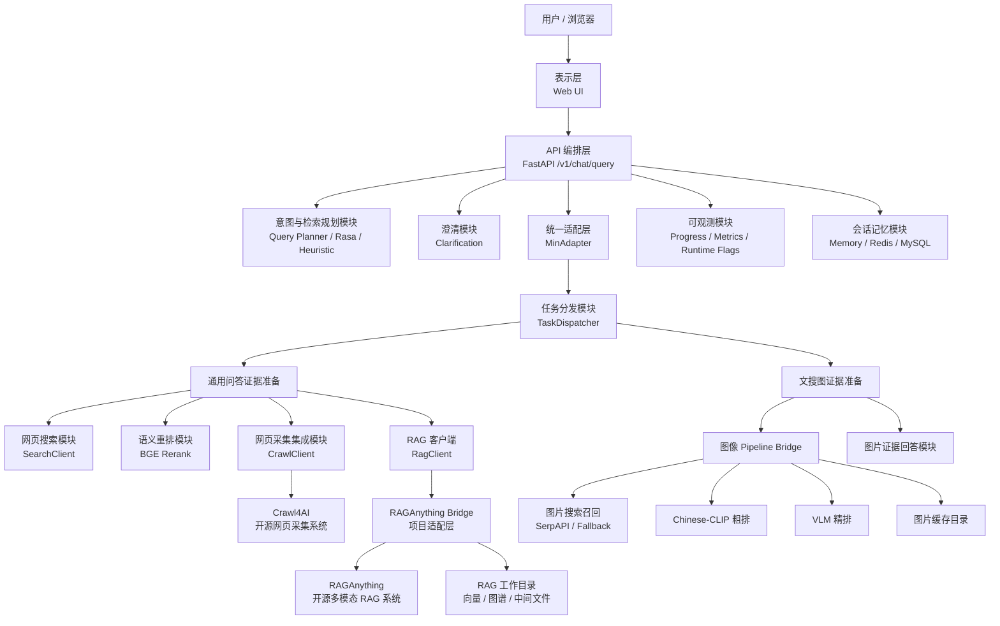
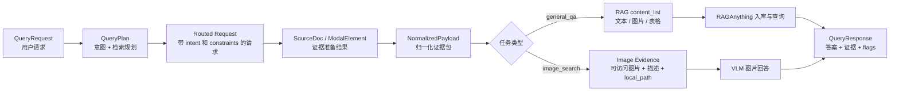
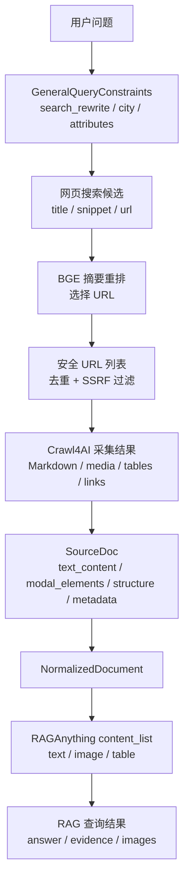
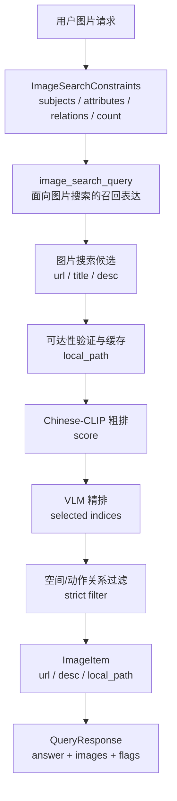

# 系统设计与系统实现重写稿（版本二）

> 本版本根据新的写作要求重新组织：系统设计章重点写架构体系、模块划分、接口设计和模块间数据流转；系统实现章重点写各模块内部的实现逻辑、核心算法、核心数据结构和兜底策略。代码仅用伪代码或短结构片段说明，不再大段粘贴源码。

# 3 系统设计

本章从系统整体蓝图角度，对面向通用问答与文搜图场景的多模态 RAG 原型系统进行设计说明。系统设计关注的是“系统由哪些部分组成、模块之间如何协作、数据如何在模块之间流转、接口如何定义”，而不是具体函数如何编写。为了避免后续实现章与设计章重复，本章只讨论模块边界、体系结构、接口契约和模块级数据模型。

本系统面向两类核心任务：一类是基于网页或文档证据的通用问答，另一类是根据文本描述检索图片并生成图片证据说明。两类任务表面上差异较大：通用问答处理网页文本、表格和 RAG 证据，文搜图处理图片召回、图文匹配和视觉语言模型判断。但从系统工程角度看，它们都可以抽象为“用户请求进入统一入口，系统进行意图规划，准备证据，基于证据生成回答，最后返回统一响应”。因此，本系统设计的主线是：

```text
用户自然语言请求
  -> 任务意图与检索规划
  -> 证据准备
  -> 证据归一化
  -> 多模态检索或视觉回答
  -> 统一答案与证据返回
```

围绕这条主线，系统采用分层架构和桥接集成方式，将 FastAPI 主服务、Query Planner、任务分发、网页采集、RAGAnything Bridge、图像 pipeline、会话记忆、安全校验和前端展示组织为一个完整系统。

## 3.1 设计目标与设计原则

本系统的设计目标包括以下几个方面。

第一，提供统一交互入口。用户不需要理解系统内部是通用问答链路还是文搜图链路，只需要通过同一个聊天接口提交自然语言请求。系统根据 query 自动判断任务类型，并返回统一格式的回答。

第二，实现证据驱动回答。通用问答不直接依赖大模型自身记忆，而是通过搜索、网页采集、重排和 RAG 引擎形成证据，再基于证据生成回答。文搜图也不只是返回图片链接，而是通过图片可达性验证、图文排序和视觉语言模型解释，给出图片证据。

第三，支持多模态内容流转。网页中不仅包含正文，还包含图片、表格、链接等结构化内容；文搜图链路也会产生图片 URL、本地缓存路径和图片描述。因此系统需要设计统一的数据结构承载不同模态证据。

第四，隔离开源组件和业务编排。Crawl4AI 和 RAGAnything 均作为开源系统接入，本项目不直接把主业务逻辑写死在它们的内部接口上，而是通过 `CrawlClient` 和 `RAGAnything Bridge` 进行封装和转换。

第五，保证安全与可观测。系统会访问用户 URL、搜索结果 URL 和图片 URL，因此必须设计 SSRF 防护、重定向校验、本地文件白名单和超时机制。同时，系统链路较长，需要通过进度事件、运行标记和指标统计暴露执行过程。

基于上述目标，系统遵循以下原则。

模块化原则：每个模块只负责一个清晰职责。例如 Query Planner 只负责意图和检索规划，TaskDispatcher 只负责证据准备，RAGAnything Bridge 只负责 RAG 数据适配。

契约化原则：模块之间通过稳定数据模型传递信息，避免直接共享内部状态。核心契约包括 `QueryRequest`、`QueryPlan`、`SourceDoc`、`NormalizedPayload` 和 `QueryResponse`。

分层解耦原则：API 层负责请求生命周期，服务层负责业务流程，集成层负责开源组件或外部服务适配，存储层负责缓存、RAG 数据和用户记忆。

可降级原则：搜索、爬虫、重排、RAG、VLM 等外部能力都可能失败。系统设计中为每一类外部依赖保留 fallback 路径，并通过 runtime flags 表示实际发生的降级。

安全前置原则：危险 URL 应尽早被拒绝，不应等到爬虫或图片代理真正访问时才发现风险。

## 3.2 系统总体架构设计

系统采用 B/S 架构，前端浏览器作为表示层，FastAPI 主服务作为统一 API 编排层，后端服务模块作为业务逻辑层，开源系统和模型服务通过桥接层接入，Redis、MySQL、本地图片缓存和 RAGAnything 工作目录作为存储层。

系统总体架构如图 3-1 所示。



图 3-1 中，系统不是由单一模型直接完成回答，而是由多个功能模块串联完成。最上层的 API 编排层负责控制请求生命周期；中间的任务分发和适配层负责把不同场景转换为统一证据结构；底层的开源系统和模型服务负责网页采集、多模态 RAG、图文匹配和视觉理解。

从请求流向看，所有用户请求都先进入 FastAPI 主服务。主服务根据显式 intent 或 Query Planner 结果确定任务类型。如果是通用问答，则进入网页搜索、重排、采集和 RAG 链路；如果是文搜图，则进入图片召回、图片可达性验证、CLIP 粗排、VLM 精排和图片回答链路。两条链路最后都通过统一响应结构返回答案、证据、图片和调试信息。

## 3.3 功能模块划分

为了保证系统可维护性，系统按职责划分为九个主要模块。

### 3.3.1 API 编排模块

API 编排模块是系统对外入口，主要职责包括请求校验、`request_id` 生成、进度初始化、意图规划调度、澄清状态处理、调用 Adapter、异常处理和统一响应。该模块不直接执行网页搜索、图片排序或 RAG 查询，而是根据流程调度其他模块。

### 3.3.2 意图与检索规划模块

意图与检索规划模块负责把用户自然语言 query 转换为可执行计划。计划内容包括任务类型、置信度、检索改写、实体和场景约束。该模块优先使用 LLM Query Planner，一次完成意图判断和约束抽取；当 LLM 不可用或置信度不足时，系统使用 Rasa 和启发式规则兜底。

### 3.3.3 澄清模块

澄清模块负责判断请求是否缺少必要信息。例如天气问题缺少城市，或者图片请求只有“来几张图”这种泛化表达时，系统不立即执行检索，而是返回澄清问题并在用户偏好中记录 pending 状态。用户下一轮补充信息后，系统将补充内容合并到原始 query。

### 3.3.4 任务分发模块

任务分发模块根据 intent 选择证据准备方式。`general_qa` 分支负责处理直传文档、指定 URL 或开放网页搜索；`image_search` 分支负责处理用户直传图片或调用图像 pipeline 检索图片。该模块的输出是统一的 `SourceDoc` 和 `ModalElement`，供 Adapter 使用。

### 3.3.5 通用问答证据准备模块

通用问答证据准备模块由 SearchClient、BGERerankClient 和 CrawlClient 组成。SearchClient 负责搜索候选网页；BGE 重排负责从候选中选择更相关 URL；CrawlClient 负责调用 Crawl4AI 采集网页正文、图片、表格和链接。该模块的目标是为 RAG 提供高质量证据，而不是直接生成答案。

### 3.3.6 多模态 RAG 集成模块

多模态 RAG 集成模块由 RagClient 和 RAGAnything Bridge 构成。RagClient 是主服务内部客户端，负责调用 Bridge 的 `/ingest` 和 `/query`。RAGAnything Bridge 是项目自有适配层，负责把内部文档结构转换成 RAGAnything 的 `content_list`，并调用开源 RAGAnything 完成入库和查询。

### 3.3.7 文搜图模块

文搜图模块由图像 pipeline bridge 和图片证据回答模块组成。图像 pipeline bridge 负责图片召回、去重、可达性验证、缓存、Chinese-CLIP 粗排和 VLM 精排；图片证据回答模块负责基于最终图片集合生成自然语言说明，并对空间关系等硬约束进行二次验证。

### 3.3.8 会话记忆模块

会话记忆模块保存用户最近对话历史和偏好设置。历史用于后续回答上下文，偏好用于回答风格和澄清状态。系统支持内存、Redis、MySQL 和 hybrid 四种后端，以适配本地开发和持久化部署两类场景。

### 3.3.9 安全与可观测模块

安全模块负责 URL 安全校验、图片代理重定向校验和本地图片路径白名单。可观测模块包括 progress、metrics 和 runtime flags，用于记录请求阶段、全局指标和单次请求执行标记。

表 3-1 总结了核心模块之间的输入输出关系。

| 模块 | 输入 | 输出 | 作用边界 |
|---|---|---|---|
| API 编排模块 | `QueryRequest` | `QueryResponse` | 控制请求生命周期，不做具体模型推理 |
| 意图规划模块 | query、请求上下文 | `QueryPlan` | 产生任务类型和检索规划 |
| 澄清模块 | query、pending 状态、偏好 | 澄清决策 | 处理缺槽和多轮补充 |
| TaskDispatcher | 带 intent 的请求 | `SourceDoc`、`ModalElement` | 准备证据，不生成最终回答 |
| 通用问答证据模块 | 搜索 query 或 URL | 网页证据文档 | 搜索、重排、采集、过滤 |
| RAG 集成模块 | `NormalizedPayload` | RAG 答案和证据 | 入库、查询和降级 |
| 文搜图模块 | 图片检索 query、约束 | 图片候选和图片答案 | 图片召回、排序、解释 |
| MemoryClient | uid、历史、偏好 | 上下文状态 | 保存多轮会话和澄清状态 |
| 安全可观测模块 | URL、阶段事件、运行状态 | 校验结果、指标、flags | 风险控制和调试支持 |

## 3.4 系统数据流转设计

上一节从模块角度说明系统组成，本节从数据角度说明模块如何串联。系统的核心并不是某个单独模块，而是数据在不同模块之间逐步变成更“可执行、更有证据、更可回答”的结构。

### 3.4.1 全局数据流

系统全局数据流如图 3-2 所示。



全局数据流可以拆成六次主要结构转换。

第一次转换是“自然语言请求到执行计划”。用户输入的 `QueryRequest` 只包含自然语言和少量配置，系统通过 Query Planner 将其转换为 `QueryPlan`，明确任务类型、检索改写和结构化约束。

第二次转换是“执行计划到路由请求”。主服务将 `QueryPlan` 写回请求对象，形成带有 `intent`、`image_constraints` 或 `general_constraints` 的 routed request。此时请求已经具备执行方向。

第三次转换是“路由请求到证据文档”。TaskDispatcher 根据 intent 准备证据。通用问答得到网页 `SourceDoc`，文搜图得到图片 `ModalElement` 和封装后的图片结果文档。

第四次转换是“证据文档到归一化 payload”。MinAdapter 将不同来源的 `SourceDoc` 转换成统一的 `NormalizedPayload`。此后下游不再关心证据来自搜索、URL、用户上传还是图片 pipeline。

第五次转换根据任务类型分叉。通用问答中，RAGAnything Bridge 将 `NormalizedDocument` 转换成 `content_list`，其中包括 text、image、table、equation 等 item；文搜图中，系统将 `ModalElement` 转换成 VLM 可以处理的图片行，包括 URL、描述和本地路径。

第六次转换是“证据到统一响应”。RAGAnything 或 VLM 输出答案后，系统组织为 `QueryResponse`，其中包含 answer、evidence、images、trace_id、latency、route 和 runtime_flags。

### 3.4.2 通用问答数据流

通用问答的数据流更加偏向文本证据和网页结构，如图 3-3 所示。



在该链路中，数据的质量逐步提高。搜索阶段的数据较粗，只包含标题、摘要和 URL；BGE 阶段根据 query 选择更相关的候选；Crawl4AI 阶段把 URL 变成完整网页证据；RAGAnything Bridge 阶段把网页证据进一步拆成多模态入库格式。

该数据流说明了为什么系统需要多阶段处理。如果直接把搜索摘要交给大模型回答，证据不够充分；如果直接抓取所有搜索结果，成本过高且噪声较多；如果只保存纯文本，又会丢失网页中的图片和表格。因此，系统采用“先轻量召回、再语义筛选、再结构化采集、最后多模态入库”的流程。

### 3.4.3 文搜图数据流

文搜图的数据流更加偏向图片候选和视觉验证，如图 3-4 所示。



在该链路中，`local_path` 是非常关键的数据字段。开放域图片 URL 经常失效或被防盗链限制，因此系统先下载并缓存图片，只有可访问图片才进入后续排序和展示。CLIP 阶段负责批量粗排，VLM 阶段负责理解复杂语义，严格过滤阶段负责处理左右、上下、动作关系等难以用关键词判断的条件。

### 3.4.4 会话与澄清数据流

会话澄清的数据流是主链路的补充。其设计目标是在缺少必要信息时暂停执行，并在用户补充后恢复原任务。

```text
用户原始 query
  -> 澄清检测
  -> pending_clarification 写入 preferences
  -> 返回澄清问题
  -> 用户下一轮补充
  -> 读取 pending_clarification
  -> 合并补充信息与原 query
  -> 恢复原 intent 继续执行
```

例如，用户输入“明天天气怎么样”，系统无法确定城市，因此返回“你想查询哪个城市的天气？”。此时系统在偏好中保存 scenario、original_query 和 missing_slots。用户回复“北京”后，系统合并为“北京 明天天气怎么样”，并继续走 `general_qa` 链路。

## 3.5 模块级数据模型设计

本节只介绍模块之间通信所需的数据模型，不展开所有实现字段。实现章会在具体模块中介绍核心算法所依赖的关键结构。

### 3.5.1 QueryRequest：统一请求模型

`QueryRequest` 是前端或调用方进入系统的统一请求结构。它的字段可以按功能分为五组。

| 字段组 | 代表字段 | 作用 |
|---|---|---|
| 用户与追踪 | `uid`、`request_id`、`timestamp` | 标识用户、请求和进度记录 |
| 任务输入 | `query`、`url`、`source_docs`、`images` | 承载自然语言、指定网页、直传文档或图片 |
| 任务控制 | `intent`、`use_rasa_intent`、`intent_confidence_threshold` | 控制意图判断和兜底策略 |
| 场景约束 | `image_constraints`、`general_constraints` | 保存结构化解析结果 |
| 规模限制 | `max_images`、`max_web_docs`、`max_web_candidates` | 控制图片数量、网页数量和搜索候选范围 |

该模型的关键设计点是同时支持显式 intent 和自动 intent。如果调用方明确指定 intent，系统直接进入对应链路；如果没有指定，系统调用 Query Planner 判断。这样既支持前端自动模式，也支持测试时强制指定场景。

### 3.5.2 QueryPlan：意图规划模型

`QueryPlan` 是 Query Planner 输出给主编排层的执行计划。它不是最终响应，而是中间控制结构。

| 字段 | 含义 |
|---|---|
| `intent` | `general_qa` 或 `image_search` |
| `confidence` | planner 对结果的置信度 |
| `source` | 规划来源，例如 `llm_planner` |
| `entities` | 抽取出的实体，如城市、地点、数量 |
| `general_constraints` | 通用问答约束 |
| `image_constraints` | 文搜图约束 |
| `flags` | 规划阶段产生的运行标记 |

该模型的作用是把“模型输出 JSON”转化为系统可执行对象。主编排层只需要判断置信度和 intent，不需要理解 LLM 原始文本。

### 3.5.3 SourceDoc 与 ModalElement：证据交换模型

`SourceDoc` 是任务分发模块到 Adapter 之间的证据文档模型。

| 字段 | 含义 | 在不同场景中的表现 |
|---|---|---|
| `doc_id` | 文档唯一 ID | 搜索结果、网页、图片结果都有独立 ID |
| `text_content` | 文本正文 | 网页 Markdown、搜索摘要、图片请求文本 |
| `modal_elements` | 多模态元素 | 图片、表格、公式或通用元素 |
| `structure` | 半结构化内容 | 表格、链接、网页类型、图片结果类型 |
| `metadata` | 元信息 | URL、标题、来源、`crawl4ai_full` 等 |

`ModalElement` 是图片、表格、公式等模态元素的统一表示。

| 字段 | 含义 |
|---|---|
| `type` | 模态类型，如 image、table、equation、generic |
| `url` | 远程资源地址 |
| `desc` | 资源描述，如图片 alt 或表格说明 |
| `local_path` | 本地缓存路径，图片检索和 RAG 图片入库中使用 |

该结构使通用问答和文搜图能够共用一个证据接口。网页采集结果可以把正文放入 `text_content`，图片放入 `modal_elements`；文搜图可以把多张图片作为 `modal_elements`，并用 `structure.type=image_search_result` 标识来源。

### 3.5.4 NormalizedPayload：归一化执行模型

`NormalizedPayload` 是 Adapter 输出给 RAG 或图片回答模块的内部执行模型。它的作用是将不同来源的证据统一成下游可使用的形式。

| 字段 | 含义 |
|---|---|
| `uid` | 用户标识 |
| `request_id` | 请求标识 |
| `intent` | 最终执行意图 |
| `query` | 当前执行 query |
| `original_query` | 用户原始 query |
| `image_search_query` | 文搜图召回 query |
| `documents` | 归一化后的文档列表 |
| `image_constraints` / `general_constraints` | 场景约束 |

Adapter 之后，系统不再区分证据来自用户上传、搜索、网页采集还是图片检索；下游只需要根据 intent 选择 RAG 查询或图片回答。

### 3.5.5 QueryResponse：统一响应模型

`QueryResponse` 是系统对外输出结构。

| 字段 | 含义 |
|---|---|
| `answer` | 最终自然语言回答 |
| `evidence` | 文本证据列表 |
| `images` | 图片证据列表 |
| `trace_id` | 链路追踪 ID |
| `latency_ms` | 请求耗时 |
| `route` | 实际执行路线 |
| `runtime_flags` | 本次请求运行标记 |

其中 `runtime_flags` 是系统设计中的调试契约。例如，当 RAG 查询失败后走本地 fallback，响应会带有 `rag_query_fallback`；当文搜图跳过普通 RAG 入库，响应会带有 `image_search_ingest_skipped`。这使论文测试阶段可以解释每个请求实际经过了哪些分支。

## 3.6 接口设计

接口设计包括外部 HTTP 接口和内部模块接口。外部接口面向前端或 API 调用方，内部接口面向模块之间的数据交换。

### 3.6.1 外部接口设计

系统主要外部接口如表 3-2 所示。

| 接口 | 方法 | 输入 | 输出 | 功能 |
|---|---|---|---|---|
| `/v1/chat/query` | POST | `QueryRequest` | `QueryResponse` | 统一聊天查询入口 |
| `/v1/chat/progress` | GET | `request_id` | progress event 列表 | 查询请求执行进度 |
| `/v1/chat/image-proxy` | GET | `url` 或 `local_path` | 图片二进制 | 安全加载远程或本地图片 |
| `/healthz` | GET | 无 | 状态 JSON | 主服务健康检查 |
| `/metrics` | GET | 无 | Prometheus 文本 | 指标暴露 |

`/v1/chat/query` 是系统核心接口。该接口不暴露内部链路细节，而是通过 `intent` 和 constraints 支持可选控制。调用方可以让系统自动判断意图，也可以显式指定 `general_qa` 或 `image_search`。

`/v1/chat/progress` 用于长链路任务的前端展示。系统不把 progress 混在最终响应中，而是通过 request_id 单独查询，这样不会阻塞主响应结构，也便于前端轮询。

`/v1/chat/image-proxy` 用于图片展示安全控制。它既能代理远程图片，也能读取白名单目录下的本地缓存图片。前端不直接访问开放域图片 URL，而是统一走该接口。

### 3.6.2 内部接口设计

内部接口不是 HTTP API，而是模块之间的方法契约。

| 内部接口 | 输入 | 输出 | 设计目的 |
|---|---|---|---|
| `plan_query(req)` | `QueryRequest` | `QueryPlan | None` | 生成意图和检索规划 |
| `prepare_documents(req)` | routed request | `SourceDoc`、`ModalElement` | 准备证据 |
| `normalize_input(req)` | `QueryRequest` | `NormalizedPayload` | 证据归一化 |
| `ingest_to_rag(payload)` | `NormalizedPayload` | indexed ids | RAG 入库 |
| `query_with_context(payload)` | `NormalizedPayload` | `QueryResponse` | 基于上下文生成回答 |
| `search_web_hits(query)` | query、top_k | 搜索结果文档 | 网页候选召回 |
| `crawl(url)` | 安全 URL | `SourceDoc` | 网页采集 |
| `search_and_rank_images(query)` | 图片 query、top_k | 图片元素 | 文搜图候选准备 |

内部接口的共同特点是输入输出都使用系统定义的数据模型，而不是直接传递外部服务的原始 JSON。这样可以把外部服务变化限制在 connector 或 bridge 内部。

## 3.7 开源系统集成设计

本系统集成了 Crawl4AI 和 RAGAnything 两个开源系统。论文中应将它们作为开源系统理解与使用，而不是写成完全自研模块。本项目的工作重点是围绕当前场景完成统一封装、数据转换、流程编排和可靠性增强。

### 3.7.1 Crawl4AI 集成设计

Crawl4AI 是面向 LLM/RAG 场景的开源网页采集系统，能够通过浏览器渲染获取动态网页，清洗 HTML，生成 Markdown，提取媒体、链接和表格，并支持内容过滤和并发调度。

在本系统中，Crawl4AI 不直接暴露给主编排层，而是由 `CrawlClient` 封装。该封装层有三个设计目标。

第一，屏蔽调用方式差异。Crawl4AI 可以通过本地 SDK 调用，也可以通过远程 HTTP 服务调用。主流程不关心具体方式，只调用 `crawl(url)`。

第二，统一输出结构。Crawl4AI 原始结果包含不同版本字段，例如 markdown 可能是字符串，也可能是对象。`CrawlClient` 负责提取主要 Markdown、媒体、表格、链接和完整快照，并映射为 `SourceDoc`。

第三，为 RAG 保留结构信息。系统不仅保存纯文本，还将 `crawl4ai_full` 放入 metadata，将 tables 和 links 放入 structure，将图片等媒体转换为 `ModalElement`。这样 RAGAnything Bridge 后续可以根据完整快照构造多模态 `content_list`。

### 3.7.2 RAGAnything 集成设计

RAGAnything 是开源多模态 RAG 系统，支持将文本、图片、表格、公式等内容接入 RAG 流程。它的核心输入是 `content_list`，每个 item 通过 `type` 表示内容类型，例如 text、image、table、equation。

本项目通过 RAGAnything Bridge 集成该系统。Bridge 的设计目标包括：

第一，提供稳定 HTTP 边界。主服务只调用 Bridge 的 `/ingest` 和 `/query`，不直接依赖 RAGAnything SDK 的内部对象。

第二，完成数据格式适配。主服务传入的是 `NormalizedDocument`，Bridge 将其转换为 RAGAnything 需要的 `content_list`。

第三，处理网页混合内容。对于 Crawl4AI 采集的网页，Bridge 优先使用 HTML/cleaned HTML 进行文档解析，再补充 Markdown、表格和图片。

第四，处理远程图片本地化。RAGAnything 的图片处理通常需要本地图片路径，因此 Bridge 会下载远程图片并生成 `img_path`。若下载失败，则降级为文本证据。

第五，提供弱证据 fallback。即使 RAGAnything SDK 初始化失败，Bridge 仍保留文档弱缓存，使主服务可以返回基本 evidence，而不是完全失败。

## 3.8 安全与可观测设计

### 3.8.1 安全设计

系统安全风险主要来自 URL 访问。用户可能传入内网地址，搜索结果也可能包含不安全 URL，图片 URL 还可能通过重定向跳转到本地或私有地址。因此系统采用多层安全策略。

入口层：`QueryRequest.url` 必须是公开 `http/https` URL，拒绝 localhost、私有 IP、link-local、reserved 和 unspecified 地址。

任务分发层：从搜索结果中提取 URL 后再次进行安全过滤和去重，不安全 URL 不进入 CrawlClient。

图片代理层：远程图片访问前校验协议和 host；遇到重定向时，每一次跳转后的 URL 都重新校验；本地图片只允许读取图片缓存目录和 RAGAnything remote_images 目录。

超时层：搜索、爬虫、RAG、图片 pipeline 和 VLM 调用都设置超时，避免外部服务长时间阻塞请求。

### 3.8.2 可观测设计

系统可观测性由三个部分组成。

Progress 用于记录请求阶段。例如 `intent.planning`、`general_qa.search_hits`、`general_qa.crawled`、`image_search.pipeline_done`、`general_qa.answering` 等。前端根据 request_id 查询 progress 并展示。

Metrics 用于记录全局计数。例如请求总数、成功数、失败数、intent fallback 次数、RAG fallback 次数、搜索 fallback 次数、crawl fallback 次数、澄清次数和延迟累计。

Runtime flags 用于记录单次请求的关键分支。例如 `query_planner_llm` 表示使用了 LLM planner，`rag_query_fallback` 表示 RAG 查询降级，`image_search_vlm_spatial_filter_applied` 表示应用了空间关系过滤。

## 3.9 本章小结

本章从系统设计角度说明了多模态 RAG 原型系统的架构体系、模块划分、数据流转、模块级数据模型、接口设计、开源系统集成设计以及安全可观测设计。系统整体以统一请求入口为起点，以 Query Planner 和 TaskDispatcher 完成任务分流，以 `SourceDoc`、`NormalizedPayload` 和 `QueryResponse` 保持模块间数据契约，以 Crawl4AI 和 RAGAnything Bridge 完成网页多模态证据接入，以图像 pipeline 完成文搜图证据准备。通过这种设计，通用问答和文搜图虽然内部链路不同，但在整体系统中被组织为一条统一的“请求规划、证据准备、证据归一、证据回答、统一响应”的流程。

# 4 系统实现

本章在系统设计基础上，说明系统各模块的具体实现逻辑。与系统设计章不同，本章重点回答“模块内部如何完成任务、采用了哪些算法和策略、失败时如何兜底、核心数据结构如何支撑实现”。本章不大段粘贴源码，仅使用简化伪代码和结构示意说明关键实现。

## 4.1 主编排模块实现

主编排模块位于聊天 API 中，是一次请求的调度中心。它的实现逻辑可以概括为“初始化、规划、澄清、分流、归一化、入库、回答、收尾”八个阶段。

伪代码如下。

```text
function chat_query(request):
    reset runtime flags
    create or reuse request_id
    start progress

    if request.intent is empty:
        plan = query_planner(request)
        if plan confidence is enough:
            apply plan
        else:
            fallback to Rasa or heuristic
    else:
        use explicit intent

    context = memory.get_context(uid)
    if request is reply to pending clarification:
        merge reply with original query

    apply scenario constraints
    if clarification is needed:
        save pending clarification
        return clarification response

    normalized = adapter.normalize_input(request)
    adapter.ingest_to_rag(normalized)
    response = adapter.query_with_context(normalized)

    complete progress
    update metrics
    return response
```

该流程中，主编排模块不关心搜索服务如何调用、Crawl4AI 如何解析网页、RAGAnything 如何建索引，也不关心 Chinese-CLIP 如何计算相似度。它只负责按照请求生命周期将各模块串联起来。

主编排模块实现中有三个关键策略。

第一，显式 intent 优先。如果调用方已经传入 intent，系统不再进行自动判断，直接进入对应链路。这便于测试和前端手动模式。

第二，Planner 优先但允许兜底。没有显式 intent 时，系统优先使用 LLM Query Planner；如果没有 API key、调用失败、JSON 解析失败或置信度低，则使用 Rasa 和启发式规则，保证系统可用。

第三，澄清早于证据准备。天气缺城市、图片请求过泛等情况不应直接消耗搜索和模型资源，而应先追问用户。澄清决策发生在 Adapter 之前，可以避免无效检索。

## 4.2 Query Planner 实现

Query Planner 的目标是一次性完成两个任务：判断意图和生成检索规划。相比“先识别 intent，再按场景调用第二次 LLM 解析”的方式，该实现减少了模型调用次数，降低了延迟。

Planner 的输入包括用户 query、是否带 URL、是否带 source_docs、是否带用户图片、最大图片数和最大网页数。输出包括 intent、confidence、search_rewrite、entities 和对应场景 constraints。

实现步骤如下。

```text
function plan_query(request):
    if LLM api key is missing:
        return None

    prompt = build_json_only_prompt(request)
    raw_json = call_llm_with_timeout(prompt)
    if raw_json is invalid:
        return None

    intent = normalize_intent(raw_json.intent)
    confidence = clamp(raw_json.confidence, 0, 1)
    search_rewrite = raw_json.search_rewrite or request.query

    if intent == image_search:
        constraints = build_image_constraints(raw_json)
    else:
        constraints = build_general_constraints(raw_json)

    return QueryPlan(intent, confidence, constraints, flags)
```

Prompt 规则主要包括：

1. 只输出 JSON，不输出解释文本。
2. `general_qa` 包括问答、总结网页、解释、分析、对比、天气、推荐、理解用户上传内容等。
3. `image_search` 只表示用户明确要求按文本找外部图片、照片、壁纸等。
4. 提到图片不一定是文搜图。如果用户是在分析上传图片内容，应归为通用问答。
5. `search_rewrite` 必须适合所选检索链路。通用问答面向网页/RAG 检索，文搜图面向图片搜索。

Planner 之后，系统会根据 intent 构造不同约束。

通用问答约束包括 `city`、`attributes`、`compare_targets`、`needs_clarification` 等字段，主要用于天气、对比、推荐和搜索改写。

文搜图约束包括 `subjects`、`attributes`、`style_terms`、`count`、`landmark`、`time_of_day`、`spatial_relations`、`action_relations` 和 `object_relations` 等字段，主要用于图片召回和 VLM 筛选。

Planner 的兜底策略分为三层。

第一层是 LLM Planner。正常情况下使用它，因为它能同时输出 intent 和 constraints。

第二层是 Rasa。它作为传统意图识别兜底，适合在 LLM 不可用时提供基本分类。

第三层是 heuristic。系统根据图片、照片、壁纸、天气、对比、如何、为什么等关键词进行启发式判断。heuristic 的准确率不如 LLM，但可以保证服务不完全不可用。

## 4.3 澄清模块实现

澄清模块主要处理两类缺槽。

第一类是天气缺城市。天气问题如果没有城市，直接搜索会得到泛化结果，回答质量较差。因此系统检查 query 中是否存在城市实体，或用户偏好中是否有默认城市。如果都没有，则返回澄清问题。

第二类是图片请求过泛。例如“来几张图”“给我几张图片”没有主体、地点或风格，图片搜索无法确定目标。系统会追问用户想看哪个地点或主体。

澄清实现逻辑如下。

```text
function should_clarify(query, intent, entities, preferences):
    if intent is general_qa and query is weather question:
        city = entities.city or extract_city(query) or preferences.default_city
        if city exists:
            return no clarification, maybe rewrite query with city
        else:
            return ask "你想查询哪个城市的天气？"

    if intent is image_search:
        if query is too generic and no landmark/subject:
            return ask "你想看哪个地点或主体的图片？"

    return no clarification
```

pending 状态保存在用户偏好中。其核心字段包括 scenario、original_query 和 missing_slots。用户下一轮回复后，系统根据 scenario 合并 query。

```text
weather pending + "北京"
  -> "北京 明天天气怎么样"

image_search pending + "重庆洪崖洞"
  -> "来几张图 重庆洪崖洞"
```

这种实现避免了复杂对话状态机，但足以支持毕业设计中的关键多轮澄清场景。

## 4.4 统一适配层实现

统一适配层的核心作用是把“任务分发结果”转化为“下游可执行 payload”。它解决的问题是：通用问答可能得到网页文档，文搜图可能得到图片列表，用户也可能直接传文档或图片。如果下游模块直接处理所有来源，会造成大量条件分支。Adapter 将这些来源统一为 `NormalizedPayload`。

实现逻辑如下。

```text
function normalize_input(request):
    source_docs, prepared_images = dispatcher.prepare_documents(request)

    documents = []
    for doc in source_docs:
        documents.append(convert SourceDoc to NormalizedDocument)

    if documents is empty and prepared_images exists:
        documents.append(image_branch_document)

    if documents is still empty:
        documents.append(direct_query_document)

    return NormalizedPayload(
        uid, intent, query, original_query,
        image_search_query, constraints, documents
    )
```

Adapter 中还有一个重要策略：文搜图默认跳过普通 RAG 入库。原因是当前文搜图最终答案由 VLM 基于图片证据直接生成，图片检索结果进入普通 RAG 的收益有限，反而会增加延迟和入库成本。因此系统通过 `IMAGE_SEARCH_INGEST_ENABLED` 配置控制该行为，默认关闭，并记录 `image_search_ingest_skipped`。

对于通用问答，Adapter 会正常调用 RAG 入库和查询。回答生成时，Adapter 会先读取用户记忆和偏好，将回答风格等偏好追加到 query 中。天气类问题还会额外加入回答约束，要求模型聚焦天气现象、温度、降雨、风力、湿度等内容，避免扩展到城市介绍。

## 4.5 通用问答链路实现

通用问答链路的目标是把用户问题转换为可靠网页证据，再通过 RAG 生成回答。该链路内部包括 query 优化、网页搜索、摘要重排、URL 安全过滤、网页采集、正文重排、RAG 入库和 RAG 查询。

### 4.5.1 Query 优化

通用问答 query 优化不是复杂的语义重写，而是轻量补充检索提示。系统会移除常见口语填充词，并根据场景添加提示词。

实现策略包括：

1. 对“最新、最近、当前、今年”等问题添加新鲜度提示。
2. 对“对比、区别、哪个好、优缺点”等问题添加“对比、评测”等检索意图词。
3. 对天气问题添加“天气预报、气温、降雨、风力、湿度”等检索词。
4. 保留原始语义核心，避免过度改写导致检索方向漂移。

伪代码如下。

```text
function optimize_web_query(query):
    text = remove_common_fillers(query)
    hints = []

    if text contains freshness words:
        hints.add("最新")

    if text contains comparison words:
        hints.add("对比 评测")

    if text is weather question:
        hints.add("天气预报 气温 降雨 风力 湿度")

    return deduplicate_join(text, hints)
```

### 4.5.2 搜索召回

搜索模块支持三种路径。

第一，调用配置的搜索服务端点。这适合后续将搜索能力单独部署或替换。

第二，直接调用 SerpAPI Web Search。系统支持多个 API key 轮换，遇到鉴权失败、限流或返回 error 时尝试下一个 key。

第三，占位降级。当真实搜索不可用且允许 placeholder fallback 时，系统构造占位搜索结果，用于本地联调和自动化测试。如果生产环境不希望返回占位结果，可以关闭该配置。

搜索结果会被统一映射为 `SourceDoc`，但此时 `text_content` 主要是标题和摘要，metadata 中保存 URL、title、snippet 和 query。

### 4.5.3 BGE 摘要重排

搜索召回强调覆盖率，但不保证所有候选都相关。系统使用 BGE reranker 对搜索摘要进行语义重排，从多个候选网页中选择最值得抓取的 URL。

重排算法可抽象为：

```text
function rerank(query, docs, top_k):
    for each doc in docs:
        pair = (query, doc.title + doc.snippet)
        score = BGE_cross_encoder(pair)
    return docs sorted by score desc, take top_k
```

如果 BGE 模型加载失败或推理失败，系统不会中断链路，而是返回原始前 top_k 个候选，并记录 `bge_rerank_fallback`。这样可以保证即使本地模型环境不完整，系统仍能运行，只是证据质量下降。

### 4.5.4 URL 安全过滤与去重

重排后，系统从候选 metadata 中取出 URL。进入爬虫前需要执行去重和安全过滤。

过滤规则包括：

1. URL 不能为空。
2. 重复 URL 只保留一次。
3. 协议必须是 http 或 https。
4. host 不能是 localhost。
5. host 不能是私有 IP、回环 IP、link-local、reserved、unspecified 等地址。

被过滤的 URL 不会进入 CrawlClient，并记录 `unsafe_crawl_url_skipped`。该策略可以防止搜索结果或恶意输入触发 SSRF 风险。

### 4.5.5 并发网页采集

通过安全过滤的 URL 会进入 CrawlClient。为了提高效率，系统使用 asyncio semaphore 控制并发抓取。

```text
function crawl_urls(urls):
    concurrency = min(config.web_crawl_concurrency, len(urls))
    semaphore = Semaphore(concurrency)

    for url in urls concurrently:
        acquire semaphore
        doc = CrawlClient.crawl(url)
        release semaphore

    return crawled_docs
```

并发数由配置控制，避免同时打开过多浏览器页面造成内存和 CPU 压力。

### 4.5.6 正文重排

摘要重排发生在抓取前，只能根据标题和摘要判断网页相关性。抓取完成后，系统可以根据完整正文再做一次 BGE 重排。这一步不是必须开启，但对开放域搜索有价值，因为有些搜索摘要看似相关，正文实际不满足问题。

正文重排开启后，系统会记录 `general_qa_body_rerank`。如果正文重排失败，系统保留抓取顺序继续执行。

## 4.6 Crawl4AI 集成实现

Crawl4AI 集成模块的目标是把网页 URL 转换为本系统的 `SourceDoc`。该模块的实现重点不在重写爬虫算法，而是在开源 Crawl4AI 输出与本项目数据模型之间建立稳定映射。

### 4.6.1 调用策略

CrawlClient 采用三层调用策略。

```text
function crawl(url):
    if local Crawl4AI SDK enabled:
        try local SDK crawl
        if success:
            return map_to_SourceDoc(result)

    if remote Crawl4AI endpoint configured:
        try remote Docker-style API
        if failed:
            try custom simple crawl API
        if success:
            return map_to_SourceDoc(result)

    if placeholder fallback disabled:
        raise crawl unavailable

    return placeholder SourceDoc
```

本地 SDK 方式部署简单，适合毕业设计本地运行；远程 HTTP 方式便于将 Crawl4AI 独立部署；占位 fallback 主要用于测试和服务缺失时的链路保持。

### 4.6.2 Markdown 提取策略

Crawl4AI 不同版本的 `markdown` 字段可能有不同形态：有时是字符串，有时是对象，对象中可能包含 `fit_markdown`、`raw_markdown`、`markdown_with_citations` 等字段。系统按优先级提取：

```text
if markdown is object:
    use fit_markdown if exists
    else use raw_markdown
    else use markdown_with_citations
else if markdown is string:
    use markdown
else:
    use fit_markdown / raw_markdown / cleaned_text fallback
```

该策略保证系统对不同 Crawl4AI 输出版本有兼容性。

### 4.6.3 多模态元素映射

Crawl4AI 采集结果中可能包含 images、videos、audios、tables、links 等。系统映射规则如下。

| Crawl4AI 输出 | 系统映射 |
|---|---|
| `media.images` | `ModalElement(type="image")` |
| `media.videos` | `ModalElement(type="generic", desc="[video] ...")` |
| `media.audios` | `ModalElement(type="generic", desc="[audio] ...")` |
| `tables` | `SourceDoc.structure["tables"]` |
| `links` | `SourceDoc.structure["links"]` |
| 完整结果 | `metadata["crawl4ai_full"]` |

这里最重要的是保留 `crawl4ai_full`。如果只保存 Markdown，RAGAnything Bridge 后续无法再访问 HTML、cleaned_html、media、tables 等信息，多模态入库能力会被削弱。

## 4.7 RAGAnything Bridge 实现

RAGAnything Bridge 是本项目集成开源 RAGAnything 的关键模块。它既是 HTTP 服务，也是数据格式转换器。

### 4.7.1 Bridge 初始化

Bridge 启动时会检查 RAGAnything、LightRAG、EmbeddingFunc 等依赖是否可用，并读取模型配置。只有在 SDK 可用且配置了 API key 时，Bridge 才初始化真实 RAGAnything 实例。否则，Bridge 进入 fallback cache 模式。

RAGAnything 初始化需要三个模型函数：

1. LLM 函数：用于文本理解、表格分析、实体抽取和回答生成。
2. VLM 函数：用于图片理解和视觉增强查询。
3. Embedding 函数：用于文本向量化。

这些函数通过 OpenAI-compatible API 配置，使系统可以接入不同模型供应商。

### 4.7.2 content_list 转换算法

Bridge 的核心算法是把 `NormalizedDocument` 转换为 RAGAnything `content_list`。

对于普通文档，转换规则较直接：

```text
if doc.text exists:
    add {"type": "text", "text": doc.text}

for modal in doc.modal_elements:
    if modal is image:
        download remote image to local path
        if success:
            add {"type": "image", "img_path": local_path, "image_caption": ...}
        else:
            add text placeholder "[image] desc url"
    if modal is table:
        add {"type": "table", "table_body": modal.desc}
    if modal is equation:
        add {"type": "equation", "latex": modal.desc}
```

对于 Crawl4AI 网页文档，Bridge 使用混合转换策略：

```text
function build_hybrid_crawl_content_list(doc):
    full = doc.metadata["crawl4ai_full"]
    structure = doc.metadata["crawl_structure"]

    html = pick fit_html or cleaned_html or raw html
    if html exists:
        write html to working_dir/html_inputs
        parsed_items = Docling parser parse(html)
        add parsed_items

    if no parsed item and doc.text exists:
        add text item from doc.text

    markdown = pick fit_markdown or raw_markdown
    if markdown complements doc.text:
        add markdown supplement text item

    for table in structure.tables or full.tables:
        convert table dict to markdown table
        add table item

    for image in doc.modal_elements and full.media.images:
        materialize remote image
        if success:
            add image item with img_path
        else:
            add text fallback

    return content_list
```

该算法体现了项目自己的集成工作。Crawl4AI 的输出不是 RAGAnything 的直接输入，Bridge 需要判断 HTML、Markdown、表格和图片的优先级，并在失败时降级。

### 4.7.3 远程图片本地化

RAGAnything 图片处理需要本地图片路径，而网页和搜索结果通常只有远程 URL。Bridge 实现了远程图片 materialize 逻辑：

1. 校验 URL 协议是否为 http/https。
2. 创建 `working_dir/remote_images` 目录。
3. 使用浏览器 User-Agent 下载图片。
4. 校验 content-type 是否以 image/ 开头。
5. 根据 content-type 或 URL 后缀推断扩展名。
6. 使用 URL hash 生成稳定文件名。
7. 返回本地 `img_path`。

如果图片下载失败，Bridge 不丢弃该证据，而是添加文本 item，例如 `[image] alt url`。这样即使图片不能被 VLM 处理，RAG 中仍保留图片存在的信息。

### 4.7.4 RAG 查询与降级

Bridge 查询时优先调用 `rag.aquery(query, mode=...)`。如果 RAGAnything 初始化失败或查询异常，则返回 fallback 结果。fallback 结果来自入库时保存的弱证据缓存，包括前几篇文档的 snippet 和图片信息。

这种降级策略的作用不是提供完整 RAG 能力，而是保证系统在模型配置不完整时仍可完成接口测试，避免主流程直接失败。

## 4.8 文搜图链路实现

文搜图链路比普通网页问答更强调候选质量和图片可访问性。其内部可拆为图片 query 构造、图片召回、可达性验证、缓存、CLIP 粗排、VLM 精排、严格关系过滤和答案生成。

### 4.8.1 图片 query 构造

图片 query 来源有两种：如果 Query Planner 输出 `search_rewrite`，系统优先使用它；否则根据实体和原 query 做轻量优化。

文搜图 query 优化策略包括：

1. 保留主体，如人物、动物、地点、物体。
2. 保留风格，如壁纸、实拍、插画、高清。
3. 保留时间和地点，如夜景、黄昏、洪崖洞。
4. 对部分中文主体加入英文同义扩展，例如犬种名称。
5. 将复杂空间关系转化为更容易召回的“同框、合照、together photo”等表达。

### 4.8.2 图片召回与 key 轮换

图像 pipeline 首先通过 SerpAPI Google Images 召回候选。系统支持多个 API key，按顺序尝试。某个 key 返回 401、403、429 或 error 时，自动尝试下一个 key。

召回结果会被转换为 `ImageCandidate`，包括 URL、title、desc、source 和 score。此时 score 还没有语义意义，主要是候选容器。

如果 SerpAPI 没有可用结果，系统使用公开图片源作为降级召回，并设置 fallback 标记。

### 4.8.3 可达性验证与本地缓存

开放域图片检索中，候选 URL 不一定能展示。系统在排序前进行可达性验证。

算法如下。

```text
function filter_accessible_candidates(candidates):
    remove duplicated urls
    probe first max_check candidates concurrently
    for each candidate:
        download image with timeout
        if content-type starts with image:
            save to cache with hash filename
            candidate.local_path = saved path
            mark ok
    return candidates with local_path
```

缓存策略包括：

1. 图片文件名由 URL hash 和扩展名组成。
2. 已缓存图片再次访问时刷新访问时间。
3. 系统定期清理超过 TTL 的缓存文件。
4. 后续 CLIP、VLM 和前端展示优先使用 local_path。

该策略显著提高前端展示稳定性，因为最终图片已经在后端验证并缓存。

### 4.8.4 Chinese-CLIP 粗排

Chinese-CLIP 粗排的目标是在可访问候选中快速筛选语义相关图片。其算法过程为：

```text
function chinese_clip_filter(query, candidates):
    load Chinese-CLIP model and processor
    select eval_pool from candidates
    download or open local cached images
    encode images into image_features
    encode query into text_features
    normalize both features
    score = cosine_similarity(image_features, text_features)
    sort candidates by score
    keep top candidates above threshold
```

如果 Chinese-CLIP 模型不可用，系统降级为 lexical score，即计算 query tokens 与候选 title/desc tokens 的重合比例。这种降级不如 CLIP 准确，但可以保证链路继续运行。

### 4.8.5 VLM 精排

CLIP 擅长粗粒度语义匹配，但难以准确判断复杂动作、空间关系和细节。系统将 CLIP 保留的候选池交给 VLM 精排。VLM 输入包括用户 query、候选图片 URL/local_path、title、desc 和 CLIP score。输出为候选索引排序或带 score 的 JSON。

VLM 精排策略如下：

1. 只对较小候选池执行，避免成本过高。
2. 要求模型输出 JSON，降低解析复杂度。
3. 若 VLM 输出不可解析，则回退到 CLIP 排序或文本 rerank。
4. 若 VLM 凭证缺失，则跳过 VLM 精排。

### 4.8.6 空间关系严格过滤

用户经常提出“左边、右边、上面、旁边”等空间要求。搜索和 CLIP 对这些关系不稳定，因此系统在 VLM 排序后执行严格过滤。

逻辑如下。

```text
if query contains left/right spatial words:
    strict_pool = top candidates from VLM or CLIP
    strict_indices = VLM judge which images strictly satisfy relation
    if strict_indices exists:
        top = strict_pool[strict_indices]
        if top changed:
            regenerate answer from filtered images
```

这样可以避免出现“答案说满足左右关系，但图片列表并不满足”的不一致问题。

### 4.8.7 图片答案生成

最终图片答案不是简单描述每张图片，而是结合用户 query 和结构化约束生成说明。系统将图片 rows 和 constraints 文本传给 VLM，让模型说明哪些图片更符合需求、哪些约束被满足。如果 VLM 无法生成答案，系统返回降级提示，并保留图片列表供人工查看。

## 4.9 会话记忆与偏好实现

MemoryClient 支持四种后端：memory、Redis、MySQL 和 hybrid。

memory 模式使用进程内 deque 保存最近若干轮对话，适合本地开发和测试。

Redis 模式使用 list 保存历史，用 hash 保存偏好。历史写入时执行 `LPUSH` 和 `LTRIM`，保证只保留最近 `max_turns` 条。

MySQL 模式自动创建两张表：`user_memory_history` 保存历史对话，`user_preferences` 保存偏好 JSON。偏好表使用 `uid + pref_key` 唯一约束，便于更新 pending clarification 和回答风格。

hybrid 模式优先读写 Redis，同时可回退 MySQL。这种模式适合需要快速读写和持久化备份的场景。

会话记忆在系统中的主要用途包括：

1. 保存最近对话，便于后续扩展上下文回答。
2. 保存 `answer_style`，影响回答语气或格式。
3. 保存 `pending_clarification`，支持多轮澄清。
4. 保存默认城市等偏好，减少重复追问。

## 4.10 图片代理与前端实现

前端负责输入和展示，后端图片代理负责安全加载图片。前端不会直接把远程图片 URL 放到 img 标签，而是统一构造代理地址。

图片渲染逻辑为：

```text
if image.local_path exists:
    img.src = /v1/chat/image-proxy?local_path=...
else:
    validate image.url is http/https
    img.src = /v1/chat/image-proxy?url=...
```

后端图片代理分为本地路径模式和远程 URL 模式。

本地路径模式：

1. 检查文件是否存在。
2. 检查路径是否位于允许目录。
3. 检查 MIME 类型是否为图片。
4. 返回图片二进制，并设置缓存头。

远程 URL 模式：

1. 检查协议是否为 http/https。
2. 解析 host，拒绝 localhost、私有地址和危险地址。
3. 手动处理重定向。
4. 每次重定向后重新校验目标 URL。
5. 校验响应 content-type 是否为 image。
6. 返回图片二进制。

前端还实现了 progress 面板。发送请求时，前端生成 request_id；请求执行过程中，前端轮询 `/v1/chat/progress`，将阶段事件渲染为“思考过程”。这样用户可以看到系统正在进行意图规划、搜索、抓取、RAG 查询或图片排序。

## 4.11 安全与可观测实现

### 4.11.1 URL 安全实现

URL 安全公共函数主要判断两件事：协议是否安全，host 是否可访问。

```text
function is_safe_public_http_url(url):
    parsed = parse(url)
    if scheme not in {http, https}:
        return false
    if no netloc:
        return false
    if hostname is localhost:
        return false
    if hostname is IP and is private/loopback/link-local/reserved:
        return false
    return true
```

图片代理还会进一步做 DNS 解析校验，防止域名解析到私有 IP。这个实现比只检查字符串更可靠。

### 4.11.2 Progress 实现

Progress 使用内存字典保存最近请求，每个 request_id 对应一个任务状态。为避免内存无限增长，系统限制最大任务数，并定期淘汰较旧记录。每个任务最多保存最近若干事件。

事件字段包括 stage、message、data、elapsed_ms 和 seq。stage 使用模块化命名，例如：

```text
intent.planning
intent.finalized
general_qa.search_hits
general_qa.crawled
general_qa.answering
image_search.pipeline_done
image_search.answering
pipeline.answer_done
```

这种命名方便前端展示，也方便开发者定位问题发生在哪个阶段。

### 4.11.3 Metrics 实现

Metrics 使用线程锁保护计数器，并以 Prometheus 文本格式输出。系统记录的指标包括请求总数、成功失败数、各类 fallback 次数、澄清次数和延迟累计。该实现较轻量，不依赖外部监控系统，但格式兼容 Prometheus，便于后续扩展。

### 4.11.4 Runtime Flags 实现

Runtime flags 使用 `ContextVar` 保存。这样在异步并发请求中，每个请求拥有独立 flags 集合，不会互相污染。主流程开始时调用 reset，模块执行过程中调用 add，最终在 `QueryResponse` 中返回排序后的 flags。

常见 flags 包括：

| flag | 含义 |
|---|---|
| `query_planner_llm` | 使用了 LLM planner |
| `intent_fallback` | 意图识别进入兜底 |
| `search_fallback` | 搜索服务降级 |
| `crawl_fallback` | 网页采集降级 |
| `bge_rerank_fallback` | BGE 重排降级 |
| `rag_ingest_fallback` | RAG 入库降级 |
| `rag_query_fallback` | RAG 查询降级 |
| `image_search_ingest_skipped` | 文搜图跳过普通 RAG 入库 |
| `image_search_vlm_spatial_filter_applied` | 图片空间关系过滤生效 |

Runtime flags 使每次响应不仅有答案，还有执行路径说明。

## 4.12 关键实现难点与解决策略

### 4.12.1 多任务统一入口与差异化执行

难点：通用问答和文搜图差异很大，前者依赖网页和 RAG，后者依赖图片搜索和 VLM。如果接口完全分开，前端复杂；如果后端完全混写，代码难维护。

解决策略：使用统一 `QueryRequest` 和 `QueryResponse`，中间通过 Query Planner 和 TaskDispatcher 分流。Adapter 负责把不同来源证据归一化，保证下游边界清晰。

### 4.12.2 开源组件输出格式不一致

难点：Crawl4AI 输出网页采集结果，RAGAnything 需要 `content_list`。两者不是天然兼容。

解决策略：实现 RAGAnything Bridge，专门负责 HTML、Markdown、table、image 的转换和优先级处理。对图片进行本地化，对失败图片降级为文本。

### 4.12.3 开放域图片质量不稳定

难点：图片搜索返回的 URL 可能失效、不相关、非图片或被防盗链限制。

解决策略：将可达性验证前置；下载成功后写入本地缓存；排序时先 CLIP 粗排，再 VLM 精排；展示时优先使用 local_path。

### 4.12.4 空间关系难以检索

难点：“左边”“右边”等空间关系很难通过搜索关键词或 CLIP 相似度准确判断。

解决策略：Query Planner 抽取空间关系；搜索阶段尽量扩大召回；VLM 精排后再用严格关系过滤；过滤结果改变时重新生成答案。

### 4.12.5 外部服务不稳定

难点：搜索 API、Crawl4AI、RAGAnything、BGE、VLM 都可能因配置、网络或资源问题失败。

解决策略：每个外部依赖都设置 fallback。搜索可占位降级，爬虫可 SDK/HTTP/placeholder 多级降级，BGE 可返回原顺序，RAG 可本地缓存降级，VLM 可返回图片列表和提示。所有降级都通过 metrics 和 runtime flags 记录。

### 4.12.6 长链路用户感知弱

难点：通用问答和文搜图都可能耗时较长，用户不知道系统是否仍在工作。

解决策略：实现 progress 事件和前端思考面板，让用户看到意图规划、搜索、抓取、排序、回答生成等阶段。

## 4.13 本章小结

本章从实现角度说明了系统各模块的内部逻辑。主编排模块负责请求生命周期控制；Query Planner 通过一次 LLM 调用融合意图识别和检索规划，并通过 Rasa/heuristic 兜底；澄清模块处理天气城市和泛化图片请求；Adapter 将不同来源证据统一为 `NormalizedPayload`；通用问答链路通过 query 优化、搜索召回、BGE 重排、URL 安全过滤、Crawl4AI 采集和 RAGAnything 查询形成证据化回答；文搜图链路通过图片召回、可达性验证、缓存、Chinese-CLIP 粗排、VLM 精排和空间关系过滤生成图片证据回答；记忆、图片代理、安全、progress、metrics 和 runtime flags 则保证系统具备多轮能力、安全性和可观测性。

与上一章的设计说明不同，本章重点梳理了模块内部的算法和策略。可以看出，本项目的实现重点不是简单拼接多个模型接口，而是围绕多模态 RAG 应用场景，对开源网页采集系统、开源多模态 RAG 系统、图像检索、语义重排、视觉语言模型、记忆存储和前端交互进行了系统化编排，并针对数据结构不一致、图片不稳定、外部服务失败和安全访问风险设计了相应的工程策略。
