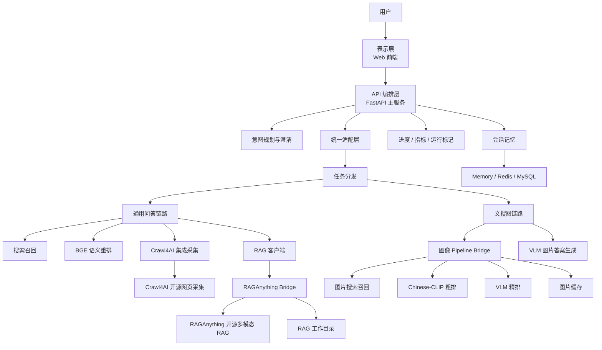
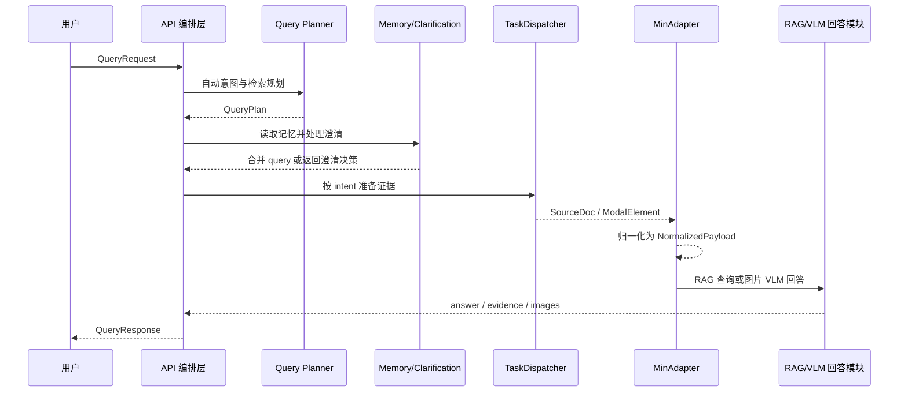
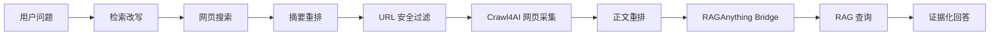
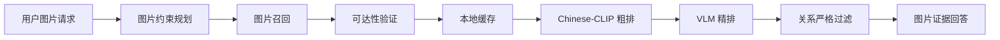

# 系统设计与系统实现重写稿（版本三）

> 本版本按论文正文思路重写。写作主线不是机械罗列“架构、模块、接口、数据流、算法”，而是围绕一个完整系统如何从用户请求出发，经过任务规划、证据组织、多模态处理和统一响应逐步形成可运行产品来展开。系统设计章强调“为什么这样组织系统以及模块之间怎样协作”，系统实现章强调“各模块内部怎样把设计落地，包括关键数据结构、算法流程和兜底策略”。Crawl4AI 与 RAGAnything 按开源系统理解和项目集成使用来写。

# 3 系统设计

本章在需求分析和方案论证的基础上，对面向通用问答与文搜图场景的多模态 RAG 原型系统进行总体设计。系统设计需要解决的核心问题不是某一个模型如何调用，而是如何把自然语言理解、网页搜索、网页采集、多模态 RAG、图片检索、视觉语言模型、会话记忆和前端交互组织成一条逻辑完整、接口统一、可调试、可降级的系统链路。

从用户视角看，系统只提供一个聊天入口。用户可以问“某个问题的最新情况”，也可以输入“帮我找几张某种图片”，还可以给出指定 URL 要求系统基于网页回答。从系统内部看，这些请求对应完全不同的处理方式：通用问答需要先准备文本或网页证据，再进入 RAG；文搜图需要先召回图片，再经过图文匹配和视觉模型判断。因此，本系统设计的关键是把不同任务抽象为同一个高层过程：

```text
用户请求 -> 意图与检索规划 -> 证据准备 -> 证据归一化 -> 证据增强回答 -> 统一响应
```

该抽象使系统既能保持统一入口和统一响应，又能在内部根据任务类型执行不同的专业链路。后续所有模块划分、数据模型和接口设计都围绕这条主线展开。

## 3.1 总体设计思路

本系统采用“统一编排 + 双任务链路 + 多模态证据接入”的设计思路。

所谓统一编排，是指所有请求都先进入 FastAPI 主服务，由主服务完成请求校验、意图规划、澄清判断、任务分发、进度记录、异常处理和统一响应。主服务不直接承担搜索、爬虫、RAG 或视觉模型推理的底层细节，而是作为系统的调度中心。

所谓双任务链路，是指系统内部将请求划分为通用问答和文搜图两条主链路。通用问答链路以网页和文档证据为中心，主要流程是搜索召回、语义重排、网页采集、多模态 RAG 入库和基于证据回答；文搜图链路以图片证据为中心，主要流程是图片召回、图片可达性验证、本地缓存、Chinese-CLIP 粗排、视觉语言模型精排和图片证据回答。

所谓多模态证据接入，是指系统不把证据局限为纯文本。网页采集结果中的 Markdown、HTML、表格、图片、链接等信息会被统一组织为内部证据文档，再通过 RAGAnything Bridge 转换为多模态 RAG 引擎可处理的 `content_list`。文搜图结果中的图片 URL、描述和本地缓存路径也会被组织成统一图片证据，供视觉语言模型生成解释。

这种设计思路背后的逻辑是：多模态 RAG 系统的难点不只是“调用一个大模型回答问题”，而是如何把开放环境中的异构信息转化为可靠证据，再把证据交给合适的模型处理。因此，系统设计重点放在证据流转、模块边界和兜底能力上。

## 3.2 系统体系结构设计

系统采用分层架构，整体分为表示层、API 编排层、业务服务层、集成桥接层和存储支撑层。各层既相互协作，又保持职责边界清晰。



表示层由静态 Web 前端构成，主要负责用户输入、意图选择、URL 输入、答案展示、图片展示、证据展示和进度展示。前端不直接访问外部图片，而是通过后端图片代理加载图片，避免跨域和不安全 URL 访问问题。

API 编排层是系统核心入口，负责组织一次请求的完整生命周期。它接收统一请求模型，调用意图规划模块确定任务类型，调用澄清模块判断是否需要追问用户，再调用统一适配层进入具体任务链路。API 编排层同时负责 progress、metrics 和 runtime flags 的记录，使长链路任务具有可观测性。

业务服务层包含 Query Planner、TaskDispatcher、SearchClient、BGERerankClient、RagClient、MemoryClient 和图片答案生成等模块。该层承载本项目的主要业务逻辑，包括任务分流、证据准备、检索改写、上下文处理和回答路径选择。

集成桥接层负责把开源系统和外部模型服务纳入统一系统。Crawl4AI 作为开源网页采集系统，通过 CrawlClient 被封装为网页证据生产模块；RAGAnything 作为开源多模态 RAG 系统，通过 RAGAnything Bridge 被封装为稳定的 `/ingest` 和 `/query` 服务；图像 pipeline bridge 则将 SerpAPI、Chinese-CLIP 和 VLM 排序封装为图片检索服务。

存储支撑层包含 RAGAnything 工作目录、图片缓存目录、内存会话、Redis 和 MySQL。RAG 工作目录用于保存解析文件、向量、图谱和中间数据；图片缓存目录用于保存经过可达性验证的开放域图片；Redis/MySQL 用于保存用户历史、偏好和澄清状态。

## 3.3 系统运行主流程设计

为了让系统具有整体感，本节从一次请求的运行过程说明各模块如何串联。

当用户提交 query 后，请求首先被构造成 `QueryRequest`。该对象不仅包含用户自然语言，还包含 uid、request_id、可选 intent、可选 URL、可选 source_docs、图片数量限制和网页数量限制等信息。主服务接收请求后，会生成或复用 request_id，并创建进度任务。

如果请求没有显式指定 intent，系统进入意图规划阶段。Query Planner 根据 query 和请求上下文输出 `QueryPlan`，其中包括任务类型、置信度、检索改写和结构化约束。如果 Planner 不可用或置信度不足，则使用 Rasa 和启发式规则兜底。此时，系统已经从“自然语言输入”转化为“可执行任务计划”。

随后，系统读取用户记忆和偏好，并判断是否存在 pending clarification。如果上一轮系统曾追问用户缺失信息，本轮用户回复会被合并回原始 query。例如天气问题缺城市时，用户下一轮回复“北京”，系统会合并为“北京 明天天气怎么样”。如果当前请求仍缺少必要信息，系统会返回澄清问题，而不进入检索链路。

当 intent 和 constraints 都确定后，请求进入 TaskDispatcher。对于通用问答，Dispatcher 准备网页或文档证据；对于文搜图，Dispatcher 准备图片证据。证据准备完成后，MinAdapter 将不同来源的证据归一化为 `NormalizedPayload`。这是系统中的重要边界：在 Adapter 之前，系统关注请求理解和证据准备；在 Adapter 之后，系统关注证据入库和回答生成。

最后，系统根据 intent 执行回答。通用问答会将证据送入 RAGAnything Bridge，由 RAGAnything 完成多模态入库和查询；文搜图默认跳过普通 RAG 入库，直接由视觉语言模型基于图片证据生成回答。无论内部走哪条链路，系统最终都返回统一的 `QueryResponse`。

整体流程如图 3-2 所示。



## 3.4 模块划分与职责设计

系统模块划分不是按文件简单罗列，而是按请求生命周期中的职责进行组织。

### 3.4.1 请求控制类模块

请求控制类模块包括 API 编排、Query Planner 和 Clarification。它们位于系统链路前半部分，负责回答“当前请求是什么任务、是否具备执行条件、应该进入哪条链路”。

API 编排模块负责请求生命周期。它把用户请求转交给 Planner、澄清模块、Adapter 和回答模块，并负责进度、指标和异常收尾。

Query Planner 负责把自然语言 query 解析为执行计划。其输出不是最终答案，而是 intent、search_rewrite 和 constraints。该模块的设计价值在于减少后续模块的语义猜测，让通用问答和文搜图在进入执行链路前已经拥有明确目标。

Clarification 负责判断信息是否充分。它只处理会阻断执行的关键缺槽，例如天气城市和泛化图片主体。澄清模块避免系统在信息不足时盲目搜索，从而节省资源并提升回答质量。

### 3.4.2 证据准备类模块

证据准备类模块包括 TaskDispatcher、SearchClient、BGERerankClient、CrawlClient 和 ImagePipelineClient。它们的共同目标是把用户 query 转换为可回答证据。

TaskDispatcher 是证据准备入口。它按 intent 分流：`general_qa` 进入文本/网页证据准备，`image_search` 进入图片证据准备。

SearchClient 负责开放域网页召回。它将 query 转换为搜索候选，每个候选包含标题、摘要和 URL。

BGERerankClient 负责语义筛选。搜索结果数量较多且噪声较大，BGE 重排用于选择更值得抓取或更值得入库的文档。

CrawlClient 负责网页内容采集。它集成开源 Crawl4AI，将 URL 转换为包含 Markdown、图片、表格和链接的网页证据。

ImagePipelineClient 负责调用图像 pipeline。它将图片检索 query 转换为可展示、可排序、可解释的图片证据。

### 3.4.3 证据消费类模块

证据消费类模块包括 MinAdapter、RagClient、RAGAnything Bridge 和图片 VLM 回答模块。它们位于系统链路后半部分，负责把证据转化为回答。

MinAdapter 负责证据归一化。它把不同来源的 `SourceDoc` 和 `ModalElement` 统一转换为 `NormalizedPayload`，并根据 intent 决定是否执行 RAG 入库。

RagClient 是主服务访问 RAG 的客户端。它优先调用 RAGAnything Bridge，失败时使用本地弱缓存降级。

RAGAnything Bridge 负责将内部证据文档转换为开源 RAGAnything 可处理的 `content_list`，并提供 `/ingest` 和 `/query` HTTP 接口。

图片 VLM 回答模块负责根据图片证据生成自然语言说明，并对空间关系等复杂约束进行二次检查。

### 3.4.4 支撑类模块

支撑类模块包括 MemoryClient、安全模块、Progress、Metrics、Runtime Flags 和前端图片代理。

MemoryClient 保存用户上下文和偏好，为多轮澄清和回答风格提供支持。

安全模块负责 URL 安全校验和图片代理访问控制，防止 SSRF 和任意文件读取。

Progress、Metrics 和 Runtime Flags 负责记录执行过程，使系统可以被观察、测试和调试。

前端图片代理配合后端图片缓存，使开放域图片检索结果能够稳定展示。

## 3.5 模块间数据模型设计

系统设计章中的数据模型重点不是列出所有字段，而是说明模块之间靠哪些结构传递信息。核心数据模型可以理解为五个阶段性结构：`QueryRequest`、`QueryPlan`、`SourceDoc`、`NormalizedPayload` 和 `QueryResponse`。

### 3.5.1 QueryRequest：用户请求结构

`QueryRequest` 是系统入口结构，表示“用户想让系统做什么”。它包含五类信息。

| 信息类别 | 关键字段 | 设计含义 |
|---|---|---|
| 用户与追踪 | `uid`、`request_id`、`timestamp` | 关联会话、进度和运行日志 |
| 原始任务 | `query`、`url`、`source_docs`、`images` | 表示用户自然语言、指定网页、直传文档和图片 |
| 任务控制 | `intent`、`use_rasa_intent`、`intent_confidence_threshold` | 控制自动意图识别和兜底判断 |
| 任务规模 | `max_images`、`max_web_docs`、`max_web_candidates` | 限制图片数量、网页数量和候选范围 |
| 结构化约束 | `image_constraints`、`general_constraints` | 保存规划或解析出的场景约束 |

该模型的设计重点是统一性。无论用户是问答、查网页还是找图片，入口都是同一结构。差异化处理被推迟到 Planner 和 Dispatcher 中完成。

### 3.5.2 QueryPlan：执行计划结构

`QueryPlan` 表示系统对用户请求的理解结果。它处于请求和执行之间，是系统从“语言理解”过渡到“工程执行”的关键结构。

| 字段 | 作用 |
|---|---|
| `intent` | 决定进入通用问答还是文搜图 |
| `confidence` | 决定是否采信 Planner 结果 |
| `search_rewrite` | 提供适合检索链路的改写 query |
| `entities` | 保存城市、地点、数量等通用实体 |
| `general_constraints` | 保存通用问答约束 |
| `image_constraints` | 保存文搜图约束 |
| `flags` | 标识规划阶段行为 |

在数据流中，`QueryPlan` 不直接返回给用户，而是被主编排层写回请求对象，影响后续 Dispatcher 和回答模块。

### 3.5.3 SourceDoc 与 ModalElement：证据结构

`SourceDoc` 表示“可以作为回答依据的一份证据”。它是 TaskDispatcher 的主要输出，也是 Adapter 的主要输入。

| 字段 | 设计含义 |
|---|---|
| `doc_id` | 证据唯一标识，便于追踪和返回 evidence |
| `text_content` | 文本证据，网页中通常是 Markdown |
| `modal_elements` | 图片、表格、公式等多模态元素 |
| `structure` | 表格、链接、网页结构、图片搜索结果类型等半结构化信息 |
| `metadata` | URL、标题、来源、完整 Crawl4AI 快照等元信息 |

`ModalElement` 表示文档中的一个模态元素。

| 字段 | 设计含义 |
|---|---|
| `type` | 模态类型，如 image、table、equation、generic |
| `url` | 远程资源地址 |
| `desc` | 模态描述，如图片 alt、表格说明 |
| `local_path` | 本地缓存路径，主要用于图片展示和 RAG 图片入库 |

该模型把网页证据和图片证据放到同一抽象下。网页可以有正文和图片，图片搜索结果也可以被封装为一种特殊证据文档。

### 3.5.4 NormalizedPayload：执行载荷结构

`NormalizedPayload` 是 Adapter 输出的执行载荷，表示“已经准备好进入回答阶段的数据”。它比 `SourceDoc` 更接近下游 RAG/VLM 模块的输入。

| 字段 | 作用 |
|---|---|
| `uid`、`request_id` | 关联会话和进度 |
| `intent` | 决定回答方式 |
| `query`、`original_query`、`image_search_query` | 区分执行 query、用户原话和图片召回 query |
| `documents` | 归一化后的证据文档 |
| `image_constraints`、`general_constraints` | 回答阶段仍需参考的约束 |

这里特别需要区分 `query`、`original_query` 和 `image_search_query`。通用问答中，`query` 可以被改写成更适合检索的表达；文搜图中，`image_search_query` 用于图片召回，而 `original_query` 保留用户原始意图，供最终 VLM 回答使用。这个设计避免检索改写污染最终回答语义。

### 3.5.5 QueryResponse：统一响应结构

`QueryResponse` 表示系统最终返回给前端的结果。

| 字段 | 作用 |
|---|---|
| `answer` | 自然语言回答 |
| `evidence` | 文本证据片段 |
| `images` | 图片证据 |
| `trace_id` | 链路追踪 |
| `latency_ms` | 请求耗时 |
| `route` | 实际执行路线 |
| `runtime_flags` | 单次请求执行标记 |

该结构使两条链路拥有统一输出。通用问答通常返回 answer 和 evidence，可能带 images；文搜图通常返回 answer 和 images，evidence 可为空。前端只需要按统一模型渲染。

## 3.6 接口设计

接口设计分为外部接口和内部接口。外部接口保证前端和外部调用方接入简单，内部接口保证模块协作稳定。

### 3.6.1 外部接口

| 接口 | 方法 | 作用 | 输入 | 输出 |
|---|---|---|---|---|
| `/v1/chat/query` | POST | 统一聊天查询 | `QueryRequest` | `QueryResponse` |
| `/v1/chat/progress` | GET | 查询请求进度 | `request_id` | 阶段事件 |
| `/v1/chat/image-proxy` | GET | 安全加载图片 | `url` 或 `local_path` | 图片二进制 |
| `/healthz` | GET | 健康检查 | 无 | 状态 JSON |
| `/metrics` | GET | 指标输出 | 无 | Prometheus 文本 |

`/v1/chat/query` 是核心接口。系统没有为通用问答和文搜图设计两个外部接口，而是通过统一请求模型和内部 intent 分流降低前端复杂度。

`/v1/chat/progress` 与主查询接口分离。这样主响应保持简洁，前端可以按 request_id 独立轮询进度。

`/v1/chat/image-proxy` 是文搜图和网页图片展示的安全边界。它使前端不直接加载外部 URL，而由后端统一校验和代理。

### 3.6.2 内部接口

系统内部关键接口如下。

| 接口 | 输入 | 输出 | 说明 |
|---|---|---|---|
| `plan_query` | `QueryRequest` | `QueryPlan` | 生成任务计划 |
| `should_clarify` | query、intent、entities、preferences | 澄清决策 | 判断是否缺槽 |
| `prepare_documents` | 带 intent 的请求 | `SourceDoc`、`ModalElement` | 准备证据 |
| `normalize_input` | `QueryRequest` | `NormalizedPayload` | 证据归一 |
| `ingest_to_rag` | `NormalizedPayload` | indexed ids | RAG 入库 |
| `query_with_context` | `NormalizedPayload` | `QueryResponse` | 生成回答 |
| `crawl` | URL | `SourceDoc` | 网页采集 |
| `search_and_rank_images` | 图片 query | 图片元素 | 图片检索排序 |

内部接口都围绕系统数据模型设计，而不是直接暴露第三方系统原始 JSON。这样做的好处是：如果 Crawl4AI、RAGAnything 或图片搜索供应商变化，只需要修改对应 connector/bridge，不需要改动主流程。

## 3.7 双链路设计

### 3.7.1 通用问答链路

通用问答链路面向网页和文档证据。其设计重点是证据质量控制。



该链路的逻辑是先用低成本方式获得候选，再逐步提高证据质量。搜索阶段获取覆盖率，摘要重排减少抓取成本，URL 安全过滤降低风险，网页采集获得完整内容，正文重排进一步降低噪声，RAG 查询基于最终证据生成答案。

### 3.7.2 文搜图链路

文搜图链路面向图片证据。其设计重点是图片可用性和语义匹配。



该链路先解决图片能不能访问，再解决图片是否相关，最后解决图片是否满足复杂关系。这个顺序很重要。如果先排序再验证，模型可能选择无法展示的图片；如果只做关键词搜索，不足以判断复杂空间和动作关系。

## 3.8 开源系统集成设计

### 3.8.1 Crawl4AI 集成设计

Crawl4AI 是开源网页采集系统，具备异步浏览器渲染、HTML 清洗、Markdown 生成、媒体提取、链接提取、表格提取、内容过滤和并发调度能力。本项目并不将其写作自研底层爬虫，而是将其作为网页采集能力接入系统。

项目侧的设计工作主要体现在三点。

第一，封装调用边界。主流程不直接依赖 Crawl4AI SDK，而是通过 CrawlClient 调用。CrawlClient 可以优先使用本地 SDK，也可以使用远程 HTTP 服务。

第二，统一输出结构。Crawl4AI 输出被转换为 `SourceDoc`，其中 Markdown 进入 `text_content`，图片等媒体进入 `modal_elements`，表格和链接进入 `structure`，完整快照进入 `metadata["crawl4ai_full"]`。

第三，保留多模态信息。系统不是只取网页正文，而是保留 HTML、Markdown、media、tables 和 links，为后续 RAGAnything Bridge 转换提供材料。

### 3.8.2 RAGAnything 集成设计

RAGAnything 是开源多模态 RAG 系统，支持 text、image、table、equation 等内容进入 RAG 流程。其核心思想是将多模态内容转换为可检索的文本块、实体、向量和知识图谱节点，并通过 LightRAG 的混合检索能力生成回答。

本项目通过 RAGAnything Bridge 集成该系统。Bridge 的职责不是简单转发请求，而是完成数据适配：

1. 将内部 `NormalizedDocument` 转换为 RAGAnything 的 `content_list`。
2. 对 Crawl4AI 网页快照进行 HTML/Markdown/表格/图片混合转换。
3. 将远程图片下载成本地 `img_path`。
4. 图片下载失败时降级为文本证据。
5. RAGAnything 不可用时保留弱证据缓存。

这样，主服务可以通过稳定接口使用开源 RAGAnything，而不需要直接处理其内部解析器、工作目录和模型函数。

## 3.9 安全与可观测设计

系统设计中的安全重点是 URL 访问控制。用户输入 URL、搜索结果 URL 和图片 URL 都可能带来 SSRF 风险。系统在三个位置执行安全控制：请求入口校验用户 URL，任务分发中过滤搜索结果 URL，图片代理中校验远程 URL 和每次重定向目标。本地图片代理只允许访问图片缓存目录和 RAGAnything remote_images 目录。

可观测设计包括 progress、metrics 和 runtime flags。Progress 面向前端，用于展示当前执行阶段；metrics 面向全局运行状态，用于统计请求数量、失败数量和 fallback 次数；runtime flags 面向单次响应，用于说明该请求实际走过哪些关键分支。

## 3.10 本章小结

本章从系统整体角度说明了多模态 RAG 原型系统的设计。系统以统一聊天入口为起点，通过 Query Planner 把自然语言转换为任务计划，通过 TaskDispatcher 准备通用问答或文搜图证据，通过 Adapter 归一化证据，通过 RAGAnything Bridge 或 VLM 图片回答模块生成结果，最终以统一响应返回。系统设计的核心不是简单堆叠模型，而是围绕“证据如何产生、如何归一、如何被消费”建立完整数据流和模块协作关系。

# 4 系统实现

本章说明系统设计在工程中的实现方式。与上一章不同，本章不再重复架构图和模块划分，而是按照系统运行顺序，说明各模块内部如何处理数据、采用哪些算法和策略、遇到异常如何兜底，以及哪些核心数据结构支撑这些实现。

## 4.1 请求编排实现

请求编排模块实现了系统的一次完整运行控制。其内部逻辑可以概括为以下流程：

```text
接收 QueryRequest
初始化 request_id、progress、runtime flags
确定 intent 和 constraints
处理 pending clarification
根据 intent 执行证据准备
归一化证据
执行 RAG 入库或图片回答
写回记忆
生成 QueryResponse
记录 metrics 和 progress
```

实现中的关键点是顺序控制。意图规划必须早于任务分发，因为 Dispatcher 需要知道进入哪个链路；澄清判断必须早于证据准备，因为缺少必要信息时不应浪费搜索和模型资源；证据归一化必须早于 RAG/VLM，因为下游回答模块只接受统一结构。

主编排还负责异常收尾。如果任一阶段出现错误，系统会记录 progress error 和失败指标，避免前端长期停留在运行状态。

## 4.2 意图规划与约束解析实现

意图规划模块采用“一次 LLM 规划 + 多级兜底”的实现方式。

### 4.2.1 LLM Planner

LLM Planner 的输入是用户 query 和请求上下文，输出是严格 JSON。系统在 prompt 中明确要求模型同时完成两件事：判断 intent 和生成检索规划。

输出结构被解析为以下核心字段：

| 字段 | 用途 |
|---|---|
| `intent` | 选择 general_qa 或 image_search |
| `confidence` | 判断结果是否可靠 |
| `search_rewrite` | 作为后续检索 query |
| `entities` | 保存城市、地点、数量等通用实体 |
| `general_constraints` | 通用问答槽位 |
| `image_constraints` | 图片检索槽位 |

解析过程中会对 intent 进行标准化，例如把 `image`、`search_image` 统一归一为 `image_search`；对 confidence 进行 0 到 1 的裁剪；对 count 等字段进行范围限制，防止模型输出异常值。

### 4.2.2 兜底策略

Planner 失败可能由多种原因引起：缺少 API key、网络失败、模型返回非 JSON、超时、置信度不足。系统不把这些情况视为致命错误，而是进入兜底链路。

兜底顺序为：

```text
LLM Planner
  -> Rasa intent parser
  -> heuristic keyword classifier
  -> default general_qa
```

Rasa 主要提供传统意图分类能力。Heuristic 则根据关键词判断，例如“图片、照片、壁纸、找几张”偏向文搜图，“天气、对比、如何、为什么”偏向通用问答。如果所有规则都不明确，系统默认进入通用问答，因为通用问答对不确定请求更安全。

这种策略保证系统不会因为 LLM 不可用而完全失效。

## 4.3 澄清与记忆实现

澄清模块关注“信息是否足够执行”。当前系统实现了两类澄清。

天气澄清：当 intent 为通用问答且 query 包含天气相关词时，系统尝试从实体、query 文本和用户偏好中获取城市。如果没有城市，则返回澄清问题，并把 pending 状态写入用户偏好。

图片澄清：当 intent 为文搜图且 query 过短或过泛时，系统判断缺少主体或地点，返回图片主体澄清问题。

pending 状态结构可以抽象为：

```text
pending_clarification = {
    scenario: "weather" or "image_search",
    original_query: "...",
    missing_slots: ["city"] or ["landmark"]
}
```

用户下一轮回复时，系统读取 pending 状态。如果 scenario 是 weather，则把城市合并到原始 query；如果 scenario 是 image_search，则把用户补充的主体或地点追加到原始 query。合并后清空 pending 状态，继续执行原 intent。

记忆模块支持 memory、Redis、MySQL 和 hybrid。其核心不是复杂长期记忆，而是服务当前系统需要：最近对话、回答偏好和 pending 澄清状态。Redis 使用 list 保存历史、hash 保存偏好；MySQL 使用 `user_memory_history` 和 `user_preferences` 两张表保存持久化数据。

## 4.4 证据准备实现

证据准备由 TaskDispatcher 统一调度。该模块根据 intent 进入两个分支。

### 4.4.1 通用问答证据准备

通用问答分支按输入类型分为三种路径。

第一，用户传入 `source_docs`。系统直接使用这些文档作为证据。这适合测试或外部系统已经准备好文档的场景。

第二，用户传入 `url`。系统跳过搜索，直接对指定 URL 执行安全校验和网页采集。这适合“总结这个网页”“根据这个页面回答”的场景。

第三，用户只传入普通问题。系统执行完整开放域流程：

```text
query 优化
  -> 搜索候选
  -> BGE 摘要重排
  -> URL 去重与安全过滤
  -> 并发网页采集
  -> 可选正文重排
  -> 输出 SourceDoc
```

query 优化主要是给搜索引擎更明确的检索提示。比如天气问题补充“天气预报、气温、降雨、风力”等词，对比问题补充“对比、评测”等词。

搜索召回负责获取足够候选。系统优先使用配置的搜索服务或 SerpAPI，失败时根据配置决定是否占位降级。

BGE 摘要重排负责从搜索候选中选择更相关的 URL。它的输入是 query 和搜索摘要，输出是按相关性排序的候选。

URL 安全过滤负责拒绝 localhost、私有 IP、link-local、reserved 等目标，防止 SSRF。

网页采集使用 CrawlClient，并通过 semaphore 控制并发，避免同时抓取过多页面。

正文重排是可选优化。当抓取到多个网页正文时，系统可以再次使用 BGE 对完整正文排序，提高进入 RAG 的证据质量。

### 4.4.2 文搜图证据准备

文搜图分支首先确定图片检索 query。若 Query Planner 提供 `search_rewrite`，则直接使用；否则使用原始 query 和实体做轻量优化。

如果请求中已经带有图片，系统直接使用这些图片；否则调用图像 pipeline bridge。图像 pipeline 返回的每张图片会被转换为 `ModalElement(type="image")`，包含 URL、描述和本地缓存路径。

最后，Dispatcher 会把所有图片结果封装成一个特殊 `SourceDoc`，其 `structure.type` 为 `image_search_result`，`metadata.source` 为 `image_pipeline`。这样 Adapter 可以用统一方式处理图片结果。

## 4.5 Crawl4AI 网页采集集成实现

CrawlClient 的实现重点是“兼容调用 + 结构映射 + 信息保留”。

调用策略为：

```text
优先本地 Crawl4AI SDK
  -> 失败后尝试远程 Crawl4AI endpoint
  -> 远程 Docker schema 失败后尝试简单 schema
  -> 仍失败则根据配置占位降级或抛错
```

本地 SDK 调用后，系统会提取四类核心信息。

第一，Markdown 正文。不同 Crawl4AI 版本可能返回 `fit_markdown`、`raw_markdown`、`markdown_with_citations` 或字符串 markdown。系统按优先级选择最适合 RAG 的文本。

第二，多媒体元素。网页图片被转换为 image 类型模态元素，视频和音频被转换为 generic 类型，并在 desc 中保留媒体类型说明。

第三，表格和链接。表格和链接不直接塞入纯文本，而是保存在 `structure` 中，供 RAGAnything Bridge 后续转换。

第四，完整快照。原始 Crawl4AI 结果被保存为 `metadata["crawl4ai_full"]`。这使 Bridge 可以再次读取 HTML、cleaned_html、media、tables 等信息。

该模块的兜底策略包括：本地 SDK 不可用时返回 None，让远程 endpoint 接手；远程调用失败时记录 `crawl_fallback`；如果不允许 placeholder fallback，则抛出不可用错误。

## 4.6 RAGAnything Bridge 实现

RAGAnything Bridge 是系统实现中最重要的数据适配模块。它解决的问题是：主服务内部的证据文档不能直接进入 RAGAnything，必须转换成 RAGAnything 的 `content_list`。

### 4.6.1 Bridge 初始化策略

Bridge 启动时会检查 RAGAnything SDK 是否可导入，检查 API key 是否配置。如果缺少依赖或配置，Bridge 不初始化真实 RAG 实例，但仍保留 fallback docs 缓存。这使 Bridge 在不完整环境下仍能响应 `/ingest` 和 `/query`，便于本地调试。

真实 RAG 实例需要配置三类函数：LLM 函数、视觉模型函数和 embedding 函数。系统通过 OpenAI-compatible API 封装这些函数，从而可以切换不同模型供应商。

### 4.6.2 普通文档转换

普通文档转换相对直接。

```text
if document has text:
    add text item

for each modal element:
    if image:
        download image to local file
        if success:
            add image item with img_path
        else:
            add text fallback
    if table:
        add table item
    if equation:
        add equation item
    otherwise:
        add generic text item
```

其中图片本地化是关键。RAGAnything 的图片处理更适合本地路径，因此 Bridge 会把远程图片下载到 `remote_images` 目录，再将路径写入 `img_path`。

### 4.6.3 Crawl4AI 网页混合转换

对于 Crawl4AI 网页文档，Bridge 使用更复杂的混合转换。

```text
读取 crawl4ai_full
选择 fit_html / cleaned_html / raw html
如果 HTML 存在:
    写入 html_inputs 目录
    使用 Docling parser 解析为 content items

如果解析结果为空:
    使用 doc.text 作为 text item

读取 Markdown supplement:
    若与 doc.text 互补，则追加为 text item

读取 tables:
    转换为 Markdown table
    添加 table item

读取 modal images 和 media.images:
    下载远程图片
    成功则添加 image item
    失败则添加 text fallback
```

该算法的核心思想是“尽量保留网页结构，同时保证失败可降级”。HTML 解析能保留更完整结构，Markdown 补充能避免正文丢失，表格单独转换能提升表格可理解性，图片本地化能支持多模态处理。

### 4.6.4 RAG 查询与弱证据降级

查询阶段优先调用 RAGAnything 的 `aquery`。如果 RAGAnything 查询失败，Bridge 从 fallback docs 中取最近文档构造 evidence 和 images。主服务中的 RagClient 也有本地 fallback 存储，进一步保证远程 Bridge 不可用时系统仍可返回基本结果。

## 4.7 文搜图实现

文搜图实现的难点在于开放域图片结果不稳定，并且用户需求往往包含复杂语义。系统采用“先保证可用，再保证相关，再保证约束”的实现策略。

### 4.7.1 图片召回

图像 pipeline 首先通过 SerpAPI Google Images 召回图片候选。候选结构包含 URL、标题、描述、来源、分数和本地路径。

系统支持多 query variants。例如原始 query 可以补充“实拍、场景”，部分中文犬种或空间关系可以增加英文表达。这样做是为了扩大图片搜索召回范围。

如果配置了多个 SerpAPI key，系统按顺序尝试。遇到无权限、限流或返回 error 时，继续尝试下一个 key。所有尝试信息会写入 debug，供前端或测试分析。

### 4.7.2 可达性验证与缓存

召回结果不直接进入排序。系统先去重并并发下载候选图片。

可达性验证判断条件包括：

1. HTTP 请求成功。
2. 响应 content-type 以 image/ 开头。
3. 图片文件可以写入缓存目录。

成功后，候选的 `local_path` 被写入本地缓存路径。后续 CLIP、VLM 和前端展示都优先使用本地路径。

缓存还包含 TTL 清理策略。系统定期删除过期图片，避免缓存目录无限增长。

### 4.7.3 Chinese-CLIP 粗排

Chinese-CLIP 粗排用于快速计算 query 与图片的语义相似度。

算法流程如下。

```text
加载 Chinese-CLIP 模型和 processor
读取候选图片
编码图片为 image_features
编码 query 为 text_features
归一化两个向量
计算余弦相似度
按相似度排序
保留 top pool
```

如果 Chinese-CLIP 不可用，系统使用 lexical score 降级，即计算 query 与候选标题/描述的词项重合度。该策略不能完全替代 CLIP，但可以保证服务不因模型缺失而中断。

### 4.7.4 VLM 精排与回答

CLIP 粗排后，系统将候选池交给 VLM 精排。VLM 能够更好理解图片内容、主体关系、动作和细节。VLM 精排通常只处理较小候选池，以控制成本和延迟。

VLM 输出候选索引排序。如果输出格式异常，系统回退到 CLIP 排序或文本 rerank。这样可以避免模型输出不稳定导致链路失败。

最终回答由 VLM 基于图片列表和结构化约束生成。系统会把 ImageSearchConstraints 转换为约束文本，例如主体、属性、空间关系、动作关系等，让 VLM 在回答时参考。

### 4.7.5 空间关系严格过滤

对于“左边、右边、前后、上下”等空间关系，系统增加严格过滤阶段。该阶段不是依赖关键词，而是让 VLM 判断候选图片是否严格满足关系。

流程为：

```text
if query contains spatial relation:
    choose strict_pool from top candidates
    ask VLM to return indices satisfying relation
    if result exists:
        replace final images with strict result
        if image set changed:
            regenerate answer
```

该策略解决了文搜图中的一个常见问题：图片搜索可能召回了相关主体，但不满足方位关系。严格过滤保证最终图片和回答描述一致。

## 4.8 RAGClient 与回答生成实现

RagClient 是主服务访问 RAG 的统一客户端。它的实现策略是“远程优先，本地兜底”。

入库时，RagClient 优先调用 RAGAnything Bridge `/ingest`。如果远程调用失败，则将文档写入本地内存 store，并记录 `rag_ingest_fallback`。

查询时，RagClient 优先调用 Bridge `/query`。如果远程调用失败且允许 placeholder fallback，则从本地 store 中取当前 uid 的文档构造 evidence 和 images，并返回本地降级回答。

本地 fallback 的目的不是提供高质量 RAG，而是让系统在 RAG 服务未启动或模型配置不完整时仍可运行。这对于毕业设计开发、接口测试和异常场景展示有意义。

## 4.9 图片代理与前端展示实现

前端使用统一响应模型渲染答案、证据、图片和 runtime flags。图片展示时，前端优先使用 `local_path`，其次使用远程 URL，并统一通过 `/v1/chat/image-proxy` 加载。

图片代理实现分为本地路径和远程 URL 两种模式。

本地路径模式会检查文件是否存在、是否位于允许目录、是否为图片文件。允许目录主要包括图片 pipeline 缓存目录和 RAGAnything remote_images 目录。

远程 URL 模式会检查协议、host 和 DNS 解析结果。请求时不自动跟随重定向，而是手动处理，每次重定向后重新校验目标 URL。这样可以防止公开 URL 跳转到内网地址。

前端还通过 progress 接口展示系统执行阶段。每个请求生成 request_id，后端记录阶段事件，前端轮询并渲染。这使用户能够看到系统当前处于意图规划、网页搜索、抓取、RAG 查询还是图片排序阶段。

## 4.10 可观测与运行标记实现

系统实现了三层可观测能力。

Progress 是请求级事件流。每个事件包含 stage、message、data、elapsed_ms 和 seq。系统在关键阶段写入事件，例如 intent planning、search hits、snippet rerank、crawl done、RAG answering、image pipeline done 等。

Metrics 是全局计数器。系统记录请求总数、成功数、失败数、fallback 次数、澄清次数和延迟累计，并通过 `/metrics` 输出。

Runtime flags 是单次请求执行标记，使用 ContextVar 保存，避免异步请求之间互相污染。常见 flags 包括 `query_planner_llm`、`intent_fallback`、`search_fallback`、`crawl_fallback`、`rag_query_fallback`、`image_search_ingest_skipped` 和 `image_search_vlm_spatial_filter_applied`。

这三类信息各有用途：progress 给用户看过程，metrics 给系统看整体，runtime flags 给单次响应解释执行路径。

## 4.11 关键兜底策略总结

系统中的兜底策略不是附加功能，而是保证原型系统可运行的重要组成部分。

| 模块 | 失败场景 | 兜底策略 |
|---|---|---|
| Query Planner | 无 API key、超时、坏 JSON、低置信度 | Rasa，再 heuristic，最后默认 general_qa |
| SearchClient | 搜索端点失败或 SerpAPI 失败 | 多 key 轮换，占位或空结果 |
| BGE Rerank | 模型加载或推理失败 | 返回原始 top_k |
| CrawlClient | 本地 SDK 不可用 | 远程 endpoint |
| CrawlClient | 远程 endpoint 不可用 | placeholder 或抛错 |
| RAGAnything Bridge | SDK 或模型未就绪 | 弱证据缓存 |
| RagClient | 远程 RAG 入库/查询失败 | 本地 store fallback |
| Image Pipeline | 图片搜索无结果 | 公开图片源 fallback |
| Chinese-CLIP | 模型不可用 | lexical score |
| VLM 精排 | 凭证缺失或输出异常 | CLIP 排序或文本 rerank |
| 图片代理 | 远程图片不可用 | 返回明确错误，不污染系统状态 |

这些兜底策略保证系统在不同依赖缺失时仍能完成基本流程，并通过 runtime flags 告知调用方实际执行路径。

## 4.12 本章小结

本章按照系统运行顺序说明了各模块的实现逻辑。主编排模块负责请求生命周期；意图规划模块通过 LLM Planner、Rasa 和 heuristic 完成任务判断；澄清模块处理缺槽信息；TaskDispatcher 分别准备网页证据和图片证据；CrawlClient 将开源 Crawl4AI 输出映射为内部证据文档；RAGAnything Bridge 将内部证据转换为开源 RAGAnything 的多模态入库格式；文搜图链路通过图片召回、可达性验证、缓存、Chinese-CLIP、VLM 精排和空间关系过滤生成图片答案；RagClient、图片代理、progress、metrics 和 runtime flags 则保证系统具备降级能力、安全性和可观测性。

从实现角度看，本项目的主要工作不是简单调用开源系统或模型接口，而是围绕多模态 RAG 应用场景完成了一套完整的工程编排：把自然语言请求变成任务计划，把网页和图片变成统一证据，把开源系统输出变成可消费数据结构，并在外部依赖不稳定时通过多级兜底保持系统可运行。
