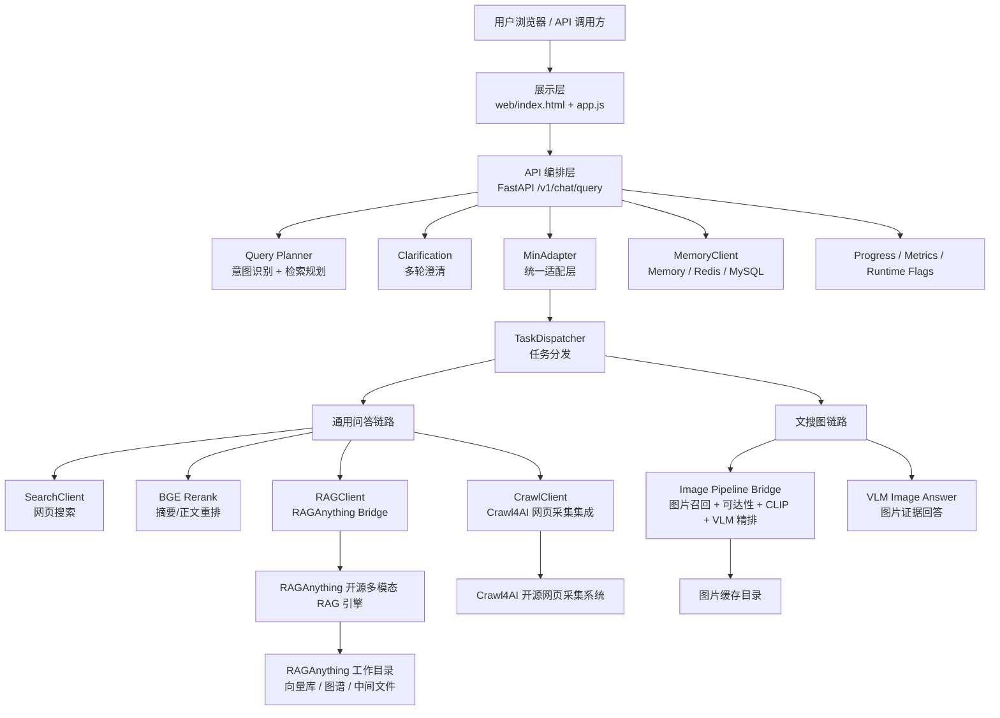
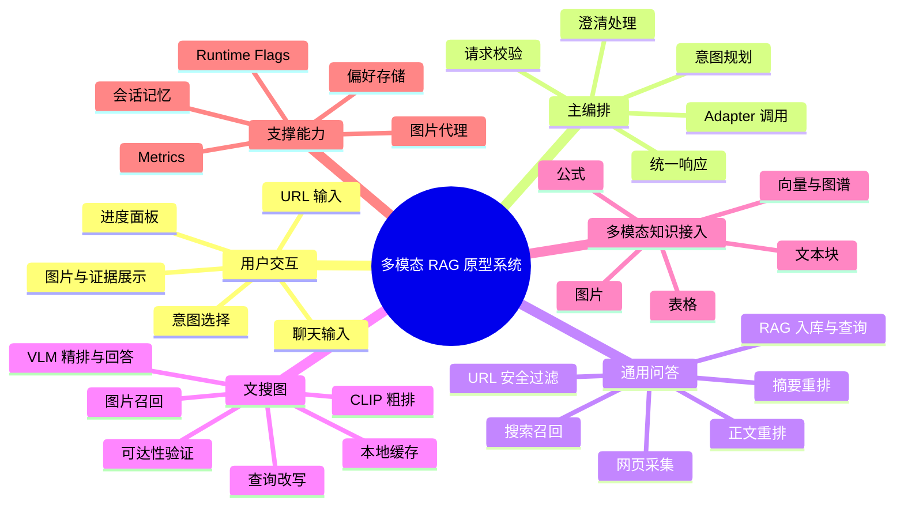
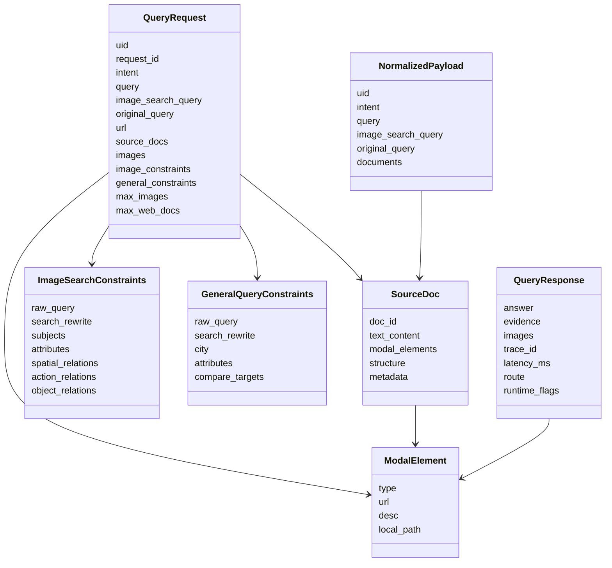
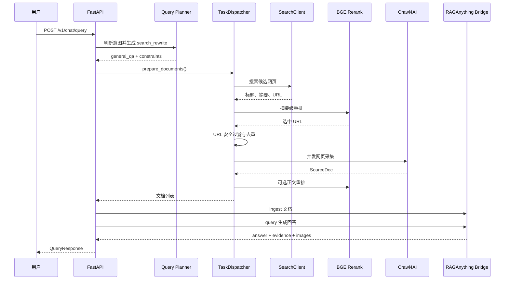
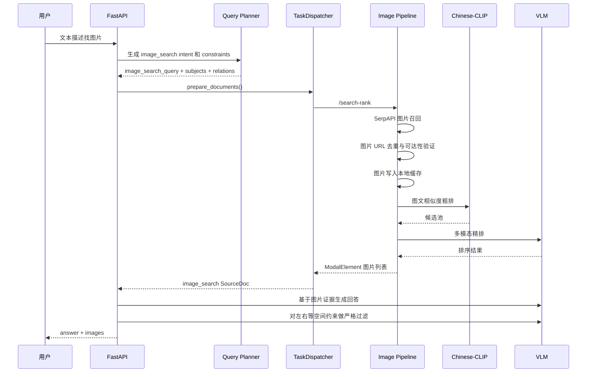

# 系统设计与系统实现扩写稿

> 本文档用于替换或扩写毕业设计论文中的“系统设计”和“系统实现”两部分。写作口径为：系统设计侧重说明系统蓝图、模块边界、数据模型、接口模型和流程规划；系统实现侧重说明这些设计在工程代码中如何落地，并用关键代码片段、运行流程和截图占位作为实现证据。

# 3 系统设计

本章在前文需求分析和方案论证的基础上，对面向通用问答与文搜图场景的多模态 RAG 原型系统进行系统设计。系统设计的重点不是描述某一段代码如何编写，而是明确系统由哪些层次和模块构成，各模块之间如何协作，核心数据如何流转，接口如何规划，以及安全性、可扩展性和可观测性如何在系统蓝图层面得到保证。

本系统的核心目标是为用户提供统一的自然语言交互入口，使用户既可以提出开放域通用问题，也可以通过文本描述检索图片，并获得带有证据说明的回答。由于系统同时涉及网页搜索、网页内容采集、重排序、多模态 RAG、图片检索、视觉语言模型、会话记忆和前端展示等能力，如果直接把所有逻辑耦合在一个接口中，将造成维护困难和扩展困难。因此，系统采用分层架构和桥接集成设计，将外部开源系统、模型服务和本项目自研编排逻辑解耦。

## 3.1 设计目标与原则

系统设计目标主要包括以下几个方面。

第一，统一入口与统一响应。系统对外提供统一的 `/v1/chat/query` 接口，无论用户发起通用问答、指定网页问答还是文搜图请求，都通过同一个请求模型进入系统，并通过统一响应模型返回答案、证据、图片、运行链路和调试标记。这样可以降低前端和调用方的接入复杂度。

第二，任务自动分流。系统需要根据用户 query 自动判断当前任务属于通用问答还是图片检索，并生成适合后续检索链路的改写 query 和结构化约束。对于普通问答，检索 query 应适合网页搜索和 RAG 查询；对于文搜图，检索 query 应适合图片搜索和图文匹配。

第三，证据优先的问答链路。通用问答不能直接依赖大模型的参数知识，而应通过搜索、网页采集、重排和 RAG 入库形成证据，再基于证据生成回答。这样可以提高回答的可追溯性和实时性。

第四，多模态内容统一接入。网页中的正文、标题、列表、表格、图片等内容应被转换为统一的中间结构，最终进入多模态 RAG 引擎。图片检索链路也应返回可解释的图片证据，而不是简单展示图片 URL。

第五，安全和可观测。系统会主动访问用户提供的 URL、搜索结果 URL 和图片 URL，因此需要在设计阶段考虑 SSRF 防护、本地文件访问限制、重定向校验、超时控制和降级策略。同时，系统需要通过进度事件、运行标记和指标暴露关键执行路径，便于调试和论文测试分析。

基于以上目标，系统遵循以下设计原则。

模块化原则：将主 API 编排、任务分发、网页采集、RAG Bridge、图像 pipeline、记忆管理、前端展示等能力拆分为相对独立的模块，每个模块只承担明确职责。

分层解耦原则：接口层不直接调用具体模型，业务层不直接处理底层 HTTP 细节，集成层负责把开源组件和模型服务封装为稳定接口。

可降级原则：搜索、爬虫、BGE、RAGAnything、VLM、Redis、MySQL 等能力都可能不可用，系统应优先记录运行标记并返回可解释结果，而不是让整个链路崩溃。

数据契约优先原则：通过 Pydantic 模型明确请求、响应、文档、模态元素和约束结构，使不同模块之间通过稳定数据结构协作。

安全前置原则：在请求模型、任务分发和图片代理等入口处尽早执行 URL 安全校验，避免危险 URL 进入后续网络访问环节。

## 3.2 系统总体架构设计

系统整体采用 B/S 结构和分层后端架构。前端浏览器作为展示层，FastAPI 主服务作为 API 编排层，业务服务模块作为服务层，Crawl4AI、RAGAnything、图像 pipeline、Rasa、模型 API 等通过集成桥接层接入，Redis、MySQL、本地缓存和 RAG 存储作为存储层。

系统总体架构如图 3-1 所示。



图 3-1 中，各层职责如下。

展示层负责用户输入、意图选择、URL 输入、答案展示、证据展示、图片展示和进度展示。前端不直接访问搜索到的图片，而是通过后端图片代理加载图片，减少跨域、防盗链和不安全 URL 问题。

API 编排层由 FastAPI 主服务实现，负责请求校验、`request_id` 生成、运行标记初始化、意图规划、澄清判断、调用适配层、异常处理和统一响应。该层是系统的对外门面，但不直接实现网页搜索、爬虫、RAG 或图像模型推理。

服务层负责系统核心业务逻辑，包括 query planner、任务分发、搜索客户端、网页采集客户端、BGE 重排客户端、RAG 客户端、记忆客户端、图片答案生成等。服务层通过明确的数据模型进行协作。

集成桥接层负责连接外部开源系统或模型服务。例如，Crawl4AI 是开源网页采集系统，本项目通过 `CrawlClient` 将其 SDK 或 HTTP 接口封装为统一的 `SourceDoc` 输出；RAGAnything 是开源多模态 RAG 系统，本项目通过 `raganything_bridge.py` 将主服务的文档模型转换为 RAGAnything 的 `content_list` 输入；图像 pipeline bridge 则将 SerpAPI、Chinese-CLIP 和 VLM 排序能力封装为统一图片检索接口。

存储层包括 RAGAnything 工作目录、图片缓存目录、内存会话、Redis、MySQL 等。不同存储承担不同职责：RAGAnything 工作目录用于保存解析文件、向量和图谱等中间结果；图片缓存用于保障开放域图片可展示；Redis/MySQL 用于保存用户历史和偏好。

## 3.3 功能模块划分

从业务角度看，系统可以划分为通用问答、指定网页问答、文搜图、图像证据回答、多轮澄清和运行观测六类功能；从工程角度看，可以划分为主编排模块、意图规划模块、任务分发模块、网页采集集成模块、多模态 RAG 集成模块、图像检索桥接模块、记忆模块、安全模块和前端模块。

系统功能模块结构如图 3-2 所示。



各模块设计说明如下。

主编排模块负责系统请求生命周期控制。它接收 `QueryRequest`，初始化进度和指标，根据 request 中是否显式指定 intent 决定是否调用 query planner，再根据最终 intent 调用对应处理链路。主编排模块的输出必须符合 `QueryResponse`。

意图规划模块负责将用户自然语言 query 转换为任务意图和检索规划。该模块采用一次 LLM JSON 调用同时完成 intent routing 和 query/constraints planning，避免传统“先意图识别、再场景解析”造成两次 LLM 调用和更高延迟。

任务分发模块负责根据 intent 选择通用问答链路或文搜图链路。通用问答链路处理用户直传文档、指定 URL 和开放搜索三种输入；文搜图链路处理用户直传图片和外部图片检索两种输入。

网页采集集成模块负责将网页 URL 转换为适合 RAG 的结构化文档。该模块基于开源 Crawl4AI 系统，保留网页 Markdown、媒体、表格、链接和完整采集快照，便于后续多模态 RAG Bridge 进一步转换。

多模态 RAG 集成模块负责把主服务中的 `NormalizedDocument` 转换为 RAGAnything 可以处理的 `content_list`，并调用 RAGAnything 的入库和查询能力。该模块解决的是本项目数据结构与开源 RAGAnything 输入结构之间的适配问题。

图像检索桥接模块负责开放域图片召回、图片可达性检查、本地缓存、Chinese-CLIP 粗排、VLM 精排和调试信息返回。由于图片搜索结果经常存在失效链接、防盗链和内容不匹配问题，该模块将可达性验证放在排序之前。

记忆模块负责保存用户最近若干轮对话和偏好信息。它支持内存、Redis、MySQL 和 hybrid 四种模式，使毕业设计阶段可以轻量运行，也能扩展到更稳定的持久化环境。

安全模块主要负责 URL 安全校验和图片代理安全控制。系统拒绝访问 localhost、私有 IP、link-local、reserved 等地址，并对图片代理中的每次重定向重新校验目标 URL。

前端模块负责轻量化交互演示。前端使用原生 HTML、CSS 和 JavaScript，不依赖复杂框架，便于部署和论文展示。

为了进一步明确各模块边界，表 3-1 给出了核心模块的输入、输出和主要约束。该表可以作为系统详细设计和后续实现章节之间的对应关系。

| 模块 | 主要输入 | 主要输出 | 设计约束 |
|---|---|---|---|
| FastAPI 主编排模块 | `QueryRequest` | `QueryResponse` | 不直接实现模型推理，只负责请求生命周期和模块编排 |
| Query Planner | 用户 `query`、上下文信息、请求限制 | `QueryPlan` | 一次 LLM 调用同时输出 intent 和 constraints，失败快速降级 |
| Clarification | 当前 query、pending 状态、用户偏好 | 澄清问题或合并后的 query | 只处理必要缺槽，不打断信息充分的请求 |
| TaskDispatcher | 带 intent 的 `QueryRequest` | `list[SourceDoc]`、`list[ModalElement]` | 按 intent 分流，统一输出证据文档 |
| SearchClient | 检索 query、候选数量 | 搜索摘要 `SourceDoc` | 支持远程搜索、SerpAPI 和占位降级 |
| BGERerankClient | query、候选文档 | 重排后的文档列表 | 模型不可用时保持原顺序并记录 fallback |
| CrawlClient | 安全 URL | 网页 `SourceDoc` | 支持本地 Crawl4AI SDK、远程服务和降级 |
| RAGClient | `NormalizedDocument`、tags、query | RAG 查询响应 | 优先远程 RAGAnything Bridge，失败转本地 fallback |
| RAGAnything Bridge | ingest/query 请求 | RAGAnything 入库结果或回答 | 负责 content_list 转换、图片本地化和弱证据缓存 |
| ImagePipelineClient | 图片检索 query、top_k | `ModalElement` 图片列表 | 对接图像 pipeline，失败记录 image pipeline fallback |
| Image Pipeline Bridge | query、top_k | 可访问图片、debug 信息 | 图片召回、去重、缓存、CLIP 粗排、VLM 精排 |
| MemoryClient | uid、query、answer、intent | history、preferences | 支持 memory/Redis/MySQL/hybrid |
| Image Proxy | `url` 或 `local_path` | 图片二进制响应 | 校验 URL、重定向、本地目录和 MIME 类型 |

从该表可以看出，系统设计采用“输入输出契约驱动”的方式。每个模块不暴露内部实现细节，而是通过明确的数据模型交互。例如，CrawlClient 内部可以使用本地 SDK 或远程服务，但对上层始终返回 `SourceDoc`；RAGClient 内部可以使用远程 RAGAnything Bridge 或本地 fallback，但对 Adapter 始终返回 `QueryResponse`。

## 3.4 核心数据模型设计

数据模型是系统设计的核心。由于本系统需要在多个模块之间传递用户请求、网页文档、图片元素、结构化约束、RAG 证据和运行状态，因此数据模型必须兼顾表达能力、边界校验和扩展性。

本系统核心数据模型来自 `app/models/schemas.py`，总体关系如图 3-3 所示。



### 3.4.1 请求数据模型 QueryRequest

`QueryRequest` 是系统对外请求入口，承载用户输入、可选意图、可选 URL、可选源文档、图片候选和运行限制。设计该模型的目的，是让不同任务都能通过同一接口进入系统，同时在入口处完成基本边界校验。

以下代码片段展示了 `QueryRequest` 的主要结构。为便于论文阅读，代码中加入字段说明，省略了部分导入语句。

```python
class QueryRequest(BaseModel):
    # 用户 ID，用于区分会话记忆和偏好；限制长度避免异常输入。
    uid: str = Field(min_length=1, max_length=128)

    # 前端或调用方可传入 request_id；为空时后端自动生成。
    request_id: str | None = Field(default=None, min_length=6, max_length=128)

    # 可选显式意图。为空时由 Query Planner 自动判断。
    intent: Literal["image_search", "general_qa"] | None = None

    # 当前处理 query，是系统执行链路的主要输入。
    query: str = Field(min_length=1, max_length=4000)

    # 文搜图专用召回 query。它和 query 分离，避免检索改写影响最终回答语义。
    image_search_query: str | None = None

    # 用户原始表达。即使 query 被改写，也保留原始语义用于回答。
    original_query: str | None = None

    # 指定网页问答 URL。必须是公开 http/https URL。
    url: str | None = Field(default=None, max_length=2048)

    # 用户直接上传或上游传入的证据文档。
    source_docs: list[SourceDoc] = Field(default_factory=list)

    # 用户直接提供的图片或图像 pipeline 返回的图片候选。
    images: list[ModalElement] = Field(default_factory=list)

    # 文搜图结构化约束，例如主体、数量、空间关系等。
    image_constraints: ImageSearchConstraints | None = None

    # 通用问答结构化约束，例如城市、属性、比较对象等。
    general_constraints: GeneralQueryConstraints | None = None

    # 是否允许 Rasa 作为意图识别兜底。
    use_rasa_intent: bool = True

    # 意图置信度阈值，低于阈值时进入兜底逻辑。
    intent_confidence_threshold: float = Field(default=0.6, ge=0.0, le=1.0)

    # 文搜图最大返回图片数。
    max_images: int = Field(default=5, ge=1, le=12)

    # 通用问答最大网页文档数。
    max_web_docs: int = Field(default=5, ge=1, le=10)

    # 搜索候选网页上限，避免过大的开放域搜索开销。
    max_web_candidates: int | None = Field(default=None, ge=1, le=50)

    @field_validator("url")
    @classmethod
    def validate_http_url(cls, value: str | None) -> str | None:
        if value is None:
            return None
        if not is_safe_public_http_url(value):
            raise ValueError("url must be a public http or https URL")
        return value
```

字段含义进一步说明如下。

| 字段 | 类型 | 含义 | 设计作用 |
|---|---|---|---|
| `uid` | `str` | 用户或会话标识 | 关联会话记忆、用户偏好和历史上下文 |
| `request_id` | `str \| None` | 单次请求标识 | 关联 progress 事件，便于前端轮询进度 |
| `intent` | `image_search/general_qa/None` | 用户显式指定或系统推断的任务类型 | 控制进入通用问答链路还是文搜图链路 |
| `query` | `str` | 当前执行 query | 通用问答中可被改写为更适合检索的 query |
| `image_search_query` | `str \| None` | 图片检索专用 query | 文搜图召回使用，避免污染最终回答语义 |
| `original_query` | `str \| None` | 用户原始输入 | 用于回答生成、澄清恢复和语义保真 |
| `url` | `str \| None` | 指定网页 URL | 触发指定网页问答，入口处进行 SSRF 防护 |
| `source_docs` | `list[SourceDoc]` | 直接传入的证据文档 | 支持外部系统或测试绕过网页搜索 |
| `images` | `list[ModalElement]` | 直接传入的图片元素 | 支持用户图片或已有图片候选参与回答 |
| `image_constraints` | `ImageSearchConstraints \| None` | 文搜图约束 | 表示主体、属性、数量、空间关系等 |
| `general_constraints` | `GeneralQueryConstraints \| None` | 问答约束 | 表示城市、属性、比较对象、澄清状态等 |
| `use_rasa_intent` | `bool` | 是否启用 Rasa 兜底 | 在 LLM planner 不可用时提高可用性 |
| `intent_confidence_threshold` | `float` | 意图置信度阈值 | 控制 planner/Rasa 结果是否被采信 |
| `max_images` | `int` | 图片返回数量上限 | 限制文搜图开销和前端展示规模 |
| `max_web_docs` | `int` | 网页文档数量上限 | 限制 crawl/RAG 入库规模 |
| `max_web_candidates` | `int \| None` | 搜索候选数量 | 控制搜索召回和重排范围 |

该模型的关键设计点是区分 `query`、`original_query` 和 `image_search_query`。其中 `query` 是当前链路执行使用的文本，可能被通用问答 planner 改写；`original_query` 保存用户最初语义，避免回答阶段丢失用户原意；`image_search_query` 只用于图片召回，通常会比原始 query 更偏向搜索引擎关键词表达。这个设计避免了一个常见问题：如果直接把文搜图检索改写覆盖 `query`，最终 VLM 回答会围绕改写后的关键词而不是用户原话生成解释。

### 3.4.2 证据文档模型 SourceDoc 与模态元素模型 ModalElement

`SourceDoc` 是任务分发阶段的证据文档模型。无论证据来自搜索结果、网页采集、用户上传文档还是图片 pipeline，最终都先被组织成 `SourceDoc`。这样，后续 Adapter 和 RAG Bridge 不需要关心证据来源。

```python
class ModalElement(BaseModel):
    # 模态类型：图片、表格、公式或通用元素。
    type: Literal["image", "table", "equation", "generic"]

    # 远程资源 URL，例如网页图片地址。
    url: str | None = None

    # 模态元素描述，例如图片 alt、表格说明或公式解释。
    desc: str | None = None

    # 本地缓存路径。图片经过可达性验证或下载后优先使用该字段。
    local_path: str | None = None


class SourceDoc(BaseModel):
    # 文档唯一标识，通常包含来源类型和 URL hash。
    doc_id: str

    # 文本正文，网页场景中通常是 Markdown。
    text_content: str = ""

    # 文档中的图片、表格、公式等多模态元素。
    modal_elements: list[ModalElement] = Field(default_factory=list)

    # 半结构化内容，例如网页标题、表格、链接、图片搜索结果类型等。
    structure: dict[str, Any] = Field(default_factory=dict)

    # 来源、URL、标题、完整 Crawl4AI 快照等元信息。
    metadata: dict[str, Any] = Field(default_factory=dict)
```

`ModalElement` 的字段设计说明如下。

| 字段 | 含义 | 示例 |
|---|---|---|
| `type` | 模态元素类别 | `image`、`table`、`equation`、`generic` |
| `url` | 远程资源地址 | 搜索引擎返回的图片 URL，网页中的图片 src |
| `desc` | 元素描述 | 图片 alt 文本、表格标题、公式说明 |
| `local_path` | 本地缓存路径 | 图片 pipeline 下载后的缓存文件路径 |

`SourceDoc` 的字段设计说明如下。

| 字段 | 含义 | 设计理由 |
|---|---|---|
| `doc_id` | 文档 ID | 在 RAG 入库、证据返回和调试中追踪文档 |
| `text_content` | 文本正文 | 为 RAG 文本检索提供基础内容 |
| `modal_elements` | 多模态元素列表 | 保留图片、表格、公式等非纯文本证据 |
| `structure` | 结构化信息 | 保存表格、链接、网页结构和图片搜索结果类型 |
| `metadata` | 元信息 | 保存来源、URL、标题、完整采集快照、查询词等 |

设计上，`SourceDoc` 并不直接等同于数据库表，而是系统内部的标准证据交换格式。其优势在于：网页搜索结果可以只包含标题和摘要；网页采集结果可以包含 Markdown、媒体、表格和链接；图片检索结果可以把多张图片封装为一个 `image_search_result` 文档。不同来源的证据通过同一模型进入 Adapter。

### 3.4.3 文搜图约束模型 ImageSearchConstraints

文搜图场景与普通问答不同，用户 query 中经常包含主体、数量、风格、地点、时间、空间关系和动作关系。例如“找几张金毛在左边、边牧在右边的合照”不仅要求找狗的图片，还要求满足左右位置关系。为了让后续检索和 VLM 筛选有明确依据，系统设计了 `ImageSearchConstraints`。

```python
class SpatialRelationConstraint(BaseModel):
    # 空间关系类型，例如 left_of、right_of、next_to 等。
    relation: Literal["left_of", "right_of", "next_to", "on", "under", ...]

    # 关系中的主主体。
    primary_subject: str

    # 关系中的次主体。
    secondary_subject: str


class ActionRelationConstraint(BaseModel):
    # 动作主体，例如“人”“猫”“狗”。
    subject: str

    # 动作动词，例如“骑”“抱着”“追逐”。
    verb: str

    # 动作对象。
    object: str


class ObjectRelationConstraint(BaseModel):
    # 主体。
    subject: str

    # 主体与对象之间的关系。
    relation: str

    # 对象。
    object: str


class ImageSearchConstraints(BaseModel):
    raw_query: str
    search_rewrite: str | None = None
    subjects: list[str] = Field(default_factory=list)
    attributes: list[str] = Field(default_factory=list)
    subject_synonyms: dict[str, list[str]] = Field(default_factory=dict)
    style_terms: list[str] = Field(default_factory=list)
    exclude_terms: list[str] = Field(default_factory=list)
    count: int | None = None
    landmark: str | None = None
    time_of_day: str | None = None
    must_have_all_subjects: bool = True
    spatial_relations: list[SpatialRelationConstraint] = Field(default_factory=list)
    action_relations: list[ActionRelationConstraint] = Field(default_factory=list)
    object_relations: list[ObjectRelationConstraint] = Field(default_factory=list)
    needs_clarification: bool = False
    clarification_question: str | None = None
    parser_source: str = "heuristic"
```

字段说明如下。

| 字段 | 含义 | 作用 |
|---|---|---|
| `raw_query` | 用户原始图片请求 | 保留用户真实语义 |
| `search_rewrite` | 图片检索改写词 | 面向搜索引擎召回，提高候选覆盖率 |
| `subjects` | 图片主体列表 | 指定必须出现的对象或人物 |
| `attributes` | 主体属性 | 颜色、姿态、年龄、服装、环境等 |
| `subject_synonyms` | 主体同义词 | 用于扩展搜索词，例如“金毛/Golden Retriever” |
| `style_terms` | 风格词 | 壁纸、写实、插画、高清、电影感等 |
| `exclude_terms` | 排除词 | 避免不希望出现的元素 |
| `count` | 图片数量 | 控制最终返回图片数量 |
| `landmark` | 地点或地标 | 适合旅游、城市、建筑图片搜索 |
| `time_of_day` | 时间条件 | 夜景、清晨、黄昏等 |
| `must_have_all_subjects` | 是否必须包含所有主体 | 控制多主体图片的严格程度 |
| `spatial_relations` | 空间关系 | 左右、上下、前后、相邻等约束 |
| `action_relations` | 动作关系 | 人骑马、猫追球等 |
| `object_relations` | 对象关系 | 主体与物体之间的持有、穿戴、包含等 |
| `needs_clarification` | 是否需要澄清 | 当 query 过泛时触发追问 |
| `clarification_question` | 澄清问题 | 返回给用户的问题文本 |
| `parser_source` | 约束来源 | 标记来自 planner、LLM parser 还是 heuristic |

该模型使文搜图不再只是关键词匹配，而是将用户需求分解为可检索、可排序和可验证的结构化条件。搜索阶段主要使用 `search_rewrite`、`subjects`、`attributes` 和 `style_terms`；排序阶段使用主体和描述信息；VLM 严格筛选阶段重点使用 `spatial_relations`、`action_relations` 和 `object_relations`。

### 3.4.4 通用问答约束模型 GeneralQueryConstraints

通用问答场景同样需要结构化约束。例如天气问题需要城市，比较问题需要比较对象，推荐类问题需要属性条件。因此系统设计了 `GeneralQueryConstraints`。

```python
class GeneralQueryConstraints(BaseModel):
    # 原始 query。
    raw_query: str

    # 面向网页搜索和 RAG 检索的改写 query。
    search_rewrite: str | None = None

    # 城市条件，主要用于天气、地点相关问答。
    city: str | None = None

    # 关注属性，例如价格、性能、天气、优缺点等。
    attributes: list[str] = Field(default_factory=list)

    # 比较对象，例如两个产品、两个城市、两个方案。
    compare_targets: list[str] = Field(default_factory=list)

    # 是否需要补充信息。
    needs_clarification: bool = False

    # 澄清问题。
    clarification_question: str | None = None

    # 解析来源。
    parser_source: str = "heuristic"
```

通用问答约束模型主要服务于三类场景。第一类是搜索改写，例如将“今天那边天气怎么样”结合用户偏好城市改写为“北京今天天气 温度 降雨 风力”。第二类是澄清，例如用户询问“明天天气怎么样”但没有城市时，系统返回澄清问题。第三类是回答约束，例如天气类回答要求聚焦天气，不展开城市历史、旅游景点等无关内容。

### 3.4.5 归一化模型 NormalizedPayload

`NormalizedPayload` 是 Adapter 输出给 RAG 和回答模块的统一内部模型。它的设计目标是将上游请求和任务分发结果归一化，保证后续处理不再关心输入来源。

```python
class NormalizedDocument(BaseModel):
    doc_id: str
    text: str
    modal_elements: list[ModalElement] = Field(default_factory=list)
    metadata: dict[str, Any] = Field(default_factory=dict)


class NormalizedPayload(BaseModel):
    uid: str
    request_id: str | None = None
    intent: Literal["image_search", "general_qa"]
    query: str
    image_search_query: str | None = None
    original_query: str | None = None
    max_images: int = 5
    image_constraints: ImageSearchConstraints | None = None
    general_constraints: GeneralQueryConstraints | None = None
    documents: list[NormalizedDocument] = Field(default_factory=list)
```

与 `SourceDoc` 相比，`NormalizedDocument` 更接近 RAG 和回答模块的输入格式：`text_content` 被规范为 `text`，`structure` 被合并到 `metadata["crawl_structure"]` 中，多模态元素保持不变。这个模型是系统内部重要分界线：在 Adapter 之前，系统关注任务分流和证据准备；在 Adapter 之后，系统关注 RAG 入库和回答生成。

### 3.4.6 响应模型 QueryResponse

`QueryResponse` 是系统对外返回结果模型，统一表达答案、证据、图片和运行状态。

```python
class EvidenceItem(BaseModel):
    # 证据来源文档 ID。
    doc_id: str

    # 证据相关性得分。
    score: float

    # 证据片段。
    snippet: str


class ImageItem(BaseModel):
    # 图片远程 URL。
    url: str

    # 图片描述。
    desc: str | None = None

    # 图片本地缓存路径。
    local_path: str | None = None


class QueryResponse(BaseModel):
    # 最终自然语言回答。
    answer: str

    # 文本证据列表。
    evidence: list[EvidenceItem] = Field(default_factory=list)

    # 图片证据列表。
    images: list[ImageItem] = Field(default_factory=list)

    # 链路追踪 ID。
    trace_id: str

    # 本次回答耗时，单位毫秒。
    latency_ms: int

    # 实际执行路线。
    route: Literal["image_search", "general_qa"] | None = None

    # 运行标记，例如 fallback、skip、filter 等。
    runtime_flags: list[str] = Field(default_factory=list)
```

响应模型设计中，`runtime_flags` 是非常重要的调试字段。它可以告诉调用方本次请求是否发生了 planner 兜底、搜索兜底、BGE 兜底、RAG 本地降级、文搜图跳过 RAG 入库、空间约束过滤等情况。毕业设计测试时，可以通过该字段解释不同测试样例为什么走不同链路。

### 3.4.7 会话记忆数据模型

系统记忆模块支持内存、Redis、MySQL 和 hybrid 四种模式。设计上，记忆数据分为历史对话和用户偏好两类。

历史对话结构如下。

| 字段 | 含义 |
|---|---|
| `uid` | 用户标识 |
| `query` / `query_text` | 用户问题 |
| `answer` / `answer_text` | 系统回答 |
| `intent` | 本轮任务意图 |
| `created_at` | MySQL 模式下的创建时间 |

用户偏好结构如下。

| 字段 | 含义 |
|---|---|
| `uid` | 用户标识 |
| `pref_key` | 偏好键，例如 `answer_style`、`pending_clarification` |
| `pref_value` | JSON 格式偏好值 |
| `updated_at` | MySQL 模式下的更新时间 |

MySQL 物理表结构设计如下。

```sql
CREATE TABLE IF NOT EXISTS user_memory_history (
    id BIGINT PRIMARY KEY AUTO_INCREMENT,
    uid VARCHAR(128) NOT NULL,
    query_text TEXT NOT NULL,
    answer_text TEXT NOT NULL,
    intent VARCHAR(64) NOT NULL,
    created_at TIMESTAMP DEFAULT CURRENT_TIMESTAMP
);

CREATE TABLE IF NOT EXISTS user_preferences (
    id BIGINT PRIMARY KEY AUTO_INCREMENT,
    uid VARCHAR(128) NOT NULL,
    pref_key VARCHAR(128) NOT NULL,
    pref_value JSON NOT NULL,
    updated_at TIMESTAMP DEFAULT CURRENT_TIMESTAMP ON UPDATE CURRENT_TIMESTAMP,
    UNIQUE KEY uniq_user_pref (uid, pref_key)
);
```

这里没有将所有会话状态拆成复杂关系表，是因为本系统属于原型系统，主要需求是保存最近上下文和少量用户偏好。`user_memory_history` 采用追加写入方式，便于追溯历史；`user_preferences` 使用 `uid + pref_key` 唯一约束，便于覆盖更新澄清状态和回答风格。

Redis 模式下，系统采用 key-value/list/hash 组合设计，避免为轻量记忆引入复杂 schema。历史记录 key 的格式为：

```text
{redis_prefix}:history:{uid}
```

该 key 对应 Redis list，系统通过 `LPUSH` 写入最新对话，再通过 `LTRIM` 保留最近 `memory_max_turns` 条。偏好 key 的格式为：

```text
{redis_prefix}:prefs:{uid}
```

该 key 对应 Redis hash，field 为偏好名称，value 为 JSON 字符串。例如，`pending_clarification` 用于保存正在等待用户补充的信息，`answer_style` 可用于保存用户期望的回答风格。Redis 结构适合快速读写，MySQL 结构适合持久保存，hybrid 模式则优先使用 Redis，同时保留 MySQL 回退能力。

### 3.4.8 QueryPlan 内部规划模型

`QueryPlan` 是 Query Planner 的内部输出模型。虽然它不是外部 API 的请求或响应，但它是系统意图解析架构的核心数据结构。

```python
@dataclass
class QueryPlan:
    # 最终任务意图，决定进入 general_qa 或 image_search。
    intent: IntentType

    # LLM 对该意图和规划结果的置信度。
    confidence: float

    # 规划来源，正常为 llm_planner。
    source: str

    # 抽取出的通用实体，例如 city、landmark、image_count。
    entities: dict[str, str] = field(default_factory=dict)

    # 文搜图约束，仅在 image_search 场景下有效。
    image_constraints: ImageSearchConstraints | None = None

    # 通用问答约束，仅在 general_qa 场景下有效。
    general_constraints: GeneralQueryConstraints | None = None

    # 本次规划产生的运行标记。
    flags: list[str] = field(default_factory=list)
```

字段说明如下。

| 字段 | 含义 | 与后续链路的关系 |
|---|---|---|
| `intent` | 规划出的任务类型 | 控制 TaskDispatcher 分支 |
| `confidence` | 规划置信度 | 低于阈值时不采信，进入 Rasa/heuristic 兜底 |
| `source` | 结果来源 | 写入日志或 runtime flags，便于调试 |
| `entities` | 通用实体字典 | 可辅助 query 改写和澄清判断 |
| `image_constraints` | 文搜图约束对象 | 用于图片召回、VLM prompt 和空间过滤 |
| `general_constraints` | 通用问答约束对象 | 用于搜索改写、天气城市和比较对象 |
| `flags` | 运行标记 | 合并进本次响应的 runtime flags |

该模型的意义在于把“自然语言理解结果”从松散字符串变成结构化对象。后续代码不需要重新解析 LLM 原始输出，而是直接读取约束字段执行对应逻辑。

### 3.4.9 Bridge 请求模型与图像候选模型

RAGAnything Bridge 对外的 ingest 请求模型如下。

```python
class IngestDocument(BaseModel):
    # 文档 ID，与主服务中的 NormalizedDocument.doc_id 对应。
    doc_id: str

    # 文档文本正文，通常为 Markdown 或普通文本。
    text: str = ""

    # 图片、表格、公式等多模态元素，以 dict 形式接收，便于 HTTP 传输。
    modal_elements: list[dict[str, Any]] = Field(default_factory=list)

    # 来源、URL、crawl4ai_full、crawl_structure 等元信息。
    metadata: dict[str, Any] = Field(default_factory=dict)


class IngestRequest(BaseModel):
    # 本次需要入库的文档列表。
    documents: list[IngestDocument]

    # 标签信息，例如 uid 和 intent。
    tags: dict[str, Any] = Field(default_factory=dict)
```

该模型与主服务中的 `NormalizedDocument` 高度对应，但为了降低 Bridge 与主服务模型版本之间的耦合，`modal_elements` 使用 `dict` 接收。Bridge 只关心字段语义，不依赖主服务 Pydantic 类本身。

图像 pipeline 中的候选图片模型如下。

```python
@dataclass
class ImageCandidate:
    # 原始远程图片 URL。
    url: str

    # 搜索引擎返回的标题。
    title: str = ""

    # 搜索引擎返回的摘要或说明。
    desc: str = ""

    # 候选来源，例如 serpapi、unsplash_source。
    source: str = "unknown"

    # 排序分数，CLIP 或降级算法会写入该字段。
    score: float = 0.0

    # 下载并缓存后的本地路径。
    local_path: str | None = None
```

该模型的关键字段是 `local_path`。只有通过可达性验证并成功缓存的图片才会拥有该字段。后续 CLIP、VLM 和前端代理都优先使用本地路径，从而减少重复访问远程图片和前端展示失败。

### 3.4.10 进度事件、指标与运行标记模型

系统的可观测数据虽然不属于业务数据库，但对毕业设计测试和问题定位非常重要。进度事件模型可以抽象为以下结构。

```python
{
    "request_id": "req_xxx",       # 请求 ID
    "status": "running",          # running / completed / error / not_found
    "created_at_ms": 1710000000000,
    "updated_at_ms": 1710000001200,
    "events": [
        {
            "ts_ms": 1710000000100,        # 事件时间
            "elapsed_ms": 100,             # 距请求开始耗时
            "seq": 1,                      # 事件序号
            "stage": "general_qa.search_hits",
            "message": "搜索引擎候选已返回。",
            "data": {"hits_count": 12}
        }
    ]
}
```

核心字段说明如下。

| 字段 | 含义 |
|---|---|
| `request_id` | 与请求模型中的 request_id 一致 |
| `status` | 请求执行状态 |
| `created_at_ms` | 进度记录创建时间 |
| `updated_at_ms` | 最近更新时间 |
| `events` | 阶段事件列表 |
| `stage` | 阶段名称，采用模块化命名 |
| `message` | 展示给前端的阶段说明 |
| `data` | 阶段附加数据，例如候选数量、URL 列表、耗时等 |

Metrics 模型用于全局计数，主要字段如下。

| 指标 | 含义 |
|---|---|
| `requests_total` | 总请求数 |
| `requests_success_total` | 成功请求数 |
| `requests_failed_total` | 失败请求数 |
| `intent_fallback_total` | 意图兜底次数 |
| `rag_ingest_fallback_total` | RAG 入库降级次数 |
| `rag_query_fallback_total` | RAG 查询降级次数 |
| `search_fallback_total` | 搜索降级次数 |
| `crawl_fallback_total` | 网页采集降级次数 |
| `bge_rerank_fallback_total` | BGE 重排降级次数 |
| `image_pipeline_fallback_total` | 图像 pipeline 降级次数 |
| `clarification_needed_total` | 返回澄清问题次数 |
| `total_latency_ms_sum` | 总端到端延迟累计 |
| `rag_latency_ms_sum` | RAG 阶段延迟累计 |

Runtime flags 是单次请求级别的集合。常见标记如下。

| Runtime flag | 含义 |
|---|---|
| `query_planner_llm` | 本次使用 LLM planner |
| `intent_fallback` | planner 或 Rasa 未命中，进入兜底 |
| `intent_heuristic_image_search` | heuristic 判定为文搜图 |
| `intent_heuristic_general_qa` | heuristic 判定为通用问答 |
| `image_query_rewritten` | 图片检索 query 被改写 |
| `general_query_rewritten` | 通用问答 query 被改写 |
| `clarification_needed` | 本轮返回澄清问题 |
| `unsafe_crawl_url_skipped` | 搜索结果中存在不安全 URL 被跳过 |
| `search_fallback` | 搜索服务降级 |
| `crawl_fallback` | 网页采集降级 |
| `bge_rerank_fallback` | BGE 重排降级 |
| `rag_ingest_fallback` | RAG 入库降级 |
| `rag_query_fallback` | RAG 查询降级 |
| `image_search_ingest_skipped` | 文搜图跳过普通 RAG 入库 |
| `image_search_vlm_selected_applied` | 文搜图采用 VLM 选择结果 |
| `image_search_vlm_spatial_filter_applied` | 应用了空间关系严格过滤 |
| `image_search_vlm_answer_generated` | VLM 成功生成图片答案 |

这些字段使系统具备“响应可解释性”。论文测试章节可以结合 runtime flags 分析每个用例实际经过了哪些阶段，而不只是展示最终结果。

## 3.5 接口设计

系统采用 REST 风格接口，对外主要提供聊天查询、进度查询、图片代理、健康检查和指标接口。

### 3.5.1 聊天查询接口

| 项目 | 内容 |
|---|---|
| 接口路径 | `POST /v1/chat/query` |
| 请求体 | `QueryRequest` |
| 响应体 | `QueryResponse` |
| 功能 | 根据用户 query 执行通用问答或文搜图 |

请求示例如下。

```json
{
  "uid": "web-user-001",
  "query": "帮我找几张金毛在左边、边牧在右边的合照",
  "use_rasa_intent": true,
  "intent_confidence_threshold": 0.6,
  "max_images": 5,
  "max_web_docs": 5
}
```

响应示例如下。

```json
{
  "answer": "已根据图片内容筛选出更符合描述的结果，其中前两张包含两只狗同框，左侧主体更接近金毛，右侧主体更接近边牧。",
  "evidence": [],
  "images": [
    {
      "url": "https://example.com/image.jpg",
      "desc": "two dogs together",
      "local_path": "./raganything_storage/image_pipeline_cache/xxx.jpg"
    }
  ],
  "trace_id": "tr_1234567890",
  "latency_ms": 4567,
  "route": "image_search",
  "runtime_flags": [
    "query_planner_llm",
    "image_query_rewritten",
    "image_search_ingest_skipped",
    "image_search_vlm_answer_generated"
  ]
}
```

### 3.5.2 进度查询接口

| 项目 | 内容 |
|---|---|
| 接口路径 | `GET /v1/chat/progress?request_id=...` |
| 功能 | 查询指定请求的阶段事件 |
| 典型用途 | 前端显示“搜索中、抓取中、RAG 入库中、回答生成中”等过程 |

进度事件用于补足长链路任务的可观测性。通用问答可能涉及搜索、重排、抓取、入库、查询；文搜图可能涉及图片召回、下载、CLIP、VLM，因此仅等待最终响应会造成用户感知较差。进度接口使前端能够展示当前执行阶段。

### 3.5.3 图片代理接口

| 项目 | 内容 |
|---|---|
| 接口路径 | `GET /v1/chat/image-proxy` |
| 参数 | `url` 或 `local_path` |
| 功能 | 为前端安全加载远程图片或本地缓存图片 |

图片代理接口支持两种模式。第一种是远程 URL 模式，后端先校验 URL 协议和 host，再请求图片，并校验 content-type。第二种是本地路径模式，只允许访问图片缓存目录和 RAGAnything 远程图片目录，并校验文件类型。该设计避免前端直接加载外部图片造成跨域、防盗链和安全风险。

### 3.5.4 健康检查和指标接口

| 接口 | 功能 |
|---|---|
| `GET /healthz` | 返回主服务是否存活 |
| `GET /metrics` | 返回 Prometheus 风格指标文本 |
| `GET /v1/chat/progress` | 返回请求级进度 |
| RAG Bridge `/healthz` | 返回 RAGAnything Bridge 是否就绪 |
| Image Pipeline `/healthz` | 返回图像 pipeline 是否就绪 |

## 3.6 通用问答流程设计

通用问答链路采用“搜索召回、摘要重排、安全过滤、网页采集、正文重排、RAG 入库、RAG 查询”的设计。其目标是把用户问题转换为有证据支撑的回答。

流程如图 3-4 所示。



该流程支持三种输入路径。

第一，用户直接传入 `source_docs`。这时系统跳过搜索和网页采集，直接使用用户传入文档作为证据，适合测试和外部系统集成。

第二，用户传入 `url`。这时系统跳过搜索召回，直接对指定 URL 进行安全校验和网页采集，适合“总结这个网页”“根据这个页面回答”等任务。

第三，用户只输入普通问题。系统先使用搜索引擎召回候选网页，再通过 BGE 对标题摘要重排，选择更相关的 URL 进行抓取。抓取后还可以对正文进行二次重排，减少无关网页进入 RAG。

这种设计把召回和精排分开：搜索引擎负责覆盖率，BGE 负责语义相关性，Crawl4AI 负责网页结构化，RAGAnything 负责知识入库和回答生成。

## 3.7 文搜图流程设计

文搜图链路采用“查询规划、图片召回、可达性验证、本地缓存、CLIP 粗排、VLM 精排、硬约束过滤、图片答案生成”的设计。其目标不是简单返回图片列表，而是返回符合文本描述的图片证据，并生成自然语言解释。

流程如图 3-5 所示。



文搜图链路有四个关键设计点。

第一，检索 query 与回答 query 分离。`image_search_query` 用于图片搜索召回，`original_query` 用于最终 VLM 回答。这可以避免检索改写造成回答偏离用户原意。

第二，图片可达性前置。开放域图片搜索结果中有大量不可访问、反盗链或非图片资源。如果不提前验证，后续 CLIP/VLM 和前端展示都会失败。因此系统在排序前下载并缓存图片，只有可访问候选进入后续流程。

第三，粗排和精排结合。Chinese-CLIP 适合批量计算图文相似度，但对复杂空间关系、动作关系和细粒度语义的判断能力有限；VLM 成本更高但理解能力更强，适合在小候选池上精排和解释。因此系统先用 CLIP 缩小范围，再用 VLM 处理复杂条件。

第四，硬约束后验校验。对于“左边/右边”等空间关系，仅依赖搜索关键词和 CLIP 分数不够可靠。系统在 VLM 初选后再次执行严格筛选，如果筛选结果改变，则重新生成答案，保证图片列表和文字说明一致。

## 3.8 Crawl4AI 与 RAGAnything 的开源系统集成设计

本论文将 Crawl4AI 和 RAGAnything 作为开源系统进行理解和集成说明，而不是将其写作本项目自研底层系统。本项目的主要工作是围绕毕业设计场景，对这些开源系统进行工程化集成、数据适配、链路编排和可靠性增强。

### 3.8.1 Crawl4AI 开源网页采集系统理解与集成设计

Crawl4AI 是面向大模型和 RAG 场景的开源网页采集系统。它的核心能力包括异步浏览器渲染、缓存控制、HTML 清洗、Markdown 生成、媒体提取、链接提取、表格提取、内容过滤、深度爬取和并发调度。

从系统原理看，Crawl4AI 的典型流程为：通过 `AsyncWebCrawler` 启动异步浏览器或连接已有浏览器环境；通过 `BrowserConfig` 配置浏览器类型、无头模式、代理、视口、Cookie、脚本执行等运行参数；通过 `CrawlerRunConfig` 配置单次抓取的缓存策略、页面等待、内容提取策略和 Markdown 生成策略；页面渲染完成后，通过 HTML 解析和清洗策略移除脚本、样式和噪声节点；再通过 Markdown generator 将网页结构转换为更适合大模型处理的 Markdown 文本。

在内容过滤方面，Crawl4AI 支持基于 BM25 的 query-aware 过滤，也支持基于 DOM 节点质量的 pruning 过滤。BM25 过滤更关注网页片段与 query 的相关性，适合问答场景；pruning 过滤则根据文本密度、链接密度、标签权重、节点长度、class/id 负面模式等因素去除导航栏、广告、页脚等噪声。对于表格，Crawl4AI 会根据 `thead`、`tbody`、`th`、列一致性、caption、summary、文本密度和嵌套情况评估表格质量，并提取表头、行数据、标题和摘要。

本项目对 Crawl4AI 的集成设计不是直接把网页内容当字符串使用，而是保留其多模态结构输出。`CrawlClient` 会优先以本地 SDK 方式使用 Crawl4AI；若本地 SDK 不可用，则尝试远程 Crawl4AI HTTP 服务；若仍不可用，则根据配置进入占位或失败降级。采集结果被统一映射为 `SourceDoc`，其中 Markdown 进入 `text_content`，图片、视频、音频进入 `modal_elements`，表格和链接进入 `structure`，完整采集快照进入 `metadata["crawl4ai_full"]`。这样的设计为后续 RAGAnything Bridge 二次解析网页 HTML、Markdown、表格和图片提供了充足信息。

### 3.8.2 RAGAnything 开源多模态 RAG 系统理解与集成设计

RAGAnything 是面向多模态文档的开源 RAG 系统。它在 LightRAG 的基础上扩展了图片、表格、公式等模态处理能力，支持把异构内容转换为文本块、实体、向量和知识图谱节点，并支持混合检索和视觉语言模型增强查询。

从系统原理看，RAGAnything 通过 `RAGAnythingConfig` 配置工作目录、解析器、解析方法、图片处理、表格处理、公式处理、上下文窗口和模型函数。其核心入库接口 `insert_content_list()` 接收已经解析好的 `content_list`。每个 content item 带有 `type` 字段，例如 `text`、`image`、`table`、`equation`。RAGAnything 会先分离文本内容和多模态内容：文本内容合并后进入 LightRAG 的文本检索链路；图片、表格、公式等内容交给对应 modal processor 处理。

RAGAnything 的多模态处理器通常会结合上下文生成模态描述。例如图片处理器会读取 `img_path`，结合图片前后文本、标题和 caption，调用视觉语言模型生成图片描述和实体信息；表格处理器会结合表格内容、caption 和上下文，让语言模型总结表格字段、趋势和实体；公式处理器会将 LaTeX 或文本公式解释为自然语言语义。处理完成后，多模态对象也会创建 chunk、entity、vector 和 relation，使自然语言 query 能够检索到图片或表格相关信息。

本项目对 RAGAnything 的集成设计体现在 `RAGAnything Bridge`。主服务不直接依赖 RAGAnything SDK 的内部结构，而是通过 `/ingest` 和 `/query` 接口与 Bridge 通信。Bridge 一方面负责初始化 RAGAnything、配置 LLM/VLM/Embedding 函数，另一方面负责把本项目的 `NormalizedDocument` 转换为 RAGAnything 的 `content_list`。对于 Crawl4AI 采集的网页，Bridge 会优先从 `crawl4ai_full` 中选择 HTML 或 cleaned HTML 交给 Docling parser 解析，再补充 Markdown 文本、表格和远程图片。远程图片会被下载到 RAGAnything 工作目录的 `remote_images` 中，并以 `img_path` 形式传入 RAGAnything；如果图片下载失败，则降级为文本证据。

通过这种桥接设计，本项目避免了主服务与 RAGAnything 内部实现强耦合，同时保留多模态内容进入 RAG 的能力。

## 3.9 安全与可观测设计

### 3.9.1 URL 安全设计

系统涉及三类 URL：用户直接传入的网页 URL、搜索结果 URL 和图片 URL。它们都可能被构造为内网地址、localhost 地址、link-local 地址或通过重定向跳转到危险目标。因此系统在设计上将 URL 安全作为入口约束。

主要安全策略包括：

1. 请求模型中的 `url` 必须通过 `is_safe_public_http_url()` 校验，只允许公开 `http/https`。
2. 任务分发阶段对搜索结果 URL 再次安全过滤，过滤掉不安全地址并记录 `unsafe_crawl_url_skipped`。
3. 图片代理远程 URL 模式下，在初始请求前校验 host，并在每次 301/302/303/307/308 重定向后重新校验目标。
4. 图片代理本地路径模式下，只允许读取图片缓存目录和 RAGAnything `remote_images` 目录，防止任意文件读取。
5. 网络请求设置超时，避免外部服务阻塞主链路。

### 3.9.2 可观测设计

系统可观测性由 progress、metrics 和 runtime flags 三部分组成。

Progress 是请求级进度事件。每个请求拥有 `request_id`，系统在意图规划、约束解析、搜索召回、摘要重排、URL 选择、网页抓取、RAG 入库、RAG 查询、图片检索、VLM 回答等阶段记录事件。前端通过 `/v1/chat/progress` 轮询展示。

Metrics 是全局指标统计。系统统计请求数、成功失败数、fallback 次数和延迟等指标，并通过 `/metrics` 以 Prometheus 风格文本输出。

Runtime flags 是响应级执行标记。它直接嵌入 `QueryResponse`，用于说明本次请求实际发生的关键行为，例如 `query_planner_llm`、`intent_fallback`、`search_fallback`、`crawl_fallback`、`image_search_ingest_skipped`、`image_search_vlm_spatial_filter_applied` 等。

这种设计使系统不仅能给出最终回答，还能解释“为什么这样回答”“链路中哪些能力被使用或降级”，对毕业设计测试和后续调试都有重要作用。

## 3.10 本章小结

本章从设计角度说明了系统的总体目标、分层架构、功能模块、数据模型、接口、通用问答流程、文搜图流程、开源系统集成方式以及安全与可观测方案。与实现章节不同，本章重点回答系统应该如何组成、各模块如何分工、数据如何流转以及为什么这样设计。通过统一请求响应模型、Adapter 边界、Crawl4AI 和 RAGAnything Bridge、图像 pipeline、会话记忆和安全机制，系统形成了一个可扩展、可调试、可降级的多模态 RAG 原型架构。

# 4 系统实现

本章在系统设计基础上，说明系统各模块在工程代码中的落地方式。与系统设计章不同，本章不再重复解释系统“应该如何划分”，而是重点展示“代码如何实现这些设计”“关键逻辑如何串联”“本项目实际完成了哪些集成和改造工作”。因此，本章会结合关键代码片段、流程说明和截图占位，对主编排服务、Query Planner、Adapter、通用问答链路、Crawl4AI 集成、RAGAnything Bridge、文搜图链路、记忆澄清、图片代理和前端实现进行说明。

## 4.1 开发与运行环境

系统后端主要使用 Python 生态开发，核心 Web 框架为 FastAPI，数据模型使用 Pydantic，异步 HTTP 使用 httpx，测试使用 pytest。图像检索链路使用 PyTorch、Transformers 和 Chinese-CLIP，RAG Bridge 集成 RAGAnything、LightRAG、Docling/MinerU 等能力。前端采用原生 HTML、CSS 和 JavaScript。

主要运行环境和组件如下表所示。

| 类别 | 技术或组件 | 作用 |
|---|---|---|
| 后端语言 | Python 3.10+ | 主服务、Bridge、测试脚本 |
| Web 框架 | FastAPI | API 服务、Bridge 服务 |
| 数据校验 | Pydantic | 请求、响应和内部数据模型 |
| 异步网络 | httpx / asyncio | 外部服务调用、并发抓取、图片检测 |
| 网页采集 | Crawl4AI | 网页渲染、清洗、Markdown、媒体和表格提取 |
| 多模态 RAG | RAGAnything / LightRAG | 多模态内容入库和混合检索问答 |
| 图文匹配 | Chinese-CLIP | 文搜图候选粗排 |
| 视觉语言模型 | Qwen/OpenAI-compatible VLM | 图片精排、空间约束过滤和答案生成 |
| 会话存储 | memory / Redis / MySQL | 对话历史和用户偏好 |
| 前端 | HTML / CSS / JavaScript | 交互演示和结果展示 |
| 测试 | pytest | 自动化回归测试 |

系统常用服务端口如下。

| 服务 | 默认地址 |
|---|---|
| 主编排服务 | `http://127.0.0.1:8000` |
| 图像 pipeline bridge | `http://127.0.0.1:9010` |
| RAGAnything bridge | `http://127.0.0.1:9002` |
| Rasa parse 服务 | `http://127.0.0.1:5005` |

## 4.2 FastAPI 主服务实现

主服务入口位于 `app/main.py`。该文件负责创建 FastAPI 应用、配置 CORS、挂载 `/v1` 路由、托管静态前端目录，并提供健康检查和 metrics 接口。

关键实现如下。

```python
app = FastAPI(title=settings.app_name, version=settings.app_version, lifespan=lifespan)

app.add_middleware(
    CORSMiddleware,
    allow_origins=_cors_origins(),
    allow_credentials=False,
    allow_methods=["*"],
    allow_headers=["*"],
)

# 聊天 API 统一挂载到 /v1。
app.include_router(chat_router, prefix="/v1")

# 前端静态资源由同一个后端服务托管。
if _static_dir.is_dir():
    app.mount("/static", StaticFiles(directory=str(_static_dir)), name="static")

@app.get("/")
async def serve_index() -> FileResponse:
    index = WEB_DIR / "index.html"
    if not index.is_file():
        raise HTTPException(status_code=404, detail="web UI not found")
    return FileResponse(index)

@app.get("/healthz")
async def healthz() -> dict:
    return {"status": "ok"}

@app.get("/metrics", response_class=PlainTextResponse)
async def metrics_endpoint() -> str:
    return metrics.render_prometheus()
```

该实现体现了设计章中的展示层和 API 编排层设计。前端与后端同端口部署，用户访问根路径即可打开系统页面；`/healthz` 用于健康检查；`/metrics` 用于测试和运行观测。

主业务接口位于 `app/api/chat.py` 的 `chat_query()`。该函数是系统的总编排入口，负责把一次请求从输入处理到最终响应。

核心流程代码如下，省略了部分异常处理和进度文本。

```python
@router.post("/chat/query", response_model=QueryResponse)
async def chat_query(req: QueryRequest) -> QueryResponse:
    started = time.perf_counter()

    # 1. 初始化请求级状态。
    reset_runtime_flags()
    metrics.inc("requests_total")
    request_id = (req.request_id or f"req_{uuid4().hex[:12]}").strip()
    req = req.model_copy(update={"request_id": request_id})
    progress_start(request_id, query=req.query, intent=req.intent)

    # 2. 如果没有显式 intent，则优先调用融合式 LLM planner。
    effective_intent = req.intent
    planned_image_constraints = None
    planned_general_constraints = None
    parsed_entities: dict[str, str] = {}

    if effective_intent is None:
        plan = await plan_query(req)
        if plan is not None and plan.confidence >= req.intent_confidence_threshold:
            effective_intent = plan.intent
            parsed_entities = plan.entities
            planned_image_constraints = plan.image_constraints
            planned_general_constraints = plan.general_constraints
            for flag in plan.flags:
                add_runtime_flag(flag)
        elif req.use_rasa_intent:
            ...

    # 3. Planner 不可用时，使用 Rasa 和 heuristic 兜底。
    if effective_intent is None and req.use_rasa_intent:
        parsed_intent, confidence, parsed_entities = await rasa_client.parse(req.query)
        ...

    if effective_intent is None:
        effective_intent = "image_search" if _heuristic_image_search_intent(req.query) else "general_qa"

    # 4. 处理澄清上下文，并将最终 intent 写回 request。
    context = await memory_client.get_context(req.uid)
    preferences = context.get("preferences", {})
    resolved, merged_query, next_pending, resolved_intent = maybe_resolve_pending(
        query=req.query,
        pending=preferences.get("pending_clarification"),
        preferences=preferences,
    )
    ...
    req = req.model_copy(update={"intent": effective_intent})

    # 5. 根据 intent 应用结构化约束。
    if effective_intent == "image_search":
        constraints = planned_image_constraints or await parse_image_search_constraints(...)
        req = _apply_image_constraints(req, constraints, parsed_entities)
    else:
        constraints = planned_general_constraints or await parse_general_query_constraints(...)
        req = _apply_general_constraints(req, constraints)

    # 6. 澄清检查，必要时直接返回追问。
    clarification = should_clarify(req, preferences)
    if clarification:
        ...

    # 7. Adapter 串联：归一化、入库、查询。
    normalized = await adapter.normalize_input(req)
    await adapter.ingest_to_rag(normalized)
    result = await adapter.query_with_context(normalized)

    # 8. 返回统一响应。
    result.latency_ms = int((time.perf_counter() - started) * 1000)
    return result
```

该函数体现了本项目的主要工程工作：它不是简单调用一个模型接口，而是将意图规划、兜底识别、多轮澄清、结构化约束、任务分发、RAG 入库、回答生成、运行标记和指标统计串联成完整请求生命周期。

【图 4-1：主编排服务请求处理流程截图或流程图占位】

## 4.3 Query Planner 与意图兜底实现

早期多场景系统常见做法是先调用一次 LLM 判断意图，再调用一次 LLM 解析特定场景约束。这种方式虽然结构清晰，但会增加延迟和费用。当前系统将两层融合为 `query_planner.py`：一次 LLM 调用同时输出任务意图、置信度、检索改写、实体和对应场景约束。

Planner 输出模型如下。

```python
@dataclass
class QueryPlan:
    intent: IntentType
    confidence: float
    source: str
    entities: dict[str, str] = field(default_factory=dict)
    image_constraints: ImageSearchConstraints | None = None
    general_constraints: GeneralQueryConstraints | None = None
    flags: list[str] = field(default_factory=list)
```

Planner 调用逻辑如下。

```python
async def plan_query(req: QueryRequest) -> QueryPlan | None:
    api_key, base, model = llm_env()
    if not api_key:
        return None

    payload = {
        "model": model,
        "messages": [{"role": "user", "content": _build_prompt(req)}],
        "temperature": 0,
        "max_tokens": 500,
    }

    try:
        # Planner 位于关键路径，设置较短超时，失败时快速降级。
        obj = await asyncio.wait_for(
            post_llm_json(base=base, api_key=api_key, payload=payload, retries=0),
            timeout=max(3, int(bridge_settings.planner_timeout_seconds)),
        )
    except Exception:
        return None

    if not obj:
        return None
    return plan_from_obj(req.query, obj)
```

Prompt 中明确要求模型只输出 JSON，并区分两类任务。

```python
def _build_prompt(req: QueryRequest) -> str:
    schema = {
        "intent": "general_qa | image_search",
        "confidence": "0.0-1.0",
        "search_rewrite": "string optimized for the selected retrieval pipeline",
        "entities": {},
        "general_constraints": {...},
        "image_constraints": {...},
    }

    prompt = (
        "你是多模态 RAG 系统的统一 query planner。"
        "只输出一个 JSON 对象，不要解释。\n"
        f"输出结构: {json.dumps(schema, ensure_ascii=False)}\n"
        "任务：一次性完成 intent routing 和检索 query/constraints 规划，"
        "避免后续再次调用 LLM。\n"
        "场景规则：\n"
        "1) general_qa：问答、总结网页/文档、解释、分析、对比、天气、推荐。\n"
        "2) image_search：用户明确要求按文本找外部图片、照片、壁纸。\n"
        "3) 提到图片不一定是 image_search；如果是在分析用户上传图片，选择 general_qa。\n"
        f"用户 query: {req.query}"
    )
    return prompt
```

Planner 成功时，系统不再调用旧的图片 parser 或通用问答 parser，从而避免重复 LLM 调用；Planner 不可用或置信度不足时，系统按 Rasa、heuristic 的顺序兜底。这样的实现兼顾了正常路径效率和异常情况下的可用性。

## 4.4 统一适配层实现

统一适配层位于 `app/adapters/min_adapter.py`，是 API 编排层和底层 RAG/图片回答模块之间的边界。该层对外提供三个核心方法：`normalize_input()`、`ingest_to_rag()` 和 `query_with_context()`。

### 4.4.1 输入归一化实现

`normalize_input()` 首先调用 `TaskDispatcher.prepare_documents()` 准备证据材料，然后把 `SourceDoc` 转换为 `NormalizedDocument`。如果没有任何文档但存在图片，系统会构造轻量图片文档；如果仍没有文档，则构造直接 query 文档，保证后续链路有输入。

```python
async def normalize_input(self, payload: QueryRequest) -> NormalizedPayload:
    documents: list[NormalizedDocument] = []

    # 任务分发器根据 intent 准备网页文档或图片候选。
    source_docs, prepared_images = await self.dispatcher.prepare_documents(payload)

    for src in source_docs:
        documents.append(self._from_source_doc(src))

    # 若只有图片候选，也构造一个文档，便于统一传递。
    if not documents and prepared_images:
        documents.append(
            NormalizedDocument(
                doc_id=f"img-{uuid4().hex[:8]}",
                text=payload.query,
                modal_elements=prepared_images,
                metadata={"source": "image_branch", "url": payload.url},
            )
        )

    # 最后兜底为直接 query 文档。
    if not documents:
        documents.append(
            NormalizedDocument(
                doc_id=f"txt-{uuid4().hex[:8]}",
                text=payload.query,
                modal_elements=[],
                metadata={"source": "direct_query", "url": payload.url},
            )
        )

    return NormalizedPayload(
        uid=payload.uid,
        request_id=payload.request_id,
        intent=payload.intent,
        query=payload.query,
        image_search_query=payload.image_search_query,
        original_query=payload.original_query or payload.query,
        max_images=payload.max_images,
        image_constraints=payload.image_constraints,
        general_constraints=payload.general_constraints,
        documents=documents,
    )
```

### 4.4.2 RAG 入库与查询实现

`ingest_to_rag()` 根据任务类型决定是否入库。当前文搜图链路默认跳过普通 RAG ingest，因为图片答案直接由 VLM 基于图片证据生成；通用问答链路则需要先把网页证据入库，再查询生成回答。

```python
async def ingest_to_rag(self, normalized: NormalizedPayload) -> list[str]:
    if normalized.intent == "image_search" and not settings.image_search_ingest_enabled:
        add_runtime_flag("image_search_ingest_skipped")
        return []

    tags = {"uid": normalized.uid, "intent": normalized.intent}

    async def _ingest() -> list[str]:
        return await self.rag_client.ingest_documents(normalized.documents, tags)

    indexed = await with_retry(_ingest)
    return indexed
```

`query_with_context()` 根据 intent 选择不同回答方式。通用问答调用 RAG client，文搜图调用 VLM 图片回答模块。

```python
async def query_with_context(self, normalized: NormalizedPayload) -> QueryResponse:
    context = await self.memory_client.get_context(normalized.uid)
    pref_hint = context.get("preferences", {}).get("answer_style", "")

    enhanced_query = normalized.query
    if pref_hint:
        enhanced_query = f"{normalized.query}\n[用户偏好回答风格]: {pref_hint}"

    if normalized.intent == "image_search":
        result = await build_image_search_vlm_response(
            query=(normalized.original_query or normalized.query),
            documents=normalized.documents,
            max_images=normalized.max_images,
            image_constraints=normalized.image_constraints,
            trace_id=trace_id,
        )
    else:
        result = await self.rag_client.query(
            query=enhanced_query,
            uid=normalized.uid,
            trace_id=trace_id,
        )

    await self.memory_client.update_context(
        uid=normalized.uid,
        query=normalized.query,
        answer=result.answer,
        intent=normalized.intent,
    )
    return result
```

这部分实现体现了系统自己的编排工作：对不同链路采用不同执行策略，但对外仍返回统一的 `QueryResponse`。

## 4.5 通用问答链路实现

通用问答链路主要由 `TaskDispatcher._general_qa_branch()` 实现。该函数根据输入情况选择直传文档、指定 URL 或开放搜索。

关键代码如下。

```python
async def _general_qa_branch(self, req: QueryRequest) -> tuple[list[SourceDoc], list[ModalElement]]:
    # 1. 用户直传文档时，直接作为证据。
    if req.source_docs:
        return req.source_docs[: req.max_web_docs], []

    # 2. 用户指定 URL 时，直接抓取该 URL。
    if req.url:
        crawled = [await self.crawl_client.crawl(req.url)]
        return crawled[: req.max_web_docs], []

    # 3. 开放问答：搜索召回。
    n_candidates = req.max_web_candidates or settings.web_search_candidates_n
    n_candidates = max(req.max_web_docs, n_candidates)
    optimized_web_query = optimize_web_query(req.query)
    search_hits = await self.search_client.search_web_hits(
        optimized_web_query,
        top_k=n_candidates,
    )

    # 4. 对搜索摘要进行 BGE 重排，选择待抓取 URL。
    selected_hits = await self.bge_rerank_client.rerank(
        optimized_web_query,
        search_hits,
        top_k=req.max_web_docs,
    )

    # 5. URL 去重与安全过滤。
    selected_urls: list[str] = []
    seen_urls: set[str] = set()
    for hit in selected_hits:
        url = str((hit.metadata or {}).get("url", "")).strip()
        if not url or url in seen_urls:
            continue
        if not is_safe_public_http_url(url):
            add_runtime_flag("unsafe_crawl_url_skipped")
            continue
        seen_urls.add(url)
        selected_urls.append(url)

    # 6. 并发抓取网页正文。
    crawled = await self._crawl_urls(selected_urls)

    # 7. 可选正文级重排。
    if settings.general_qa_body_rerank_enabled and len(crawled) > 1:
        reranked_body = await self.bge_rerank_client.rerank(
            optimized_web_query,
            crawled,
            top_k=req.max_web_docs,
        )
        if reranked_body:
            crawled = reranked_body
            add_runtime_flag("general_qa_body_rerank")

    return crawled[: req.max_web_docs], []
```

并发抓取实现如下。

```python
async def _crawl_urls(self, urls: list[str]) -> list[SourceDoc]:
    if not urls:
        return []

    # 并发数由配置控制，避免同时打开过多浏览器页面。
    concurrency = max(1, min(settings.web_crawl_concurrency, len(urls)))
    semaphore = asyncio.Semaphore(concurrency)

    async def _crawl_one(url: str) -> SourceDoc:
        async with semaphore:
            return await self.crawl_client.crawl(url)

    return list(await asyncio.gather(*(_crawl_one(url) for url in urls)))
```

这一实现对应设计章的通用问答流程。系统先用搜索提高召回覆盖率，再用 BGE 减少无关网页，再通过 URL 安全过滤降低访问风险，最后抓取网页正文并进入 RAG。

### 4.5.1 搜索客户端实现细节

搜索客户端位于 `app/services/connectors.py`。系统设计了三层搜索路径：优先使用配置的搜索服务端点；如果没有中间搜索服务，则直接调用 SerpAPI Web Search；如果真实搜索不可用，则根据配置决定是否返回占位候选。

```python
class SearchClient:
    async def search_web_hits(self, query: str, top_k: int = 10) -> list[SourceDoc]:
        # 1. 优先调用自定义搜索服务，便于后续替换搜索供应商。
        if settings.serpapi_endpoint:
            try:
                async with httpx.AsyncClient(timeout=settings.request_timeout_seconds) as client:
                    resp = await client.post(
                        settings.serpapi_endpoint,
                        json={"query": query, "top_k": top_k},
                    )
                    resp.raise_for_status()
                    return self._map_search_hits(resp.json(), query=query, top_k=top_k)
            except Exception:
                add_runtime_flag("search_fallback")
                metrics.inc("search_fallback_total")

        # 2. 直接调用 SerpAPI，支持多个 API key 轮换。
        serpapi_keys = self._load_serpapi_keys()
        if serpapi_keys:
            for api_key in serpapi_keys:
                params = {
                    "engine": "google",
                    "q": query,
                    "api_key": api_key,
                    "num": max(1, min(top_k, 20)),
                    "hl": "zh-cn",
                    "gl": "cn",
                }
                ...

        # 3. 禁止占位降级时返回空结果，否则构造测试占位文档。
        if not settings.allow_placeholder_fallback:
            add_runtime_flag("search_unavailable")
            return []

        return [
            SourceDoc(
                doc_id=f"search::{md5(url.encode('utf-8')).hexdigest()[:10]}",
                text_content=f"{query} {url}",
                structure={"type": "search_hit"},
                metadata={"source": "search_placeholder", "url": url},
            )
            for ...
        ]
```

搜索结果被映射为 `SourceDoc`，但此时的 `text_content` 主要是标题和摘要，不是完整网页正文。这样设计的原因是：搜索召回阶段只需要轻量候选，完整正文抓取成本较高，应在 BGE 摘要重排之后再进行。

### 4.5.2 BGE 重排客户端实现细节

BGE 重排客户端同样位于 `app/services/connectors.py`。它使用 cross-encoder 模型对 `(query, doc_text)` 对进行相关性打分。

```python
class BGERerankClient:
    async def rerank(
        self,
        query: str,
        docs: list[SourceDoc],
        top_k: int = 5,
    ) -> list[SourceDoc]:
        if not docs:
            return []

        try:
            scores = self._score_with_bge(query=query, docs=docs)
            ranked = sorted(zip(docs, scores), key=lambda item: item[1], reverse=True)
            return [doc for doc, _score in ranked[:top_k]]
        except Exception:
            # BGE 模型不可用或推理失败时，保持链路可用。
            add_runtime_flag("bge_rerank_fallback")
            metrics.inc("bge_rerank_fallback_total")
            return docs[:top_k]
```

系统在两个位置使用 BGE：第一次对搜索标题和摘要重排，目的是选择更值得抓取的 URL；第二次可选对抓取后的正文重排，目的是在完整网页内容层面剔除弱相关文档。两次重排分别服务于“降低抓取成本”和“提高 RAG 证据质量”。

【图 4-2：通用问答运行界面截图占位，例如“用户提问、系统展示答案和证据片段”】

## 4.6 Crawl4AI 集成实现

网页采集逻辑位于 `app/services/connectors.py` 的 `CrawlClient`。本项目没有把 Crawl4AI 当作简单黑盒调用，而是围绕当前 RAG 场景做了三点集成工作：第一，支持本地 SDK 和远程 HTTP 两种调用方式；第二，将 Crawl4AI 输出映射为系统统一的 `SourceDoc`；第三，保留完整 `crawl4ai_full` 快照，便于 RAGAnything Bridge 后续进行混合解析。

### 4.6.1 CrawlClient 调用实现

```python
class CrawlClient:
    async def crawl(self, url: str) -> SourceDoc:
        # 1. 优先使用本地 Crawl4AI SDK，减少单独服务部署成本。
        if settings.crawl4ai_local_enabled:
            try:
                local_data = await self._crawl_with_local_sdk(url)
                if local_data is not None:
                    return self._map_crawl4ai_response(url=url, data=local_data)
            except Exception:
                logger.warning("crawl_local_sdk_failed url=%s", url)

        # 2. 本地 SDK 不可用时，尝试远程 Crawl4AI 服务。
        if settings.crawl4ai_endpoint:
            try:
                async with httpx.AsyncClient(timeout=settings.request_timeout_seconds) as client:
                    resp = await client.post(
                        settings.crawl4ai_endpoint,
                        json={"urls": [url], "browser_config": {}, "crawler_config": {}},
                    )
                    resp.raise_for_status()
                    return self._map_crawl4ai_response(url=url, data=resp.json())
            except Exception:
                add_runtime_flag("crawl_fallback")
                ...

        # 3. 按配置决定是否允许占位降级。
        if not settings.allow_placeholder_fallback:
            add_runtime_flag("crawl_unavailable")
            raise RuntimeError(f"crawl unavailable for url={url}")

        return SourceDoc(
            doc_id=f"crawl::{md5(url.encode('utf-8')).hexdigest()[:10]}",
            text_content=f"Fetched content from {url}",
            modal_elements=[ModalElement(type="image", url=f"{url}/cover.png", desc="cover image")],
            structure={"type": "webpage"},
            metadata={"source": "crawl4ai", "url": url},
        )
```

### 4.6.2 本地 SDK 采集结果转换

```python
@staticmethod
async def _crawl_with_local_sdk(url: str) -> dict | None:
    try:
        from crawl4ai import AsyncWebCrawler
    except Exception:
        return None

    # 调用 Crawl4AI 的异步网页采集器。
    async with AsyncWebCrawler() as crawler:
        result = await crawler.arun(url=url)

    if result is None:
        return None

    # 保留完整快照，并提取 Markdown、媒体、表格和链接。
    full_snapshot = _crawl_result_to_json_snapshot(result)
    markdown_text = _markdown_text_from_crawl_result(result)
    media = getattr(result, "media", None) or full_snapshot.get("media") or {}
    tables = getattr(result, "tables", None) or full_snapshot.get("tables") or []
    links = getattr(result, "links", None) or full_snapshot.get("links") or {}

    return {
        "text_content": markdown_text,
        "media": media,
        "tables": tables,
        "links": links,
        "crawl4ai_full": full_snapshot,
        "metadata": {"source": "crawl4ai_local_sdk", "url": url},
        "structure": {"type": "webpage", "tables": tables, "links": links},
    }
```

### 4.6.3 SourceDoc 映射实现

```python
@staticmethod
def _map_crawl4ai_response(url: str, data: dict) -> SourceDoc:
    doc_id = data.get("doc_id") or f"crawl::{md5(url.encode('utf-8')).hexdigest()[:10]}"

    # 兼容不同 Crawl4AI 版本的 markdown 字段。
    text_content = (
        data.get("text_content")
        or data.get("content")
        or data.get("fit_markdown")
        or data.get("raw_markdown")
        or ""
    )

    # 将 media.images、modal_elements 等统一转换为 ModalElement。
    raw_modal: list[dict[str, Any]] = []
    ...
    modal_elements = [
        ModalElement(type=modal_type, url=item.get("url"), desc=item.get("desc"))
        for item in raw_modal
    ]

    structure = data.get("structure") if isinstance(data.get("structure"), dict) else {}
    structure.setdefault("type", "webpage")
    if isinstance(data.get("tables"), list):
        structure["tables"] = data["tables"]
    if isinstance(data.get("links"), dict):
        structure["links"] = data["links"]

    metadata = data.get("metadata") if isinstance(data.get("metadata"), dict) else {}
    metadata.setdefault("source", "crawl4ai")
    metadata.setdefault("url", url)
    metadata["crawl4ai_full"] = data.get("crawl4ai_full") or deepcopy(data)

    return SourceDoc(
        doc_id=doc_id,
        text_content=text_content,
        modal_elements=modal_elements,
        structure=structure,
        metadata=metadata,
    )
```

通过这些实现，项目把开源 Crawl4AI 的丰富输出转化为本系统稳定的数据契约，而不是只取网页纯文本。这也是后续多模态 RAG 入库能够保留表格和图片信息的基础。

【图 4-3：网页采集结果示意截图占位，例如 Markdown 正文、图片元素和表格结构】

## 4.7 RAGAnything Bridge 实现

RAGAnything Bridge 位于 `app/integrations/raganything_bridge.py`，是主服务与开源 RAGAnything 系统之间的适配层。Bridge 对外提供 `/ingest` 和 `/query`，对内负责初始化 RAGAnything、构造模型函数、转换 content list，并处理失败降级。

### 4.7.1 RAGAnything 初始化实现

```python
def _build_rag_instance() -> Any:
    if not _RAGANYTHING_AVAILABLE:
        return None

    api_key = bridge_settings.openai_api_key or ""
    if not api_key:
        return None

    config = RAGAnythingConfig(
        working_dir=bridge_settings.raganything_working_dir,
        parser=bridge_settings.raganything_parser,
        parse_method="auto",
        enable_image_processing=True,
        enable_table_processing=True,
        enable_equation_processing=True,
    )

    def llm_model_func(prompt, system_prompt=None, history_messages=[], **kwargs):
        return openai_complete_if_cache(
            bridge_settings.raganything_llm_model,
            prompt,
            system_prompt=system_prompt,
            history_messages=history_messages,
            api_key=api_key,
            base_url=bridge_settings.openai_base_url,
            **kwargs,
        )

    def vision_model_func(prompt, system_prompt=None, history_messages=[], image_data=None, messages=None, **kwargs):
        if messages:
            return openai_complete_if_cache(
                bridge_settings.raganything_vision_model,
                "",
                messages=messages,
                api_key=api_key,
                base_url=bridge_settings.openai_base_url,
                **kwargs,
            )
        return llm_model_func(prompt, system_prompt, history_messages, **kwargs)

    embedding_func = EmbeddingFunc(
        embedding_dim=bridge_settings.raganything_embedding_dim,
        max_token_size=8192,
        func=partial(
            openai_embed.func,
            model=bridge_settings.raganything_embedding_model,
            api_key=api_key,
            base_url=bridge_settings.openai_base_url,
        ),
    )

    return RAGAnything(
        config=config,
        llm_model_func=llm_model_func,
        vision_model_func=vision_model_func,
        embedding_func=embedding_func,
    )
```

该实现将 RAGAnything 所需的 LLM、VLM 和 embedding 函数统一接入 OpenAI-compatible API。这样可以根据 `.env` 配置切换模型提供方，而不需要改动主服务业务代码。

### 4.7.2 Crawl4AI 快照到 content_list 的转换

Bridge 中最关键的实现是 `_build_hybrid_crawl_content_list()`。它解决了 Crawl4AI 输出与 RAGAnything 输入之间的数据结构不一致问题。

```python
async def _build_hybrid_crawl_content_list(
    doc: IngestDocument,
    working_dir: str,
    loop: asyncio.AbstractEventLoop,
) -> list[dict[str, Any]] | None:
    if not bridge_settings.raganything_crawl_hybrid:
        return None

    # 只对带有 Crawl4AI 完整快照的文档启用混合转换。
    full = doc.metadata.get("crawl4ai_full")
    if not isinstance(full, dict):
        return None

    items: list[dict[str, Any]] = []

    # 1. 优先使用 HTML 或 cleaned HTML 走 Docling 解析。
    html_body = _pick_best_html_from_crawl_snapshot(full)
    if html_body:
        html_path = Path(working_dir).resolve() / "html_inputs" / f"{doc.doc_id}_crawl_hybrid.html"
        html_path.parent.mkdir(parents=True, exist_ok=True)
        html_path.write_text(html_body[: bridge_settings.raganything_max_html_chars], encoding="utf-8")
        parsed = await loop.run_in_executor(
            None,
            lambda: _parse_html_file_with_docling(html_path, working_dir),
        )
        if parsed:
            items.extend(parsed)

    # 2. 如果 HTML 解析没有结果，则至少插入文本正文。
    if not items and doc.text.strip():
        items.append({"type": "text", "text": doc.text.strip(), "page_idx": 0})

    # 3. 额外补充 Markdown 捕获结果，避免 HTML 解析漏掉正文。
    md_extra = _markdown_supplement_from_crawl_snapshot(full)
    if md_extra and md_extra != doc.text.strip():
        items.append({
            "type": "text",
            "text": "## Markdown capture\n\n" + md_extra,
            "page_idx": _max_page_idx(items) + 1,
        })

    # 4. 将 Crawl4AI 表格转换为 RAGAnything table block。
    for table in structure.get("tables") or full.get("tables") or []:
        body = _table_dict_to_markdown_body(table)
        if body.strip():
            items.append({
                "type": "table",
                "table_body": body,
                "table_caption": [table.get("caption") or table.get("summary") or ""],
                "table_footnote": [],
                "page_idx": _max_page_idx(items) + 1,
            })

    # 5. 下载远程图片并转换为 image block；失败则降级为文本。
    async def _add_image_url(url: str, desc: str) -> None:
        local_path = await _materialize_remote_image(url, doc.doc_id, img_counter, working_dir)
        if local_path:
            items.append({
                "type": "image",
                "img_path": local_path,
                "image_caption": [desc] if desc else [],
                "image_footnote": [],
                "page_idx": _max_page_idx(items) + 1,
            })
        else:
            items.append({
                "type": "text",
                "text": f"[image] {desc} {url}".strip(),
                "page_idx": _max_page_idx(items) + 1,
            })

    ...
    return items if items else None
```

这里体现了本项目对开源组件的融合工作：Crawl4AI 输出的是面向网页采集的结果，RAGAnything 需要的是多模态 `content_list`。项目在 Bridge 中完成 HTML 文件落盘、Docling 解析、Markdown 补充、表格转换、远程图片本地化和失败降级，从而让网页中的文本、表格和图片能够进入同一个多模态 RAG 知识系统。

### 4.7.3 入库与查询实现

```python
@app.post("/ingest")
async def ingest(req: IngestRequest) -> dict[str, Any]:
    indexed_ids = [d.doc_id for d in req.documents]
    uid = str(req.tags.get("uid", "unknown"))

    # 保存弱证据缓存，即使 RAGAnything 初始化失败也能返回基本证据。
    _fallback_docs.setdefault(uid, []).extend(req.documents)

    rag = await _get_rag()
    if rag is not None:
        for doc in req.documents:
            hybrid_list = await _build_hybrid_crawl_content_list(doc, working_dir, loop)
            if hybrid_list:
                await rag.insert_content_list(
                    content_list=hybrid_list,
                    file_path=str(doc.metadata.get("source") or doc.doc_id),
                    doc_id=doc.doc_id,
                    display_stats=False,
                )
                continue

            # 非 Crawl4AI 文档走普通 text/image/table/equation 转换。
            content_list = [...]
            if content_list:
                await rag.insert_content_list(...)

    return {"indexed_doc_ids": indexed_ids, "status": "ok"}


@app.post("/query")
async def query(req: QueryRequest) -> QueryResponse:
    rag = await _get_rag()
    if rag is not None:
        try:
            answer = await rag.aquery(
                req.query,
                mode=bridge_settings.raganything_query_mode,
            )
            evidence, images = _weak_evidence_and_images(req.uid)
            return QueryResponse(
                answer=str(answer),
                evidence=evidence,
                images=images,
                trace_id=req.trace_id,
                latency_ms=0,
            )
        except Exception:
            ...

    # RAGAnything 不可用时返回弱证据降级结果。
    evidence, images = _weak_evidence_and_images(req.uid)
    return QueryResponse(
        answer="RAGAnything bridge fallback result (SDK not fully initialized).",
        evidence=evidence,
        images=images,
        trace_id=req.trace_id,
        latency_ms=0,
    )
```

该实现说明，本项目不仅接入 RAGAnything，还为其增加了稳定的 HTTP Bridge、弱证据缓存和失败降级策略，使主服务不因 RAGAnything SDK 或模型配置不可用而完全中断。

### 4.7.4 主服务 RAGClient 实现细节

主服务并不直接调用 RAGAnything SDK，而是通过 `RagClient` 调用 RAGAnything Bridge。这样做有两个好处：第一，主服务与 RAGAnything 的依赖和工作目录解耦；第二，RAGAnything 初始化失败时，主服务仍可使用本地 fallback 返回基本证据。

```python
class RagClient:
    def __init__(self) -> None:
        # 本地 fallback 文档缓存，key 由 uid 和 doc_id 组成。
        self._store: dict[str, NormalizedDocument] = {}

    async def ingest_documents(
        self,
        documents: list[NormalizedDocument],
        tags: dict[str, Any],
    ) -> list[str]:
        # 1. 优先调用远程 RAGAnything Bridge。
        if settings.rag_anything_endpoint:
            try:
                async with httpx.AsyncClient(timeout=timeout, trust_env=False) as client:
                    resp = await client.post(
                        f"{settings.rag_anything_endpoint.rstrip('/')}/ingest",
                        json={
                            "documents": [doc.model_dump() for doc in documents],
                            "tags": tags,
                        },
                    )
                    resp.raise_for_status()
                    return self._map_ingest_response(resp.json(), documents)
            except Exception:
                add_runtime_flag("rag_ingest_fallback")
                metrics.inc("rag_ingest_fallback_total")

        # 2. 远程入库失败时写入本地缓存，保证后续仍有弱证据。
        indexed_ids: list[str] = []
        for doc in documents:
            key = f"{tags.get('uid', 'unknown')}::{doc.doc_id}"
            self._store[key] = doc
            indexed_ids.append(doc.doc_id)
        self._trim_store()
        return indexed_ids
```

查询实现同样优先远程 Bridge，失败后回到本地缓存。

```python
async def query(self, query: str, uid: str, trace_id: str) -> QueryResponse:
    if settings.rag_anything_endpoint:
        try:
            async with httpx.AsyncClient(timeout=timeout, trust_env=False) as client:
                resp = await client.post(
                    f"{settings.rag_anything_endpoint.rstrip('/')}/query",
                    json={"query": query, "uid": uid, "trace_id": trace_id},
                )
                resp.raise_for_status()
                return self._map_query_response(resp.json(), trace_id=trace_id)
        except Exception:
            add_runtime_flag("rag_query_fallback")
            metrics.inc("rag_query_fallback_total")

    if not settings.allow_placeholder_fallback:
        add_runtime_flag("rag_unavailable")
        raise RuntimeError("RAG service unavailable")

    # 本地 fallback 从当前 uid 的缓存文档中构造 evidence 和 images。
    candidates = [
        doc for key, doc in self._store.items()
        if key.startswith(f"{uid}::")
    ][:3]

    evidence = [
        EvidenceItem(
            doc_id=doc.doc_id,
            score=0.8 - idx * 0.1,
            snippet=doc.text[:120] if doc.text else "No text content.",
        )
        for idx, doc in enumerate(candidates)
    ]

    return QueryResponse(
        answer=_local_fallback_answer(),
        evidence=evidence,
        images=images[:5],
        trace_id=trace_id,
        latency_ms=0,
    )
```

本地 fallback 不是为了替代真正 RAG，而是为了让系统在缺少模型 API 或 RAGAnything Bridge 未启动时仍能完成接口联调和自动化测试。实际论文演示和完整功能测试中，应优先启动 RAGAnything Bridge。

【图 4-4：RAGAnything Bridge 入库流程截图或日志截图占位】

## 4.8 文搜图链路实现

文搜图链路由两部分组成：图像 pipeline bridge 负责图片召回、可达性验证、缓存和排序；主服务中的图片回答模块负责基于图片证据生成自然语言回答，并处理空间关系等硬约束。

### 4.8.1 图像候选召回与可达性验证

图像 pipeline 位于 `app/integrations/image_pipeline_bridge.py`。请求模型非常简单，只需要 query 和 top_k。

```python
class ImageSearchRequest(BaseModel):
    query: str
    top_k: int | None = Field(default=None)


@dataclass
class ImageCandidate:
    url: str
    title: str = ""
    desc: str = ""
    source: str = "unknown"
    score: float = 0.0
    local_path: str | None = None
```

图片可达性验证和缓存实现如下。

```python
async def _ensure_cached_image_file(url: str, timeout_seconds: int = 15) -> str | None:
    _maybe_cleanup_image_cache()

    # 已缓存图片直接返回，并刷新访问时间。
    existing = _cached_image_path(url)
    if existing.exists():
        existing.touch()
        return str(existing)

    try:
        async with httpx.AsyncClient(timeout=timeout_seconds, follow_redirects=True) as client:
            resp = await client.get(url)
            resp.raise_for_status()

        ctype = (resp.headers.get("content-type") or "").split(";")[0].strip().lower()
        if not ctype.startswith("image/"):
            return None

        path = _cached_image_path(url, ctype)
        if not path.exists():
            path.write_bytes(resp.content)
        return str(path)
    except Exception:
        return None
```

候选去重和并发检测实现如下。

```python
async def _filter_accessible_candidates(
    candidates: list[ImageCandidate],
    *,
    min_keep: int,
    max_check: int,
    concurrency: int,
    timeout_seconds: int,
) -> list[ImageCandidate]:
    # 去重，避免重复探测同一个 URL。
    unique: list[ImageCandidate] = []
    seen_urls: set[str] = set()
    for cand in candidates:
        if cand.url in seen_urls:
            continue
        seen_urls.add(cand.url)
        unique.append(cand)

    probe_pool = unique[: max(1, max_check)]
    sem = asyncio.Semaphore(max(1, concurrency))
    ok_map: dict[int, bool] = {}

    async def _probe(i: int, cand: ImageCandidate) -> None:
        async with sem:
            local_path = await _ensure_cached_image_file(cand.url, timeout_seconds=timeout_seconds)
            cand.local_path = local_path
            ok_map[i] = local_path is not None

    await asyncio.gather(*[_probe(i, c) for i, c in enumerate(probe_pool)])

    return [c for i, c in enumerate(probe_pool) if ok_map.get(i, False)]
```

该实现解决了开放域图片搜索中常见的“返回 URL 但前端无法展示”问题。只有成功下载并写入缓存目录的图片，才会进入后续 CLIP 和 VLM 排序。

### 4.8.2 Chinese-CLIP 粗排实现

```python
async def _chinese_clip_filter(
    query: str,
    candidates: list[ImageCandidate],
    top_k: int,
) -> list[ImageCandidate]:
    model, processor = _load_chinese_clip()
    if model is None or processor is None:
        return _clip_like_filter(query, candidates, top_k=top_k)

    eval_pool = candidates[:max_eval]

    # 并发下载候选图片。
    images_map: dict[int, Image.Image] = {}
    async def _dl(i: int, url: str) -> None:
        async with sem:
            img = await _download_image(url)
            if img is not None:
                images_map[i] = img

    await asyncio.gather(*[_dl(i, c.url) for i, c in enumerate(eval_pool)])

    # 计算图像特征和文本特征的余弦相似度。
    image_inputs = processor(images=valid_images, return_tensors="pt")
    text_inputs = processor(text=[query], return_tensors="pt", padding=True)

    with torch.no_grad():
        image_features = model.get_image_features(**image_inputs)
        text_model_output = model.text_model(...)
        text_features = model.text_projection(text_model_output.last_hidden_state[:, 0, :])
        image_features = image_features / image_features.norm(p=2, dim=-1, keepdim=True)
        text_features = text_features / text_features.norm(p=2, dim=-1, keepdim=True)
        sims = (image_features @ text_features.T).squeeze(-1)

    for i, score in enumerate(sims.tolist()):
        candidates[valid_indices[i]].score = float(score)

    ranked = sorted(candidates, key=lambda c: c.score, reverse=True)
    return ranked[:keep_n]
```

这部分实现使用 Chinese-CLIP 将中文文本和图片映射到同一语义空间，适合在几十张候选图中快速筛选出更相关的候选。若模型不可用，系统会降级到标题和描述的词项匹配。

### 4.8.3 VLM 精排和最终图片返回

```python
@app.post("/search-rank")
async def search_rank(req: ImageSearchRequest) -> dict[str, Any]:
    top_k = ...
    retrieval_k = ...

    # 1. 构造多 query 变体并调用 SerpAPI 图片搜索。
    query_variants = _build_query_variants(req.query)
    candidates = []
    for q in query_variants:
        one, dbg = await _search_serpapi_with_debug(q, retrieval_k, min_accessible=source_min_accessible)
        candidates.extend(one)

    # 2. 无候选时使用公开图片源降级。
    if not candidates:
        candidates = await _search_unsplash_source(req.query, retrieval_k)
        fallback_used = True

    # 3. Chinese-CLIP 粗排。
    filtered = await _chinese_clip_filter(req.query, candidates, top_k=top_k)

    # 4. VLM 精排候选池。
    subset = filtered[:pool_n]
    if bridge_settings.image_vlm_rank_enabled and subset:
        rows = [(c.url, c.title, c.desc, c.local_path) for c in subset]
        indices = await vlm_rank_clip_pool(req.query, rows, top_k=top_k)
        reranked = [subset[i] for i in indices] if indices else filtered[:top_k]
    else:
        reranked = filtered[:top_k]

    # 5. 最终再次保证 top_k 图片可访问。
    final_images = await _ensure_accessible_topk(
        preferred=reranked[:top_k],
        fallback_pool=filtered,
        top_k=top_k,
    )

    return {
        "images": [
            {
                "url": c.url,
                "desc": c.desc or c.title,
                "score": c.score,
                "source": c.source,
                "local_path": c.local_path,
            }
            for c in final_images
        ],
        "debug": {
            "provider": provider,
            "fallback_used": fallback_used,
            "query_variants": query_variants,
        },
    }
```

### 4.8.4 图片证据回答实现

图片 pipeline 返回图片候选后，主服务通过 `build_image_search_vlm_response()` 生成最终答案。

```python
async def build_image_search_vlm_response(
    *,
    query: str,
    documents: list[NormalizedDocument],
    max_images: int,
    image_constraints: ImageSearchConstraints | None,
    trace_id: str,
) -> QueryResponse:
    # 1. 从 NormalizedDocument 中收集图片行，并过滤不可达图片。
    rows = await filter_reachable_image_rows(_collect_image_rows(documents))
    if not rows:
        add_runtime_flag("image_search_vlm_no_images")
        return QueryResponse(answer="未找到可用于回答的图片结果。", images=[], ...)

    top_k = max(1, min(max_images, len(rows)))

    # 2. 将结构化约束附加到 VLM prompt。
    prompt_query = query
    constraints_text = constraints_to_prompt_text(image_constraints)
    if constraints_text:
        prompt_query = f"{query}\n\n[结构化约束]\n{constraints_text}"

    # 3. VLM 同时完成排序和答案生成。
    indices, selected, answer = await vlm_rank_and_answer_from_image_urls(
        prompt_query,
        rows,
        top_k=top_k,
    )

    # 4. 对左右等空间约束执行严格过滤。
    if strict_pool and _has_spatial_constraint(prompt_query):
        strict_indices = await vlm_filter_strict_match_indices(
            prompt_query,
            strict_pool,
            max_keep=top_k,
        )
        if strict_indices is not None:
            top = [strict_pool[i] for i in strict_indices]
            add_runtime_flag("image_search_vlm_spatial_filter_applied")
            if len(top) != before_spatial_count:
                answer = await vlm_answer_from_image_urls(prompt_query, top, max_images=len(top))
                add_runtime_flag("image_search_vlm_answer_regenerated_after_spatial_filter")

    images = [ImageItem(url=u, desc=d, local_path=local_path) for u, d, local_path in top]
    return QueryResponse(answer=answer.strip(), evidence=[], images=images, trace_id=trace_id, latency_ms=0)
```

这部分体现了文搜图实现的关键：系统不是把图片搜索结果原样展示，而是把 query planner 得到的结构化约束加入 VLM prompt，让 VLM 对候选图片进行语义判断；对于空间关系，再执行额外严格筛选，并在筛选结果变化后重新生成答案，避免文字解释和图片结果不一致。

【图 4-5：文搜图运行界面截图占位，例如“左边金毛右边边牧”查询结果】

## 4.9 会话记忆与澄清实现

会话记忆模块位于 `app/services/memory_client.py`。它支持 memory、Redis、MySQL 和 hybrid 四种后端。默认内存模式便于本地运行，Redis/MySQL 模式适合持久化或多服务部署。

### 4.9.1 会话上下文读写实现

```python
class MemoryClient:
    def __init__(self, max_turns: int = 10) -> None:
        self.max_turns = max_turns
        self.backend = settings.memory_backend.lower()
        self._history = defaultdict(lambda: deque(maxlen=max_turns))
        self._prefs = defaultdict(dict)
        ...

    async def get_context(self, uid: str) -> dict[str, Any]:
        if self.backend in {"redis", "hybrid"} and self._redis:
            context = await self._get_from_redis(uid)
            if context:
                return context

        if self.backend in {"mysql", "hybrid"}:
            context = await self._get_from_mysql(uid)
            if context:
                return context

        return {
            "history": list(self._history[uid]),
            "preferences": self._prefs[uid],
        }

    async def update_context(self, uid: str, query: str, answer: str, intent: str) -> None:
        if self.backend in {"redis", "hybrid"} and self._redis:
            await self._write_to_redis(uid, query, answer, intent)

        if self.backend in {"mysql", "hybrid"}:
            await self._write_to_mysql(uid, query, answer, intent)

        self._history[uid].append({"query": query, "answer": answer, "intent": intent})
```

### 4.9.2 MySQL 表自动创建实现

```python
async def _ensure_mysql_pool(self) -> bool:
    ...
    if not self._mysql_ready:
        async with self._mysql_pool.acquire() as conn:
            async with conn.cursor() as cur:
                await cur.execute("""
                    CREATE TABLE IF NOT EXISTS user_memory_history (
                        id BIGINT PRIMARY KEY AUTO_INCREMENT,
                        uid VARCHAR(128) NOT NULL,
                        query_text TEXT NOT NULL,
                        answer_text TEXT NOT NULL,
                        intent VARCHAR(64) NOT NULL,
                        created_at TIMESTAMP DEFAULT CURRENT_TIMESTAMP
                    )
                """)
                await cur.execute("""
                    CREATE TABLE IF NOT EXISTS user_preferences (
                        id BIGINT PRIMARY KEY AUTO_INCREMENT,
                        uid VARCHAR(128) NOT NULL,
                        pref_key VARCHAR(128) NOT NULL,
                        pref_value JSON NOT NULL,
                        updated_at TIMESTAMP DEFAULT CURRENT_TIMESTAMP ON UPDATE CURRENT_TIMESTAMP,
                        UNIQUE KEY uniq_user_pref (uid, pref_key)
                    )
                """)
        self._mysql_ready = True
    return True
```

澄清逻辑与记忆模块结合使用。当用户询问天气但缺少城市，或者图片请求过于泛化时，系统会写入 `pending_clarification` 偏好。下一轮用户回复补充信息后，`maybe_resolve_pending()` 会把补充内容合并回原始 query，并恢复原任务意图。这样实现了轻量多轮对话，而不需要引入复杂对话状态机。

【图 4-6：多轮澄清交互截图占位，例如“你想查询哪个城市的天气？”】

## 4.10 图片代理与前端实现

### 4.10.1 图片代理实现

图片代理接口位于 `app/api/chat.py`。它支持本地图片和远程图片两种加载方式。

```python
@router.get("/chat/image-proxy")
async def chat_image_proxy(
    url: str | None = Query(default=None, min_length=8, max_length=2048),
    local_path: str | None = Query(default=None, min_length=3, max_length=4096),
) -> Response:
    # 1. 本地缓存图片模式。
    if local_path:
        path = Path(local_path)
        if not path.is_file():
            raise HTTPException(status_code=404, detail="Local image not found")
        if not _is_allowed_local_image_path(path):
            raise HTTPException(status_code=403, detail="Local image path is not allowed")
        if not _is_probable_image_file(path):
            raise HTTPException(status_code=415, detail="Local file is not an image")

        content_type = mimetypes.guess_type(str(path))[0] or "application/octet-stream"
        return Response(
            content=path.read_bytes(),
            media_type=content_type,
            headers={"Cache-Control": "public, max-age=86400"},
        )

    # 2. 远程 URL 图片模式。
    if not url:
        raise HTTPException(status_code=400, detail="Either url or local_path is required")

    resp = await _fetch_remote_image_for_proxy(url)
    resp.raise_for_status()
    content_type = (resp.headers.get("content-type") or "").split(";")[0].strip().lower()
    if not content_type.startswith("image/"):
        raise HTTPException(status_code=415, detail="Upstream URL is not an image")

    return Response(
        content=resp.content,
        media_type=content_type,
        headers={"Cache-Control": "public, max-age=86400"},
    )
```

远程图片获取时，系统手动处理重定向，并在每次跳转后重新校验 URL。

```python
async def _fetch_remote_image_for_proxy(raw_url: str) -> httpx.Response:
    current_url = raw_url
    max_redirects = max(0, int(settings.image_proxy_max_redirects))

    async with httpx.AsyncClient(follow_redirects=False, trust_env=False) as client:
        for redirect_count in range(max_redirects + 1):
            await _validate_remote_image_proxy_url(current_url)
            resp = await client.get(current_url)

            if resp.status_code not in {301, 302, 303, 307, 308}:
                return resp

            location = resp.headers.get("location")
            if not location:
                return resp
            if redirect_count >= max_redirects:
                raise HTTPException(status_code=400, detail="Image proxy redirect limit exceeded")

            current_url = urljoin(current_url, location)
```

### 4.10.2 前端请求与图片渲染实现

前端位于 `web/` 目录，核心逻辑在 `web/static/app.js`。前端构造请求体并调用 `/v1/chat/query`。

```javascript
async function sendMessage(text) {
  const intentRaw = $("intentSelect").value;
  const intent = intentRaw === "" ? null : intentRaw;
  const urlVal = ($("urlInput").value || "").trim() || null;

  const body = {
    uid: currentUid,
    request_id: `req-${crypto.randomUUID?.() || Date.now()}`,
    query: text,
    use_rasa_intent: true,
    intent_confidence_threshold: 0.6,
    max_images: 5,
    max_web_docs: 5,
  };

  if (intent) body.intent = intent;
  if (urlVal) body.url = urlVal;

  const res = await fetch("/v1/chat/query", {
    method: "POST",
    headers: { "Content-Type": "application/json" },
    body: JSON.stringify(body),
  });

  if (!res.ok) {
    throw new Error(await res.text());
  }

  return await res.json();
}
```

图片渲染时，前端优先使用 `local_path` 调用后端图片代理。

```javascript
function renderImages(images) {
  if (!images || !images.length) return "";

  const imgs = images.map((im) => {
    const alt = escapeHtml(im.desc || "image");
    let proxied = "";

    if (im.local_path && typeof im.local_path === "string") {
      proxied = `/v1/chat/image-proxy?local_path=${encodeURIComponent(im.local_path)}`;
    } else {
      const href = safeImageUrl(im.url);
      if (!href) return "";
      proxied = `/v1/chat/image-proxy?url=${encodeURIComponent(href)}`;
    }

    return ``;
  }).join("");

  return `<div class="images-row">${imgs}</div>`;
}
```

这部分实现与后端图片缓存机制配合，使前端展示优先使用已经验证可达的本地图片，提升图片展示稳定性。

### 4.10.3 进度面板实现

前端在发送请求时生成 `request_id`，后端处理过程中持续写入 progress 事件。前端可以通过 `/v1/chat/progress` 轮询该请求的执行状态，并渲染为“思考过程”面板。

```javascript
const PROGRESS_API = "/v1/chat/progress";

function appendThinkingPanel(title = "思考过程") {
  const wrap = document.createElement("div");
  wrap.className = "thinking-wrap";
  wrap.innerHTML = `
    <div class="thinking-card">
      <button type="button" class="thinking-toggle" aria-expanded="true">
        <span class="thinking-title">${escapeHtml(title)}</span>
        <span class="thinking-status" data-thinking-status>运行中</span>
      </button>
      <div class="thinking-body" data-thinking-body>
        <div class="progress-empty">正在初始化...</div>
      </div>
    </div>
  `;
  ...
  return wrap;
}

function updateThinkingPanel(panel, payload) {
  const body = panel.querySelector("[data-thinking-body]");
  const statusEl = panel.querySelector("[data-thinking-status]");
  statusEl.textContent = statusMap[payload.status] || "运行中";
  body.innerHTML = renderProgress(payload.events || []);
}
```

后端进度事件结构由 `app/core/progress.py` 管理。

```python
def progress_start(request_id: str, *, query: str, intent: str | None) -> None:
    now = int(time.time() * 1000)
    with _LOCK:
        _TASKS[request_id] = {
            "request_id": request_id,
            "status": "running",
            "created_at_ms": now,
            "updated_at_ms": now,
            "seq": 0,
            "query": query,
            "intent": intent,
            "events": [{
                "ts_ms": now,
                "elapsed_ms": 0,
                "seq": 0,
                "stage": "start",
                "message": "收到请求，开始处理。",
                "data": {"intent": intent, "query": query[:200]},
            }],
        }

def progress_event(
    request_id: str,
    stage: str,
    message: str,
    data: dict[str, Any] | None = None,
) -> None:
    now = int(time.time() * 1000)
    with _LOCK:
        item = _TASKS.get(request_id)
        if not item:
            return
        item["seq"] = int(item.get("seq", 0)) + 1
        item["events"].append({
            "ts_ms": now,
            "elapsed_ms": now - int(item.get("created_at_ms", now)),
            "seq": item["seq"],
            "stage": stage,
            "message": message,
            "data": data or {},
        })
        # 只保留最新事件，避免内存无限增长。
        if len(item["events"]) > 120:
            item["events"] = item["events"][-120:]
```

该实现对毕业设计展示较有价值，因为它能够把系统内部不可见的长链路执行过程展示出来。例如，通用问答中可以看到搜索、URL 筛选、网页抓取和 RAG 查询阶段；文搜图中可以看到图片召回、图片排序和答案生成阶段。

【图 4-7：前端主界面截图占位，包括输入框、意图选择、URL 输入、答案、证据和图片区域】

## 4.11 配置与部署实现

系统配置由 `app/core/settings.py` 和 `app/integrations/bridge_settings.py` 读取 `.env`。主服务配置包括外部服务地址、搜索候选数、抓取并发数、超时时间、记忆后端和安全开关；Bridge 配置包括模型 API、RAGAnything、Chinese-CLIP、图片缓存和 VLM 排序参数。

主服务主要配置如下。

| 配置项 | 作用 |
|---|---|
| `CORS_ALLOW_ORIGINS` | 控制允许访问的前端来源 |
| `CRAWL4AI_ENDPOINT` | 远程 Crawl4AI 服务地址 |
| `CRAWL4AI_LOCAL_ENABLED` | 是否启用本地 Crawl4AI SDK |
| `SERPAPI_ENDPOINT` / `SERPAPI_API_KEY(S)` | 网页搜索配置 |
| `RAG_ANYTHING_ENDPOINT` | RAGAnything Bridge 地址 |
| `IMAGE_PIPELINE_ENDPOINT` | 图像 pipeline 地址 |
| `WEB_SEARCH_CANDIDATES_N` | 网页搜索候选数 |
| `WEB_CRAWL_CONCURRENCY` | 网页抓取并发数 |
| `GENERAL_QA_BODY_RERANK_ENABLED` | 是否启用正文级重排 |
| `IMAGE_SEARCH_INGEST_ENABLED` | 文搜图是否进入普通 RAG 入库 |
| `ALLOW_PLACEHOLDER_FALLBACK` | 是否允许占位降级 |
| `MEMORY_BACKEND` | 记忆后端类型 |

Bridge 主要配置如下。

| 配置项 | 作用 |
|---|---|
| `OPENAI_API_KEY` / `OPENAI_BASE_URL` | LLM、Embedding、RAGAnything API 配置 |
| `QWEN_API_KEY` / `QWEN_BASE_URL` | VLM 和图像回答配置 |
| `RAGANYTHING_WORKING_DIR` | RAGAnything 工作目录 |
| `RAGANYTHING_PARSER` | 文档解析器类型 |
| `RAGANYTHING_QUERY_MODE` | RAG 查询模式 |
| `RAGANYTHING_CRAWL_HYBRID` | 是否启用 Crawl4AI 混合转换 |
| `IMAGE_CACHE_DIR` | 图片缓存目录 |
| `CHINESE_CLIP_MODEL` | Chinese-CLIP 模型名称或路径 |
| `IMAGE_RETRIEVAL_K` | 图片召回候选数 |
| `IMAGE_CLIP_KEEP` | CLIP 粗排保留数 |
| `IMAGE_VLM_RANK_ENABLED` | 是否启用 VLM 精排 |

这种配置方式使系统能够在毕业设计本地环境中以轻量方式运行，也能在配置完整时接入真实搜索、真实网页采集、真实 RAGAnything 和真实 VLM 服务。

### 4.11.1 URL 安全实现

系统的 URL 安全公共函数位于 `app/core/url_safety.py`。该函数被请求模型校验和 dispatcher URL 过滤复用，避免不同模块各写一套规则造成遗漏。

```python
def is_blocked_hostname(hostname: str | None) -> bool:
    if not hostname:
        return True

    host = hostname.strip().rstrip(".").lower()
    if host in {"localhost"} or host.endswith(".localhost"):
        return True

    try:
        addr = ipaddress.ip_address(host)
    except ValueError:
        # 普通域名不在此处解析，图片代理会进一步做 DNS 解析校验。
        return False

    return (
        addr.is_private
        or addr.is_loopback
        or addr.is_link_local
        or addr.is_multicast
        or addr.is_reserved
        or addr.is_unspecified
    )


def is_safe_public_http_url(raw_url: str | None) -> bool:
    if not raw_url:
        return False
    parsed = urlparse(raw_url)
    if parsed.scheme not in {"http", "https"} or not parsed.netloc:
        return False
    return not is_blocked_hostname(parsed.hostname)
```

在 `QueryRequest` 中，该函数用于拒绝用户直接传入的不安全 URL；在 `TaskDispatcher` 中，该函数用于过滤搜索结果 URL；在图片代理中，系统还进一步解析域名 IP，防止远程 URL 最终指向内网地址。

### 4.11.2 Metrics 与 Runtime Flags 实现

系统的全局指标由 `MetricsStore` 管理。该类使用线程锁保护计数器，并提供 Prometheus 风格文本输出。

```python
@dataclass
class MetricsStore:
    requests_total: int = 0
    requests_success_total: int = 0
    requests_failed_total: int = 0
    intent_fallback_total: int = 0
    rag_ingest_fallback_total: int = 0
    rag_query_fallback_total: int = 0
    search_fallback_total: int = 0
    crawl_fallback_total: int = 0
    bge_rerank_fallback_total: int = 0
    image_pipeline_fallback_total: int = 0
    clarification_needed_total: int = 0
    total_latency_ms_sum: int = 0
    rag_latency_ms_sum: int = 0

    def inc(self, name: str, value: int = 1) -> None:
        with self._lock:
            setattr(self, name, int(getattr(self, name, 0)) + value)

    def render_prometheus(self) -> str:
        with self._lock:
            lines = [
                "# HELP mmrag_requests_total Total chat requests.",
                "# TYPE mmrag_requests_total counter",
                f"mmrag_requests_total {self.requests_total}",
                ...
            ]
        return "\n".join(lines) + "\n"
```

Runtime flags 使用 `ContextVar` 保存，保证每个请求拥有独立的运行标记集合。

```python
_runtime_flags_ctx: ContextVar[set[str]] = ContextVar("runtime_flags", default=set())

def reset_runtime_flags() -> None:
    _runtime_flags_ctx.set(set())

def add_runtime_flag(flag: str) -> None:
    current = set(_runtime_flags_ctx.get())
    current.add(flag)
    _runtime_flags_ctx.set(current)

def get_runtime_flags() -> list[str]:
    return sorted(_runtime_flags_ctx.get())
```

这种实现比普通全局 list 更适合异步 Web 服务，因为不同请求可能并发执行。使用 `ContextVar` 可以避免一个请求的 fallback 标记污染另一个请求的响应。

## 4.12 关键难点与解决方案

### 4.12.1 设计与实现难点一：多场景任务如何统一入口

问题：通用问答和文搜图使用的检索对象、排序方式和回答方式完全不同。如果为每个场景设计独立接口，前端和调用方会变复杂；如果强行合并逻辑，后端会难以维护。

解决方案：系统设计统一 `QueryRequest` 和 `QueryResponse`，并在后端通过 Query Planner 和 TaskDispatcher 分流。`MinAdapter` 作为统一边界，保证不同场景在归一化后拥有一致的数据结构。

效果：前端始终只调用 `/v1/chat/query`，但后端可以根据 intent 执行不同链路。

### 4.12.2 设计与实现难点二：Crawl4AI 与 RAGAnything 数据结构不一致

问题：Crawl4AI 输出面向网页采集，包含 HTML、Markdown、media、tables、links 等；RAGAnything 输入面向多模态 RAG，需要 `content_list`，其中图片需要本地 `img_path`，表格需要 table block。这两者不能直接对接。

解决方案：项目实现 RAGAnything Bridge，在 Bridge 中读取 `crawl4ai_full` 快照，选择 HTML 进行 Docling 解析，补充 Markdown 文本，把表格转换为 Markdown table，把远程图片下载到本地，再组织为 RAGAnything content item。

效果：网页正文、表格和图片能够以 RAGAnything 原生方式入库，提高了网页多模态内容利用率。

### 4.12.3 设计与实现难点三：开放域图片结果不稳定

问题：图片搜索返回的 URL 经常失效、防盗链、非图片内容或与 query 不匹配，直接展示会导致大量裂图和不相关结果。

解决方案：系统在图片 pipeline 中先进行 URL 去重、并发可达性验证和本地缓存，再使用 Chinese-CLIP 粗排和 VLM 精排。前端展示时优先通过 `local_path` 调用后端代理。

效果：最终返回给前端的图片基本都是已经下载成功的本地可代理图片，展示稳定性和相关性更高。

### 4.12.4 设计与实现难点四：安全访问控制

问题：系统需要访问用户 URL 和图片 URL，存在 SSRF、内网探测和任意文件读取风险。

解决方案：系统在 Pydantic request validator、dispatcher URL 过滤和 image proxy 中分别进行安全校验；图片代理对每次重定向后 URL 重新校验；本地图片代理只允许访问白名单目录。

效果：危险 URL 难以进入实际网络请求环节，本地路径也不能任意读取系统文件。

### 4.12.5 设计与实现难点五：长链路可观测性

问题：通用问答和文搜图都是长链路任务，如果只返回最终答案，用户和开发者无法知道系统卡在搜索、抓取、入库还是模型阶段。

解决方案：系统实现 progress event、runtime flags 和 metrics。前端轮询 progress 展示阶段事件，响应中返回 runtime flags，`/metrics` 输出全局统计。

效果：系统具备较好的可解释运行轨迹，便于论文测试、问题定位和后续优化。

## 4.13 本章小结

本章从实现角度说明了系统各模块如何落地。FastAPI 主服务实现统一入口和静态前端托管；`chat_query()` 串联意图规划、澄清、约束解析、Adapter、RAG 和回答生成；Query Planner 通过一次 LLM 调用融合意图识别和检索规划；TaskDispatcher 实现通用问答和文搜图分流；CrawlClient 对 Crawl4AI 开源网页采集系统进行了 SDK/HTTP 双模式集成；RAGAnything Bridge 将网页、表格和图片转换为 RAGAnything `content_list`；图像 pipeline 结合图片召回、可达性验证、缓存、Chinese-CLIP 和 VLM 实现文搜图；MemoryClient、图片代理、前端进度面板和配置系统则补齐了交互、可观测、安全和部署能力。

与系统设计章相比，本章重点展示的是工程实现证据和关键代码。可以看出，本项目的主要工作不是单独训练一个模型，而是围绕多模态 RAG 应用场景，将开源网页采集系统、开源多模态 RAG 系统、搜索服务、重排模型、视觉语言模型、记忆存储和前端展示整合为一条可运行的完整链路，并针对数据结构差异、开放域图片不稳定、SSRF 风险和长链路调试等问题进行了工程化处理。
