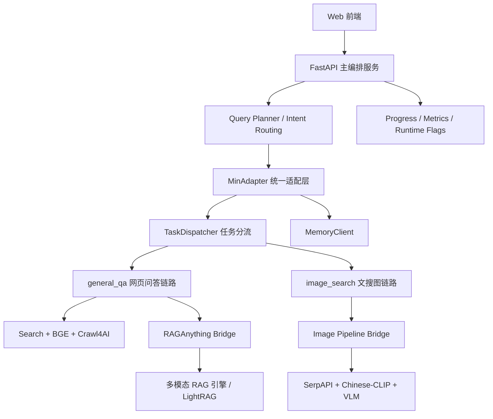
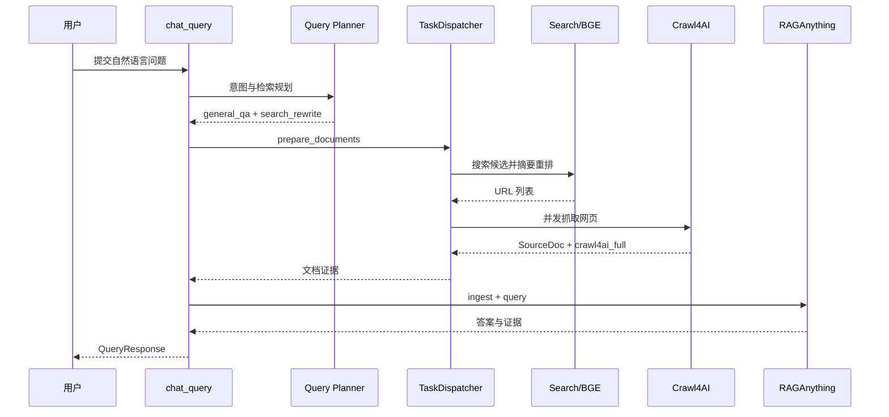
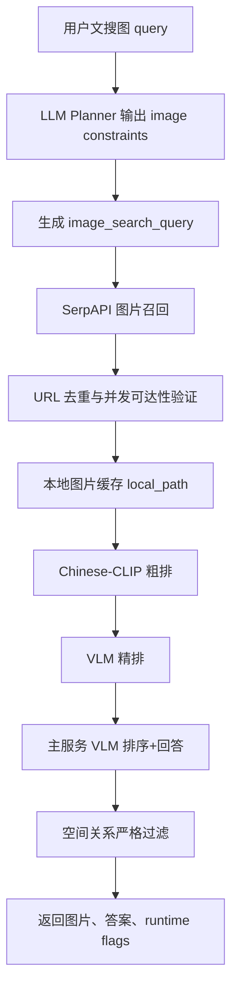

## 正文章节结构（模板建议）
# 第1章 绪论

## 1.1 课题背景、目的与意义

随着大语言模型、多模态大模型与检索增强生成技术的快速发展，通用问答系统已经从早期依赖封闭参数知识的“静态生成”形态，逐步演进为能够结合外部知识源、实时网页内容、结构化文档与视觉证据进行回答的“检索增强型智能系统”。传统大语言模型虽然在语言理解、推理和生成方面表现出较强能力，但其知识主要来源于训练语料，存在知识更新滞后、对长尾事实覆盖不足、回答缺乏可追溯证据、容易产生幻觉等问题。Retrieval-Augmented Generation（RAG）通过在生成前从外部知识库或网页中检索相关信息，将模型的参数化知识与非参数化记忆结合起来，为开放域问答、知识密集型任务和专业场景问答提供了更加可靠的技术路线[1]。

然而，现实互联网并不是单一文本知识库。现代网页通常由正文、图片、图标、表格、卡片、列表、脚本渲染内容、跳转链接、PDF/Office 附件以及视频封面等多类型信息共同构成。HTTP Archive 的 Web Almanac 2024 指出，网页中的图像和视频已经成为用户体验的重要组成部分，网页媒体的编码、嵌入和交付方式呈现出明显复杂化趋势；其中图像尺寸和视频数量仍在增长，网页持续向视觉化方向发展[2]。这意味着，若系统仍只对网页正文进行抽取和检索，就会遗漏大量关键证据。例如，商品页面中的产品外观、新闻页面中的现场图片、科普页面中的流程图、统计页面中的图表以及搜索结果中的图片缩略图，往往承载着文本无法完整表达的信息。对于“根据图片找相关内容”“给我找某类图片并解释依据”“结合网页内容回答问题”等任务，仅依靠文本 RAG 已难以满足需求。

多模态 RAG 正是在这一背景下形成的重要研究方向。与传统 RAG 相比，多模态 RAG 不再只检索文本段落，而是将图像、表格、网页结构、截图、文档块等异构对象纳入统一的检索与生成链路，通过跨模态表示学习、视觉语言模型理解和多模态证据融合，使回答能够同时基于文本证据和视觉证据。已有研究表明，多模态 RAG 在需要同时理解图文信息的问答场景中具有明显优势，能够缓解纯文本检索无法覆盖视觉信息的问题[3]。MuRAG 等工作进一步证明，在开放域问答中引入图像与文本共同构成的外部记忆，可以提升需要图文联合推理的数据集表现[4]。因此，将多模态检索与 RAG 推理结合，是提高开放域问答系统知识覆盖率、证据完整性和回答可靠性的关键方向。

另一方面，网页解析本身也正成为制约多模态 RAG 落地的重要环节。传统网页爬虫通常以 HTML 文本抽取为核心，依赖 DOM 规则、CSS 选择器或 XPath 获取静态内容。这类方法在结构稳定、内容静态的网页上具有较高效率，但面对 JavaScript 动态渲染、搜索结果页、异步加载图片、懒加载资源、复杂卡片式布局以及多媒体元素时，往往只能得到零散文本或不稳定链接。近年来出现的面向大模型的数据抓取方法开始强调“LLM-friendly”的网页内容输出，即将原始 HTML 转换为更适合模型理解和索引的 Markdown、结构化文本或内容块[5]。但从完整系统角度看，仅完成网页抓取并不等同于完成问答：抓取后的网页内容仍需进行清洗、切分、嵌入、重排、入库、检索、上下文压缩和回答生成；网页中的图片资源还需要进行可访问性验证、缓存、图文匹配和视觉语义理解。因此，本课题不只关注单个爬虫或单个检索模型，而是围绕“网页解析—多模态检索—RAG 推理—证据化回答”的完整链路构建系统原型。

本课题最终实现的是一个面向通用问答与文搜图场景的多模态 RAG 原型系统。系统采用统一编排层设计，以 FastAPI 作为主服务入口，将意图识别、槽位抽取、网页检索、网页抓取、文本向量检索、图像检索、视觉语言模型排序、对话记忆以及 RAG 回答生成整合到同一个服务框架中。系统当前支持两类核心任务：其一是 `general_qa`，即通用问答或网页检索增强问答；其二是 `image_search`，即面向自然语言查询的文搜图和基于图像证据的多模态回答。对于通用问答任务，系统通过 Search 模块召回开放网页信息，利用 Crawl4AI 网页解析模块获取网页正文与结构化内容，再通过 BGE 向量表示与重排机制筛选高相关文本，最终将内容交给 RAGAnything Bridge 转换为适配 RAGAnything/LightRAG 的 `content_list`，支撑后续入库与检索生成。对于文搜图任务，系统通过图像桥接服务调用开放域图像搜索引擎召回候选图片，随后进行并发可访问性验证和本地缓存，再利用 Chinese-CLIP 完成粗粒度图文匹配，最后调用视觉语言模型进行细粒度排序和基于图像证据的自然语言回答。

从研究目的看，本课题希望解决三个层面的实际问题。第一，解决网页问答中知识来源不稳定与证据不足的问题。系统通过网页检索、网页解析、向量检索和 RAG 生成，将回答建立在可检索的外部内容之上，减少完全依赖模型内部知识造成的幻觉。第二，解决开放域图片检索中“能搜到但不可用、能看到但不理解”的问题。开放搜索引擎返回的图片链接常出现失效、403、重定向、防盗链、超时等情况，本系统在检索阶段加入并发可访问性验证和本地缓存机制，并在后续 CLIP 排序、VLM 精排和回答生成阶段复用缓存结果，从工程上提高系统稳定性和响应效率。第三，解决多模态 RAG 工程链路割裂的问题。系统将网页抓取、结构化转换、文本检索、图像检索、视觉理解与统一 API 编排结合起来，使多模态问答不再停留于单个模型调用，而成为可以运行、测试和扩展的系统原型。

从应用意义看，本系统具有较强的工程实用价值。一方面，在学习、科研和资料收集场景中，用户可以直接用自然语言提出问题，由系统自动检索网页、解析内容、筛选证据并给出回答，降低人工搜索、网页筛选和信息整合成本。另一方面，在图片搜索与视觉证据问答场景中，用户不仅能够获得候选图片，还能得到系统对图片相关性、可用性和视觉内容的解释，从而提升搜索结果的可理解性。对于后续扩展而言，系统的统一编排架构也便于接入更强的多模态嵌入模型、更复杂的网页解析策略、专用垂直知识库和多轮对话记忆模块，为构建更完整的网页多模态智能体奠定基础。

## 1.2 国内外研究现状

### 1.2.1 检索增强生成与多模态 RAG 研究现状

RAG 技术最早在开放域问答和知识密集型自然语言处理任务中得到广泛关注。Lewis 等提出的 Retrieval-Augmented Generation 方法将预训练生成模型与外部稠密向量索引结合，使模型在生成答案时能够访问非参数化知识库，从而改善知识更新与事实性问题[1]。随后，RAG 系统逐步从“检索文本段落并拼接到提示词”发展为包含文档切分、向量表示、召回、重排、上下文压缩、引用生成和反馈优化的复杂工程链路。在实际应用中，RAG 能够将网页、企业文档、数据库记录、FAQ 和知识图谱等外部知识纳入大模型推理过程，是当前降低大模型幻觉、增强私有知识问答能力的重要方案。

但传统 RAG 的主要局限在于其默认知识对象是文本。现实场景中的知识常以多模态形式存在：网页包含图片和表格，学术论文包含公式和图示，企业文档包含截图和流程图，电商页面包含商品图片和参数卡片，新闻页面包含图片、视频封面和时间线。若系统只保留 OCR 结果或纯文本摘要，就可能丢失布局、视觉细节和图文关系。针对这一问题，多模态 RAG 研究开始将文本、图像、视频、表格和文档版面共同纳入检索增强生成框架。2025 年的多模态 RAG 综述指出，MRAG 通过整合文本、图像和视频等多模态数据，可以弥补文本 RAG 在视觉信息理解方面的不足，并在需要图文联合理解的问答任务中表现更好[3]。这与本课题“通用问答 + 文搜图 + 图像证据回答”的系统目标高度一致。

在代表性模型方面，MuRAG 将外部多模态记忆引入生成模型，使模型能够同时检索图像和文本来回答问题。该方法采用图文语料与文本语料混合预训练，并结合对比学习与生成式训练目标，在 WebQA、MultimodalQA 等需要图文联合检索的数据集上取得较好效果[4]。这一类研究说明，多模态问答的核心并不是简单地把图片描述转成文本，而是要在检索阶段保留图像对象，在生成阶段显式利用视觉证据。近年来，RAG-Anything 等研究进一步提出将多模态内容视为互相关联的知识实体，而不是相互隔离的数据类型，并通过跨模态结构关系与语义关系共同组织知识，以提升对长文档和复杂多模态内容的检索能力[6]。这些研究为本系统中 RAGAnything Bridge 的设计提供了重要启发，即将网页解析得到的结构化网页、多模态块和 HTML/Markdown 混合内容转换为统一内容列表，使文本、图片、表格和网页块能够进入统一 RAG 编排流程。

国内相关研究主要集中在中文检索模型、中文多模态表示学习和大模型应用系统构建方面。BGE-M3 作为面向多语言、多功能和多粒度检索的嵌入模型，支持超过 100 种语言，并同时支持稠密检索、多向量检索和稀疏检索，为中文与跨语言检索系统提供了较强的向量表示基础[7]。在多模态检索方面，Chinese-CLIP 基于大规模中文图文对进行对比学习预训练，构建了多种规模的中文 CLIP 模型，能够更好地适配中文文本与图像之间的语义匹配[8]。本课题在图像检索链路中使用 Chinese-CLIP 进行粗粒度图文匹配，正是考虑到系统查询语言以中文为主，且开放域图片搜索返回结果质量参差不齐，需要在召回之后通过中文图文表示模型进行相关性过滤。

总体来看，国内外多模态 RAG 研究已经形成较为明确的发展趋势：一是从纯文本知识库扩展到包含图像、表格、公式和布局的多模态知识库；二是从单阶段向量召回扩展到“搜索召回—向量粗排—跨编码器或 VLM 精排—证据生成”的多阶段检索链路；三是从离线文档问答扩展到实时网页问答和智能体式信息获取。现有研究为本课题提供了理论与模型基础，但在工程落地上仍存在挑战，例如开放域网页内容不稳定、图片链接易失效、网页解析结果噪声大、多模态证据难以统一管理等。本系统正是围绕这些工程痛点进行整合实现。

### 1.2.2 多模态检索与图文匹配研究现状

多模态检索是多模态 RAG 的基础能力之一，其目标是根据一种模态的查询检索另一种或多种模态的候选对象。典型任务包括以文搜图、以图搜文、图文混合检索、文档截图检索、网页卡片检索等。CLIP 通过大规模图文对比学习将图像和文本映射到共享语义空间，使文本查询能够与图片向量直接计算相似度，这一范式极大推动了开放域图文检索的发展。对于中文场景，Chinese-CLIP、Wukong 等模型和数据集缓解了英文 CLIP 在中文语义理解上的不足。Wukong 数据集包含大规模中文图文对，为中文跨模态预训练提供了重要数据基础[9]；Chinese-CLIP 则在中文图文匹配、图像检索和跨模态表示学习任务中表现出更强适配性[8]。

近年来，多模态检索模型也在向统一检索方向发展。Visualized-BGE/VISTA 等工作尝试将图像 token 或视觉编码能力引入文本嵌入框架，使模型既能处理文本，又能处理图文混合对象，从而服务于更通用的多模态检索任务[10]。这类研究表明，未来检索系统将不再简单区分“文本检索系统”和“图像检索系统”，而是需要统一处理页面截图、图片、标题、描述、表格和文档块等复合对象。对于本课题而言，当前系统采用 Search 召回、Chinese-CLIP 粗排和 VLM 精排的组合方案，优点在于工程复杂度可控、中文图文匹配能力较强，并且能够通过视觉语言模型对候选图片进行进一步理解。后续若接入统一多模态嵌入模型，则可以进一步扩展到截图检索、网页块检索和图文混合文档检索。

开放域图像检索还面临一个常被研究原型忽略的工程问题，即候选图片链接的可访问性和可复用性。搜索引擎返回的图片 URL 并不总是稳定资源，实际访问时可能出现过期、跨域限制、防盗链、响应超时、内容类型错误、图片过大或下载失败等情况。如果系统在排序阶段才发现图片不可访问，就会造成检索结果不完整、VLM 调用失败和回答生成不稳定。针对这一问题，本课题在图像桥接服务中设计了并发可访问性验证与本地缓存机制：系统在召回候选图片后立即验证链接可用性，并将可访问图片缓存到本地；后续 Chinese-CLIP 粗排、VLM 精排和回答生成均复用缓存图片，而不是重复依赖原始远程链接。该设计虽然不是复杂算法创新，但对提升开放域文搜图系统的稳定性和响应效率具有直接作用。

### 1.2.3 网页解析与网页问答系统研究现状

网页解析技术经历了从规则抽取、模板抽取、DOM 分析到智能体式网页理解的发展过程。早期网页解析主要依赖 BeautifulSoup、Scrapy、XPath、CSS Selector 等工具，适用于结构稳定的静态网页。随着现代 Web 应用广泛采用 JavaScript 动态渲染、异步接口、无限滚动和前端框架，传统静态 HTML 抽取越来越难以获得完整内容。为解决动态网页问题，工程系统通常需要引入浏览器自动化、网络请求监听、渲染后 DOM 获取、页面截图和资源下载等技术。同时，大模型时代的网页解析还需要将原始网页转换为更适合模型处理的 Markdown、语义块或结构化内容，以降低提示词噪声并提高检索质量。

Web Agent 研究推动了网页理解从“提取网页内容”向“操作网页完成任务”扩展。WebGPT、Mind2Web、WebVoyager、SeeAct 等工作展示了大模型在网页导航、按钮点击、表单填写和任务执行中的潜力。这些系统往往关注交互动作规划，即如何让模型理解网页界面并完成操作。然而，对于网页作为知识载体的场景而言，系统不仅需要知道“哪里可以点击”，还需要知道“页面中包含什么知识”“哪些内容与用户问题相关”“图片或图表能否作为回答证据”。因此，网页问答系统与网页操作智能体虽然共享网页感知能力，但目标并不完全相同。本课题更侧重网页内容解析、网页检索增强问答和多模态证据组织，而不是复杂网页交互任务。

在网页问答链路中，网页抓取只是第一步。一个可用的 RAG 系统还需要完成内容清洗、块级切分、向量化、入库、召回、重排、上下文组织和答案生成。面向大模型的数据抓取系统强调输出适合 LLM 消费的结构化结果，例如 Markdown、筛选后的正文和动态页面内容[5]。本课题实现的 Crawl4AI 模块承担网页抓取与解析职责，负责从开放网页中获取可用于后续 RAG 的网页内容；RAGAnything Bridge 进一步将结构化网页、多模态块以及 HTML/Markdown 混合内容转换为统一 `content_list`，使其能够被 RAGAnything/LightRAG 处理。通过这种设计，网页解析结果不再是一次性提示词输入，而是可以进入索引、检索和多轮问答链路的知识对象。

### 1.2.4 视觉语言模型在排序与证据生成中的应用现状

视觉语言模型（VLM）是多模态问答系统的重要组成部分。与 CLIP 类模型主要输出图文相似度不同，VLM 能够对图像进行自然语言描述、回答视觉问题、识别图像中的文字和对象，并对复杂图像内容进行推理。因此，在多模态 RAG 中，VLM 常被用于两个环节：一是在检索后对候选图像或多模态块进行细粒度重排；二是在回答生成阶段将图像内容转化为可解释证据。对于开放域文搜图任务，仅依靠图文向量相似度可能会把标题相近但视觉内容不符的图片排在前面，而 VLM 可以进一步检查图片是否真正满足用户查询意图，例如图片主体、场景、颜色、构图、文字信息是否与需求一致。

本系统采用“Chinese-CLIP 粗排 + VLM 精排 + 图像证据回答”的两级视觉检索策略。Chinese-CLIP 负责在大量候选图片中快速筛除明显无关结果，降低后续 VLM 调用成本；VLM 则负责对 Top-K 候选进行细粒度判断，输出更符合用户意图的排序结果，并基于图片内容生成自然语言解释。这样的组合兼顾了效率与精度：CLIP 类模型适合批量向量匹配，VLM 适合小规模候选的深度理解。该思路也符合当前多模态检索系统常见的多阶段架构，即先使用轻量模型完成高召回候选生成，再使用更强模型完成高精度重排和证据生成。

### 1.2.5 现有研究不足与本课题定位

综合上述研究可以看出，多模态 RAG、跨模态检索和网页智能体均已取得较快进展，但从毕业设计系统实现角度看，仍存在以下不足。第一，许多 RAG 系统仍以文本为中心，对网页中的图片、图标、卡片和视觉内容支持不足，无法充分利用网页多模态知识。第二，部分多模态 RAG 研究主要面向离线文档或固定数据集，对开放域网页搜索、动态网页解析和图片链接可访问性等工程问题关注较少。第三，图像检索系统往往只给出图片列表，缺少与 RAG 问答结合的证据化解释能力。第四，网页解析、文本问答、图像检索和对话记忆常以分散工具形式存在，缺乏统一 API 编排和前端交互入口。

因此，本课题将自身定位为一个面向工程落地的多模态 RAG 原型系统，而不是单一模型算法研究。系统不追求提出全新的模型结构，而是融合当前较成熟的网页解析、语义检索、中文图文匹配、视觉语言模型和 RAG 编排方法，形成一条可运行的完整链路。其核心特点包括：以 FastAPI 实现统一服务入口和任务分流；以 LLM 完成意图识别与槽位抽取；以 Search、BGE、Crawl4AI 和 RAGAnything Bridge 构建网页问答链路；以图像桥接服务构建文搜图链路；以并发可访问性验证和本地缓存增强开放域图片检索稳定性；以 Chinese-CLIP 和 VLM 实现粗排与精排结合；以前端静态页面提供轻量实验界面。该定位既符合当前多模态 RAG 的发展趋势，也与毕业设计对系统完整性、可运行性和工程实现能力的要求相匹配。

## 1.3 论文主要内容与结构

本文围绕“面向通用问答与文搜图场景的多模态 RAG 原型系统”展开，重点研究网页检索增强问答、开放域图像检索、网页解析、多模态排序与统一服务编排的系统设计与实现。论文主要内容包括以下几个方面。

第一，分析多模态 RAG 系统的需求与任务边界。根据实际完成的系统功能，明确系统当前支持 `general_qa` 和 `image_search` 两类核心任务，并对通用问答、网页检索、网页解析、文本重排、图像搜索、图像可访问性验证、图文匹配、VLM 精排、回答生成和前端交互等需求进行归纳。

第二，设计统一编排架构。系统采用“主编排服务 + 外部桥接服务 + 轻量 Web 前端”的架构模式：主编排服务以 FastAPI 为入口，负责统一 API、意图判定、任务分流、上下文记忆、RAG 入库和查询编排；图像桥接服务负责图像搜索、可访问性过滤、CLIP 粗排、VLM 精排和图像缓存；RAGAnything Bridge 负责将网页解析结果和多模态内容转换为 RAGAnything/LightRAG 可处理的 `content_list`；前端由静态 HTML/CSS/JS 实现，用于提供实验交互界面。

第三，实现网页问答链路。对于 `general_qa` 任务，系统先通过 LLM 识别用户意图和抽取查询槽位，再调用 Search 模块获取相关网页信息；随后通过 Crawl4AI 模块抓取和解析网页内容，经过清洗、切分、BGE 表示和重排后，将高相关内容组织为 RAG 上下文，并通过 RAGAnything Bridge 完成结构化内容转换，最终由大语言模型生成面向用户的答案。

第四，实现文搜图与图像证据回答链路。对于 `image_search` 任务，系统通过开放域图像搜索引擎召回候选图片，并发验证图片 URL 的可访问性，将可用图片下载到本地缓存；随后使用 Chinese-CLIP 对文本查询和候选图片进行粗粒度匹配，选出高相关候选；最后调用视觉语言模型进行细粒度排序和内容理解，生成基于图片证据的自然语言回答，并将缓存图片和排序结果返回前端展示。

第五，进行系统测试与结果分析。通过功能测试验证通用问答、网页检索、网页解析、RAG 入库、图像检索、可访问性过滤、CLIP 粗排、VLM 精排和前端展示等模块是否能够按预期运行；通过响应时间、可访问图片比例、检索结果相关性和回答质量等指标分析系统的稳定性与不足，并总结后续可改进方向。

全文结构安排如下：第 1 章为绪论，介绍课题背景、研究意义、国内外研究现状以及论文主要内容；第 2 章进行方案论证，分析系统需求、可行性、开发工具和关键技术，确定总体方案；第 3 章介绍系统设计，包括总体架构、模块划分、接口设计、数据流和核心流程；第 4 章介绍系统实现，详细说明主编排服务、网页问答链路、图像桥接服务、RAGAnything Bridge 和前端界面的实现方式；第 5 章进行性能测试与分析，展示系统功能测试、界面效果和性能结果；第 6 章总结全文工作，分析系统不足，并展望多模态 RAG、网页解析和智能体问答系统的后续发展方向。


# 第2章 方案论证

## 2.1 系统需求分析

本课题面向通用问答与文搜图两类高频信息获取场景，目标是设计并实现一个可运行、可测试、可扩展的多模态 RAG 原型系统。与传统单轮文本问答系统不同，本系统需要同时处理网页文本、网页结构、图片资源、表格信息、用户自然语言意图、对话上下文以及外部模型服务等多种对象，因此系统需求不能只从“模型能否回答问题”角度定义，而应从完整信息处理链路出发进行分析。

从用户使用角度看，系统首先需要提供统一的自然语言入口。用户不应被迫在“网页问答接口”“图片搜索接口”“RAG 问答接口”之间手动切换，而应能够在同一个前端页面或同一个 API 中提出问题。例如，用户可以输入“总结这个网页的核心观点”，也可以输入“给我几张左边是边牧右边是金毛的照片”，系统需要自动判断任务属于通用问答还是文搜图，并进入对应处理流程。当用户提供明确意图时，系统应尊重外部传入的 `intent`；当用户没有提供意图时，系统需要通过自然语言理解模块自动完成意图识别和检索规划。

其次，系统需要支持通用问答场景。通用问答不仅包括常见事实性问题，还包括网页总结、对比分析、天气查询、解释类问题和结合指定 URL 的问题。对于没有指定文档的开放问题，系统需要具备网页搜索能力，从搜索结果中召回候选网页；对于候选网页，系统需要通过网页智能采集模块获取网页正文、Markdown、HTML 快照、表格、图片、链接等结构化内容；随后通过重排机制筛除低相关网页，并把高质量证据送入多模态 RAG 引擎进行检索增强回答。系统回答应尽量基于外部证据，而不是直接依赖大语言模型的参数化记忆。

再次，系统需要支持文搜图场景。文搜图并不是简单调用图片搜索接口返回链接，而要解决开放域图片搜索中“能搜到但打不开”“能打开但不相关”“标题相关但图像内容不满足约束”等问题。用户可能提出主体、数量、风格、动作和空间关系等复杂要求，例如“左边是 A 右边是 B”“夜晚城市街道”“几张某地点照片”。系统需要将用户原始 query 解析为结构化约束，并生成更适合图片搜索的检索 query；随后对召回图片进行可访问性验证和本地缓存，保证图片可以在后续 CLIP、VLM 和前端展示阶段稳定使用；最后通过 Chinese-CLIP 和视觉语言模型进行多阶段排序与解释性回答。

系统还需要具备网页智能采集能力。现实网页存在大量噪声，如导航栏、页脚、广告、相关推荐、登录弹窗、脚本内容和异步加载元素。若直接把原始 HTML 交给大模型，既浪费上下文，也会降低检索质量。因此，本课题将 Crawl4AI 网页智能采集模块作为系统自研组成之一，要求其具备浏览器渲染、HTML 清洗、Markdown 生成、链接引用化、媒体提取、表格识别、内容过滤和抓取快照保存等能力。该模块输出的不是单一字符串，而是面向 RAG 的结构化网页对象。

系统还需要具备多模态 RAG 能力。网页智能采集模块输出的内容包括文本、表格、图片和 HTML/Markdown 快照，这些异构内容需要进入统一知识引擎。为此，本课题将 RAGAnything 多模态 RAG 引擎作为系统自研组成之一，要求其能够处理文本、图片、表格、公式等内容类型，并将多模态对象转换为可检索的文本描述、实体节点、向量条目和知识图谱关系。对于网页来源内容，系统还需要设计桥接模块，把 Crawl4AI 的网页快照转换为 RAGAnything 支持的 `content_list`，实现网页多模态内容到 RAG 知识引擎的完整接入。

除核心功能外，系统还需要满足一定的非功能需求。第一是可扩展性。不同模型、搜索服务、RAG 后端和存储后端可能随实验环境变化，因此系统应采用分层架构和适配层设计，避免业务流程与具体服务强耦合。第二是鲁棒性。开放域搜索、网页抓取、图片下载、CLIP 模型加载、VLM 调用、RAG 服务调用都有失败可能，系统需要提供 fallback 策略，并通过 runtime flags 标记实际执行路径。第三是安全性。系统会访问用户输入 URL 和外部图片 URL，必须防止 SSRF 风险，拒绝 localhost、私有地址、link-local 地址等不安全目标。第四是可观测性。多模态 RAG 链路长、阶段多，调试困难，因此系统需要提供请求级进度、运行标记和指标统计。第五是易用性。前端应提供轻量聊天界面，支持自动意图识别、手动意图选择、可选 URL 输入、图片展示和阶段进度查看。

结合以上分析，本系统的主要功能需求可归纳如下：

1. 统一问答接口：提供 `POST /v1/chat/query`，支持通用问答与文搜图两类任务。
2. 意图识别与查询规划：自动识别 `general_qa` 与 `image_search`，并生成对应检索改写和结构化约束。
3. 通用问答链路：支持搜索召回、BGE 重排、安全 URL 过滤、网页抓取、正文重排、RAG 入库与回答。
4. 网页智能采集：支持动态网页抓取、HTML 清洗、Markdown 生成、媒体与表格提取。
5. 多模态 RAG 引擎：支持文本、图片、表格、公式等内容入库，支持混合检索和生成。
6. 文搜图链路：支持图片搜索、图片可达性验证、本地缓存、Chinese-CLIP 粗排、VLM 精排和图像证据回答。
7. 会话记忆与澄清：支持多轮上下文、用户偏好、天气城市缺失和泛化图片请求的追问。
8. 前端展示：支持聊天式交互、图片代理展示、证据片段、runtime flags 和进度面板。
9. 安全控制：支持 URL 安全校验、图片代理重定向校验、本地路径白名单。
10. 测试与可观测：支持自动化回归测试、Prometheus 风格指标和请求级阶段进度。

## 2.2 系统可行性分析

### 2.2.1 技术可行性

本系统采用 Python 生态实现，核心框架和依赖均具有较强成熟度。FastAPI 能够提供高性能异步 HTTP 服务，适合构建主编排服务和桥接服务；Pydantic 能够对请求和响应进行结构化建模，便于保证接口契约稳定；httpx 支持异步 HTTP 调用，适合连接搜索、RAG、VLM 等外部服务；pytest 可完成接口与核心模块的回归测试。

在网页解析方面，网页智能采集模块基于异步浏览器抓取和 lxml/BeautifulSoup 等解析技术，能够处理动态网页、Markdown 转换、媒体提取和表格识别。相比纯 requests 抓取，该方案能适应更复杂的现代网页。模块输出的 `CrawlResult` 包含 raw HTML、cleaned HTML、Markdown、media、links、tables、metadata 等字段，能够满足后续多模态 RAG 的数据需求。

在 RAG 方面，多模态 RAG 引擎基于 LightRAG 的文本块、向量库、实体库和知识图谱能力，并扩展图像、表格、公式等模态处理器。系统可以通过 `insert_content_list()` 直接插入预解析内容，适合与网页采集模块对接。通用问答链路中，搜索结果通过 BGE 重排筛选，再经过 Crawl4AI 抓取和 RAGAnything 入库，形成完整的检索增强回答路径。

在多模态图像检索方面，Chinese-CLIP 可用于中文文本与图片之间的粗粒度语义匹配，视觉语言模型可进一步对图片内容进行细粒度判断和回答生成。系统采用“搜索召回—可达性过滤—CLIP 粗排—VLM 精排—严格空间过滤”的流水线，避免单一模型承担全部任务。该方案在工程上可实现，在性能和效果之间也具备较好平衡。

从当前代码实现看，项目已经具备完整目录结构和可运行链路。`app/api/chat.py` 实现统一接口和意图规划；`app/services/dispatcher.py` 实现任务分流；`app/services/connectors.py` 实现搜索、爬虫、BGE 和图像 pipeline 客户端；`app/integrations/raganything_bridge.py` 和 `app/integrations/image_pipeline_bridge.py` 实现关键桥接服务；`web/` 提供前端页面；`tests/test_chat_api.py` 提供回归测试。因此，从技术角度看，本课题具备实现条件。

### 2.2.2 经济可行性

本系统主要使用 Python 生态和本地工程代码实现，开发成本集中在系统编排、模块实现、模型调用和实验验证上。FastAPI、Pydantic、httpx、pytest、Rasa 等基础框架可在本地运行；网页智能采集模块和多模态 RAG 引擎作为本课题的重要自研子系统，也可在本地以 SDK 或桥接服务方式运行。外部 API 如 SerpAPI、Qwen-VL 或 OpenAI 兼容服务可按需配置，在没有真实 API 时，系统仍保留本地 fallback 或占位策略，能够进行功能演示和回归测试。

从硬件要求看，主编排服务对硬件要求较低；CLIP、BGE 和 VLM 相关链路对计算资源要求更高，但可以通过本地小模型、远程模型 API 或降级策略灵活配置。毕业设计阶段不需要大规模训练新模型，因此经济成本可控。

### 2.2.3 运行可行性

项目采用分服务设计，主编排服务默认运行在 `8000` 端口，图像 pipeline 可运行在 `9010` 端口，RAGAnything Bridge 可运行在 `9002` 端口，Rasa Parse Bridge 可运行在 `5005` 端口。脚本目录中提供 PowerShell 启动脚本，如 `start_image_pipeline.ps1`、`start_raganything_bridge.ps1`、`start_all_stack.ps1` 和 `check_stack_health.ps1`，便于本地运行与检查。

为了降低外部依赖不稳定对演示的影响，系统采用远程优先、本地兜底的运行方式。例如，RAG 服务不可用时，`RagClient` 会使用本地内存存储返回降级回答；搜索服务不可用时，可根据配置返回占位搜索结果；图像 pipeline 不可用时，系统会返回可识别的 fallback 标记。虽然 fallback 不能替代真实模型效果，但能够保证系统流程不中断，便于调试和论文演示。

### 2.2.4 维护可行性

系统按层次组织代码，具有较清晰的维护边界。API 层负责请求生命周期和策略调度；adapter 层负责归一化、入库和最终查询；services 层负责业务能力；integrations 层负责外部或子系统桥接；models 层负责数据结构；core 层负责配置、指标、进度、安全与重试。不同模块之间通过 Pydantic 模型和固定方法交互，降低了修改局部模块对整体系统的影响。

当前代码还引入了 `Agents.md` 和多份架构文档，用于记录项目理解、运行流程、配置项和优化记录。对于毕业设计后续迭代而言，这种文档化机制能降低重新理解项目的成本。

## 2.3 开发工具分析及选择

### 2.3.1 编程语言与后端框架

系统选择 Python 作为主要开发语言。Python 在人工智能、自然语言处理、网页爬取、向量检索和后端原型开发方面生态成熟，能够方便地接入 transformers、torch、FastAPI、httpx、Rasa、Redis、MySQL 等组件。由于本课题重点在多模块编排与工程实现，而非底层高性能计算框架开发，Python 能够在开发效率和可扩展性之间取得较好平衡。

后端框架选择 FastAPI。FastAPI 支持异步请求处理，天然适合本系统中大量外部 HTTP 调用场景，如搜索、爬虫、RAG、VLM 和图片下载。FastAPI 与 Pydantic 结合紧密，可以自动校验请求参数并生成标准响应模型。系统主入口 `app/main.py` 创建 FastAPI 应用，挂载 `/v1` 路由，托管静态前端，并暴露 `/healthz` 和 `/metrics`。

### 2.3.2 数据建模与配置管理

系统使用 Pydantic 定义 `QueryRequest`、`QueryResponse`、`SourceDoc`、`ModalElement`、`ImageSearchConstraints` 等结构。这样做有三点优势：第一，API 输入输出字段清晰，便于前后端协作；第二，字段边界可以集中声明，例如 `query` 最大长度、`max_images` 范围、URL 安全校验；第三，测试中可直接构造模型对象，提升回归测试可读性。

配置管理使用 `pydantic-settings`。主服务配置位于 `app/core/settings.py`，bridge 共享配置位于 `app/integrations/bridge_settings.py`。主服务配置包括 CORS、外部 endpoint、超时、并发、memory backend、fallback 开关等；bridge 配置包括 OpenAI/Qwen API、RAGAnything、Chinese-CLIP、图片缓存和图像 pipeline 参数。虽然当前仍是主服务与 bridge 双配置中心，但已经比散落 `os.getenv()` 更易维护。

### 2.3.3 网页智能采集模块

网页智能采集模块选择基于 Crawl4AI 的自研方案。该模块提供 `AsyncWebCrawler`、`BrowserConfig`、`CrawlerRunConfig`、Markdown 生成器、内容过滤策略、表格抽取策略和深度爬取策略。与传统 requests + BeautifulSoup 方案相比，它能处理动态渲染、JavaScript、媒体资源、表格结构和 Markdown 转换，更符合多模态 RAG 的输入要求。

本项目在 `CrawlClient` 中优先使用本地 SDK 方式嵌入该模块，而不是单纯依赖远程爬虫 HTTP 服务。这样可以直接获得完整 `CrawlResult`，并把 `crawl4ai_full` 保存到文档 metadata 中，供 RAGAnything Bridge 二次装配使用。

### 2.3.4 多模态 RAG 引擎

多模态 RAG 引擎选择基于 RAGAnything 的自研方案。该引擎支持文本、图像、表格、公式等内容类型，并通过 LightRAG 提供向量检索和知识图谱检索能力。相比只把网页正文切成文本块的普通 RAG，本系统需要保留网页图片、表格和 HTML/Markdown 结构，因此使用 content_list 形式更合适。

本项目在 `app/integrations/raganything_bridge.py` 中封装该引擎，提供 `/ingest` 和 `/query` 接口，使主服务与 RAG 引擎解耦。Bridge 中还实现 HTML Docling 路由、Markdown 补充、表格转换、图片物化、失败降级等工程逻辑。

### 2.3.5 图像检索与视觉理解工具

文搜图链路使用 SerpAPI 作为开放域图片召回来源，使用 Chinese-CLIP 进行中文图文匹配，使用 Qwen/OpenAI 兼容视觉语言模型进行图片精排和回答生成。SerpAPI 负责广覆盖召回，Chinese-CLIP 负责快速粗筛，VLM 负责深层视觉语义理解。三者分工明确，符合多阶段检索系统的常见设计原则。

### 2.3.6 前端与测试工具

前端采用原生 HTML、CSS 和 JavaScript，不引入复杂前端框架。毕业设计阶段的前端主要承担交互演示、请求发送、图片展示和进度查看功能，原生方案部署简单、依赖少、维护成本低。前端页面与后端同端口托管，避免跨域配置复杂化。

测试工具选择 pytest 和 FastAPI TestClient。当前测试覆盖健康检查、请求校验、URL 安全、图片代理、中文 heuristic、parser cache、RAG 本地存储、dispatcher URL 去重、planner 路径等关键行为。自动化测试是保证后续论文修改和系统优化不破坏核心链路的重要手段。

## 2.4 关键技术分析

### 2.4.1 检索增强生成技术

RAG 的基本思想是将外部检索结果作为生成模型输入上下文，使模型回答能够基于可追溯证据。一般 RAG 流程包括文档采集、清洗、切分、向量化、入库、查询向量化、相似度检索、重排、上下文构造和答案生成。本系统在通用问答中采用搜索召回、网页抓取、BGE 重排和 RAGAnything 查询的组合方式。与封闭式问答相比，该方式更适合回答时效性和网页来源相关的问题。

### 2.4.2 多模态 RAG 技术

多模态 RAG 将检索对象从文本扩展到图片、表格、公式、网页结构等异构内容。关键问题是不同模态如何进入统一索引。本系统的多模态 RAG 引擎采用“模态内容文本化 + 实体化 + 向量化 + 图谱化”的思路：文本内容直接进入 LightRAG；图片由视觉模型生成描述和实体；表格由语言模型分析字段和趋势；公式由语言模型解释语义；所有模态最终以 chunk、entity 和 relation 形式进入知识系统。这样既保留了多模态对象，又能通过文本 query 检索。

### 2.4.3 网页解析与 Markdown 转换技术

网页解析是 RAG 的上游质量关键。网页智能采集模块通过浏览器渲染获取动态网页，再通过 lxml 清洗 HTML、提取媒体和链接，最后生成 Markdown。Markdown 相比 HTML 更适合大模型处理，因为它保留标题、列表、表格等结构，同时去除了大量标签噪声。模块中的 BM25ContentFilter 和 PruningContentFilter 分别从 query 相关性和 DOM 节点质量角度过滤内容，为后续 RAG 提供更干净的证据。

### 2.4.4 LLM 结构化规划技术

本系统使用 LLM 作为 query planner。传统做法可能先用一个模型判断 intent，再用另一个模型做图搜或通用问答槽位抽取，这会增加延迟和成本。本系统将两层融合为一次 LLM JSON 输出，要求模型同时给出 intent、confidence、search_rewrite、entities 和场景约束。为了保证工程稳定性，planner 失败时仍有 Rasa 和 heuristic 兜底。

### 2.4.5 跨模态图文匹配技术

文搜图任务的核心是计算文本 query 与图片内容之间的语义匹配。CLIP 类模型通过对比学习将图片和文本映射到同一向量空间，适合批量候选粗排。对于中文 query，Chinese-CLIP 比英文 CLIP 更适合中文语义表达。本系统在 SerpAPI 召回后使用 Chinese-CLIP 快速筛除明显无关图片，再把较小候选池交给 VLM 精排，降低 VLM 调用成本。

### 2.4.6 视觉语言模型技术

VLM 能够直接理解图片内容，并用自然语言描述或回答问题。本系统在两个环节使用 VLM：一是在图像 pipeline 中对 CLIP 后候选进行精排；二是在最终回答阶段根据入选图片生成自然语言答案。对于包含左右位置等硬约束的 query，系统还会调用 VLM 严格判断候选是否满足空间关系，并在过滤结果变化后重新生成答案，保证回答与展示图片一致。

### 2.4.7 安全与降级技术

系统涉及用户 URL、搜索结果 URL 和图片 URL，存在 SSRF 风险。为此，系统实现 `is_safe_public_http_url()`，拒绝非 http/https、localhost、私有 IP、link-local、reserved 等地址。图片代理在每次请求和每次重定向后都重新校验目标地址，本地图片读取也限制在白名单目录中。

降级方面，RAG、搜索、爬虫、BGE、图像 pipeline、VLM 等外部依赖失败时，系统不会无提示崩溃，而是记录 runtime flag 并尽量返回可解释结果。这种设计符合原型系统稳定演示和工程调试需求。

## 2.5 基本方案制定

综合需求和技术分析，本文确定采用“统一编排服务 + 网页智能采集模块 + 多模态 RAG 引擎 + 图像检索桥接服务 + 轻量前端”的总体方案。

系统以 FastAPI 主编排服务作为统一入口。所有用户请求都进入 `/v1/chat/query`，由 query planner 判断任务意图并生成检索规划。若任务为 `general_qa`，系统进入网页问答链路；若任务为 `image_search`，系统进入文搜图链路。两条链路最终都返回统一的 `QueryResponse`，包含答案、证据、图片、trace_id、latency、route 和 runtime flags。

通用问答链路采用“搜索召回—摘要重排—安全过滤—网页采集—正文重排—RAG 入库—RAG 查询”的方案。网页智能采集模块负责把开放网页转换为结构化对象，多模态 RAG 引擎负责把结构化网页内容转换为可检索知识并生成回答。

文搜图链路采用“意图约束解析—图片搜索召回—图片可达性验证—本地缓存—Chinese-CLIP 粗排—VLM 精排—空间约束过滤—VLM 回答”的方案。该链路默认跳过普通 RAG ingest，因为最终回答需要直接基于图片内容，而不是把图片列表转成纯文本后再走普通 RAG 模板。

前端采用单页聊天界面。用户可以选择自动识别意图，也可以手动指定通用问答或文搜图；可以输入可选 URL；系统返回后展示答案、证据片段、图片和 runtime flags。前端通过 `/v1/chat/progress` 轮询后端进度，使长链路执行过程可见。

## 2.6 本章小结

本章从功能需求、非功能需求、技术可行性、开发工具和关键技术等方面对系统方案进行了论证。通过分析可以看出，面向通用问答与文搜图的多模态 RAG 系统需要解决的不只是模型回答问题，还包括网页结构化采集、多模态内容入库、跨模态检索、视觉证据回答、安全访问控制和运行可观测等一系列工程问题。基于此，本文确定了以 FastAPI 为统一编排入口，以 Crawl4AI 网页智能采集模块和 RAGAnything 多模态 RAG 引擎为核心支撑，以图像 pipeline 实现文搜图，以前端页面完成交互展示的总体方案。

# 第3章 系统设计

## 3.1 功能需求

根据第 2 章分析，本系统的功能可分为面向用户的业务功能和面向开发维护的支撑功能。

面向用户的业务功能包括通用问答、指定网页问答、文搜图、图像证据回答和多轮澄清。通用问答要求系统能够根据用户问题自动搜索网页、筛选证据并生成中文回答；指定网页问答要求系统能够抓取用户给定 URL 的网页内容并基于其回答；文搜图要求系统能够根据文本描述返回符合要求的图片，并解释图片与用户需求的关系；图像证据回答要求系统不是只展示图片列表，而要基于图片内容生成自然语言说明；多轮澄清要求系统在天气缺少城市、图片请求过于泛化等情况下先追问，再把用户补充信息合并到原始问题中。

面向开发维护的支撑功能包括配置管理、服务启动、健康检查、指标统计、进度查看、runtime flags、日志、自动化测试和安全校验。由于系统包含多个外部或子服务，开发者需要通过配置切换模型、endpoint、缓存目录、并发数和 fallback 开关；需要通过 `/healthz` 和脚本检查服务是否启动；需要通过 `/metrics` 和 runtime flags 判断请求是否发生降级；需要通过进度事件查看长链路执行到了哪一步。

## 3.2 系统总体设计

系统整体采用分层架构，分为展示层、API 编排层、服务层、集成桥接层、模型与存储层。



展示层由 `web/index.html`、`web/static/app.js` 和 `web/static/styles.css` 构成。它提供聊天界面、意图选择、URL 输入、图片展示、证据展示和进度面板。前端不直接访问外部图片，而是通过后端图片代理加载，减少跨域、防盗链和不安全 URL 问题。

API 编排层位于 `app/api/chat.py`。该层处理请求生命周期，包括校验、进度初始化、意图规划、澄清处理、约束解析、adapter 调用、metrics 更新和异常处理。该层不直接实现搜索、爬虫、RAG 或图像模型，而是协调服务层完成任务。

服务层位于 `app/services/`。其中 `dispatcher.py` 负责任务分流；`connectors.py` 封装搜索、Crawl4AI、BGE 和图像 pipeline 客户端；`query_planner.py` 实现 LLM 规划；`image_query_parser.py` 保留旧解析器与 heuristic 兜底；`rag_client.py` 封装 RAG 远程调用和本地降级；`memory_client.py` 管理会话记忆；`image_search_vlm_answer.py` 和 `qwen_vlm_images.py` 实现图像回答与 VLM 工具函数。

集成桥接层位于 `app/integrations/`。`raganything_bridge.py` 将主服务文档格式转换为多模态 RAG 引擎可接受的 content_list；`image_pipeline_bridge.py` 实现图片搜索、可达性验证、缓存、CLIP 粗排和 VLM 精排；`rasa_parse_bridge.py` 提供 Rasa 兼容接口；`rankllm_bridge.py` 为重排扩展保留接口。

模型与存储层包括 RAGAnything/LightRAG 工作目录、图片缓存、Redis/MySQL 会话记忆、BGE 模型、Chinese-CLIP 模型、Qwen/OpenAI 兼容模型服务等。系统通过配置决定实际使用本地模型还是远程 API。

## 3.3 核心数据模型设计

系统采用统一数据模型承载多模态问答过程。请求模型 `QueryRequest` 包含用户 ID、请求 ID、意图、原始 query、图片检索 query、URL、源文档、图片、约束对象、阈值和候选数量限制。其中 `query` 表示当前处理 query，`original_query` 用于保留用户原始表达，`image_search_query` 专门用于文搜图召回。这样的设计避免了检索改写影响最终回答语义。

`SourceDoc` 表示任务分发阶段得到的证据文档。它包含 `doc_id`、`text_content`、`modal_elements`、`structure` 和 `metadata`。对于网页，`text_content` 通常是 Markdown；`modal_elements` 可能包含图片；`structure` 记录网页类型、表格和链接；`metadata` 记录 source、url、title 和 `crawl4ai_full`。对于文搜图，`SourceDoc` 的 `modal_elements` 保存图片候选，`metadata.image_search_query` 保存图像检索词。

`ModalElement` 是统一多模态元素结构，包含 type、url、desc 和 local_path。`local_path` 对文搜图尤其重要，它表示图片已经被下载到本地缓存，后续 CLIP、VLM 和前端代理可以复用该路径。

`ImageSearchConstraints` 表示文搜图结构化约束。它不仅保存主体和属性，还保存空间关系、动作关系、对象关系、排除词、同义词、数量和澄清问题。`GeneralQueryConstraints` 则保存通用问答检索改写、城市、属性和比较对象。二者共同支撑 query planner 的结构化输出。

`QueryResponse` 是统一响应模型，包含 `answer`、`evidence`、`images`、`trace_id`、`latency_ms`、`route` 和 `runtime_flags`。其中 runtime flags 是本系统的重要可解释字段，它能告诉开发者本次请求是否使用了 LLM planner、是否发生 intent fallback、是否进行了正文重排、是否跳过 image_search ingest、是否应用了空间过滤等。

## 3.4 Query Planner 设计

意图识别与查询规划是系统入口处的关键模块。系统将传统两阶段设计融合为一个 LLM planner：一次模型调用同时输出任务意图和检索规划。Planner 的输出结构包括：

- `intent`：`general_qa` 或 `image_search`；
- `confidence`：置信度；
- `search_rewrite`：适合当前任务的检索改写；
- `entities`：实体槽位；
- `general_constraints`：通用问答约束；
- `image_constraints`：文搜图约束。

对于通用问答，`search_rewrite` 应适合网页搜索或 RAG 检索，例如补充城市、时间、属性等关键词。对于文搜图，`search_rewrite` 应适合图片搜索，例如保留主体、场景、风格和同义词，并将复杂方位关系改写为更容易召回的“同框”“互动”“合照”等表达。

Planner 成功后，`chat.py` 直接使用其约束对象，不再调用旧 parser，减少一次 LLM 调用。若 planner 不可用，则回退到 Rasa；若 Rasa 置信度不足或结果与 heuristic 冲突，则继续回退 heuristic。该设计在效果、延迟和鲁棒性之间取得平衡。

## 3.5 通用问答流程设计

通用问答流程如下：



如果用户传入文档或 URL，系统跳过搜索召回，直接使用用户提供证据或抓取指定 URL。如果没有直接证据，系统先搜索候选网页，再使用 BGE 对搜索摘要重排。重排后 URL 需要经过安全过滤和去重，然后并发进入网页智能采集模块。抓取结果可再次基于正文重排，最终进入多模态 RAG 引擎。

这种设计将搜索引擎的广覆盖能力、BGE 的相关性筛选能力、Crawl4AI 的网页结构化能力和 RAGAnything 的多模态检索生成能力串联起来，形成证据先行的问答路径。

## 3.6 网页智能采集模块设计

网页智能采集模块作为本系统自研组成，目标是把网页转换为适合多模态 RAG 的结构化内容。模块核心为异步浏览器抓取器 `AsyncWebCrawler`。它通过 `BrowserConfig` 控制浏览器环境，通过 `CrawlerRunConfig` 控制单次抓取行为。

该模块的设计重点包括：

1. 浏览器渲染：支持 Chromium、Firefox、WebKit、CDP、持久化上下文、代理、UA、cookies、JavaScript 和 stealth 等配置，适应动态网页和反爬场景。
2. 缓存与校验：通过 CacheContext、ETag、Last-Modified 和 HEAD 指纹减少重复抓取。
3. HTML 清洗：通过 LXMLWebScrapingStrategy 提取 cleaned_html、media、links、metadata 和 tables。
4. Markdown 生成：通过 DefaultMarkdownGenerator 生成 raw_markdown、markdown_with_citations、references_markdown、fit_markdown 和 fit_html。
5. 内容过滤：支持 BM25 相关性过滤、DOM 剪枝过滤和 LLM 过滤。
6. 表格识别：通过表格评分算法区分数据表和布局表，提取 headers、rows、caption、summary。
7. 并发调度：通过 MemoryAdaptiveDispatcher 和 RateLimiter 控制批量爬取内存和域名限速。
8. 深度爬取：通过 BFS、DFS 和 BestFirst 策略支持站点级扩展采集。

在本系统当前实现中，网页智能采集模块主要以单页抓取和少量并发 URL 抓取方式使用。系统保存完整 `CrawlResult` 快照，为后续 RAGAnything content_list 装配提供原始结构依据。

## 3.7 多模态 RAG 引擎设计

多模态 RAG 引擎作为本系统自研组成，目标是将文本、图像、表格、公式等异构内容统一接入知识库，并支持检索增强生成。引擎核心类由 QueryMixin、ProcessorMixin 和 BatchMixin 组合而成，底层使用 LightRAG 的文本块、向量库、实体库、关系库和知识图谱能力。

引擎采用 content_list 作为多模态文档中间格式。每个 content item 都带有 type，例如 text、image、table、equation。`insert_content_list()` 会先将文本内容合并插入 LightRAG，再将非文本模态交给对应处理器：

- 图像处理器读取图片路径和图注，调用视觉模型生成描述和实体；
- 表格处理器读取 markdown table、caption 和 footnote，调用语言模型分析表格含义；
- 公式处理器读取公式文本或 LaTeX，生成解释和实体；
- 通用处理器处理未知模态。

为避免多模态对象脱离上下文，引擎设计 ContextExtractor。它可按页或按块提取当前对象周围文本，并控制最大 token 数。图像或表格处理器在生成描述时会把上下文放入 prompt，使模型理解该对象在文档中的作用。

多模态内容处理完成后，会被写入 text_chunks_db、chunks_vdb、entities_vdb 和 knowledge graph。也就是说，图片、表格等对象并不是简单保存路径，而是被转化为可检索 chunk、实体节点和关系边。查询时，系统可使用 hybrid 模式结合向量检索和图谱检索；若检索上下文中包含图片路径，还可使用 VLM enhanced query 让视觉模型直接查看图片。

## 3.8 文搜图流程设计

文搜图流程如下：



该流程强调四点。第一，检索 query 与回答 query 分离。`image_search_query` 用于召回，原始 query 用于最终回答。第二，可达性前置。只有能下载并缓存的图片才进入后续阶段。第三，多阶段排序。搜索引擎负责召回，CLIP 负责粗排，VLM 负责精排和解释。第四，硬约束后验校验。对于左右位置等约束，系统在 VLM 选择后再做严格过滤，并在结果变化后重答。

## 3.9 安全与可观测设计

系统安全设计主要围绕 URL 访问风险。`QueryRequest.url` 使用 `is_safe_public_http_url()` 校验，拒绝本地和私有网络目标。图片代理不仅校验初始 URL，还对每次重定向后的 URL 重新校验，防止通过公开 URL 跳转到内网地址。本地图片代理只允许访问图片缓存目录和 RAGAnything remote_images 目录，并要求文件类型为图片。

可观测设计包括 progress、metrics 和 runtime flags。Progress 保存每个 request_id 的阶段事件，前端可轮询展示；metrics 统计请求数、成功失败数、fallback 次数和延迟总和；runtime flags 则嵌入每次响应，直接告诉调用方实际走过的路径。

## 3.10 本章小结

本章对系统功能、总体架构、数据模型、query planner、通用问答、网页智能采集、多模态 RAG、文搜图、安全和可观测设计进行了详细说明。系统整体采用分层和桥接思路，将复杂的多模态链路拆分为可维护模块，并通过统一请求响应模型保持外部接口稳定。

# 第4章 系统实现

## 4.1 FastAPI 主服务实现

主服务入口位于 `app/main.py`。该文件创建 FastAPI 应用，设置 CORS 中间件，挂载 `/v1` 路由，托管 `/static` 静态目录，并提供首页、健康检查和指标接口。首页直接返回 `web/index.html`，因此前端与后端可以同端口运行。

`/healthz` 返回 `{"status":"ok"}`，用于服务可用性检查；`/metrics` 返回 Prometheus 风格文本，内容来自 `app/core/metrics.py`。应用 lifespan 在退出时调用 `close_services()`，关闭 memory client 的 Redis 或 MySQL 连接。

主 API 路由由 `app/api/chat.py` 提供。`chat_query()` 是系统最核心函数，其执行过程包括：

1. 记录开始时间；
2. 重置 runtime flags；
3. 增加请求计数；
4. 生成 request_id；
5. 创建 progress 任务；
6. 执行意图规划；
7. 加载用户记忆；
8. 处理 pending clarification；
9. 解析或应用场景约束；
10. 调用 adapter 完成归一化、入库和查询；
11. 更新 metrics、progress 和 memory；
12. 返回 `QueryResponse`。

为了避免接口失控，`QueryRequest` 对字段进行了边界约束，例如 `uid` 长度不超过 128，`query` 不超过 4000，`max_images` 范围为 1 到 12，`max_web_docs` 范围为 1 到 10，`max_web_candidates` 不超过 50。

## 4.2 Query Planner 与意图兜底实现

`app/services/query_planner.py` 实现融合式 query planner。`plan_query(req)` 首先读取 LLM 环境变量，若没有 API key 则直接返回 None。若可用，则构造 JSON schema 和任务规则，要求模型只输出 JSON。Prompt 明确区分：

- `general_qa`：问答、总结网页/文档、解释、分析、对比、天气、推荐、理解用户上传内容；
- `image_search`：用户明确要求按文本找外部图片、照片、壁纸。

Planner 输出后由 `plan_from_obj()` 解析。对于 image_search，它调用 `_image_constraints_from_obj()` 构建 `ImageSearchConstraints`；对于 general_qa，它调用 `_general_constraints_from_obj()` 构建 `GeneralQueryConstraints`。所有置信度都会被限制在 0 到 1 范围内，count 会被限制在 1 到 12 范围内。

若 planner 成功且置信度达到请求阈值，`chat.py` 使用 planner 结果；否则尝试 Rasa。Rasa 结果还会经过 guardrail：如果 Rasa 判断为 image_search，但 query 中没有明显图片意图且包含天气、对比等通用问答标记，则拒绝该分类并回退。最后 heuristic 负责最小可用兜底，识别“图片、照片、壁纸”等图搜关键词，以及“天气、为什么、怎么、是什么”等通用问答关键词。

这种实现避免 LLM 服务不可用时系统完全失效，同时减少正常路径中的 LLM 调用次数。

## 4.3 统一适配层实现

`MinAdapter` 是系统内部核心适配器。`normalize_input()` 调用 dispatcher 准备文档，并把 `SourceDoc` 转换为 `NormalizedDocument`。若没有任何文档但有图片结果，会构造轻量图片文档；若仍无文档，则构造直接 query 文档，保证后续链路总有输入。

`ingest_to_rag()` 根据 intent 决定是否入库。对于 image_search，默认配置 `image_search_ingest_enabled=false`，因此直接跳过 RAG ingest 并添加 `image_search_ingest_skipped`。这是因为文搜图最终答案由 VLM 基于图片直接生成，普通 RAG 入库在当前链路中属于冗余操作。

`query_with_context()` 加载用户上下文，并根据用户偏好拼接回答风格。对于天气类通用问答，它额外加入中文回答和天气聚焦约束，避免回答跑偏到城市旅游或历史介绍。对于 image_search，它调用 `build_image_search_vlm_response()`；对于 general_qa，它调用 `rag_client.query()`。最后该方法写回会话历史，并把 runtime flags 放入响应。

## 4.4 通用问答链路实现

通用问答由 `TaskDispatcher._general_qa_branch()` 实现。若请求包含 `source_docs`，系统直接使用用户直传文档；若包含 `url`，系统直接抓取指定 URL。否则进入搜索流程。

搜索流程先根据 `max_web_candidates` 或配置 `web_search_candidates_n` 确定候选数，再调用 `optimize_web_query()` 优化检索词。`SearchClient.search_web_hits()` 支持三种路径：配置了 `serpapi_endpoint` 时调用自定义搜索服务；配置了 SerpAPI key 时直接调用 SerpAPI Google Web Search；都不可用时根据 `allow_placeholder_fallback` 决定返回占位结果或空结果。

搜索候选返回后，`BGERerankClient.rerank()` 对标题和摘要进行重排。该客户端使用 `BAAI/bge-reranker-base` 等交叉编码器模型，将 query 和文档文本配对输入模型，按 logits 排序。模型加载或推理失败时，系统添加 `bge_rerank_fallback` 并返回原始前若干文档。

重排后，dispatcher 从 metadata 中取 URL，执行去重和安全过滤。`is_safe_public_http_url()` 拒绝不安全地址。通过过滤的 URL 会进入 `_crawl_urls()`，该方法使用 asyncio.Semaphore 根据 `web_crawl_concurrency` 控制并发。抓取完成后，如果 `general_qa_body_rerank_enabled=true` 且文档数量大于 1，系统会基于抓取正文再次执行 BGE 重排，并添加 `general_qa_body_rerank` 标记。

最终文档进入 adapter，再进入 RAG ingest/query。

## 4.5 网页智能采集模块实现

本系统的网页智能采集模块在 `CrawlClient` 中嵌入使用。`CrawlClient.crawl()` 优先检查 `settings.crawl4ai_local_enabled`，若启用则调用 `_crawl_with_local_sdk()`。该方法导入 `AsyncWebCrawler`，执行：

```python
async with AsyncWebCrawler() as crawler:
    result = await crawler.arun(url=url)
```

得到 `CrawlResult` 后，系统调用 `_crawl_result_to_json_snapshot()` 保存完整快照，并调用 `_markdown_text_from_crawl_result()` 提取主要 Markdown。该提取逻辑兼容 Crawl4AI 新旧结构：若 `markdown` 是对象，优先取 `fit_markdown`，其次取 `raw_markdown` 和 `markdown_with_citations`；若是字符串，则直接使用。系统还提取 title、media、tables 和 links，并统一返回 dict。

`_map_crawl4ai_response()` 将该 dict 转换为 `SourceDoc`。其中媒体元素会通过 `_media_dict_to_modal_items()` 转换为 ModalElement 风格：图片保留为 image，视频和音频转为 generic，并在 desc 中加 `[video]` 或 `[audio]`。表格和链接保存在 structure，完整快照保存在 metadata.crawl4ai_full。

网页智能采集模块自身的核心处理在 Crawl4AI 内部完成。`AsyncWebCrawler.arun()` 支持缓存读取、缓存新鲜度验证、robots.txt 检查、反爬重试、代理切换和浏览器抓取。抓取完成后，`aprocess_html()` 使用 LXMLWebScrapingStrategy 提取 cleaned_html、media、links、metadata 和 tables，再用 DefaultMarkdownGenerator 生成 Markdown。

Markdown 生成器先将 HTML 转为 raw markdown，再把链接转换为引用编号，并在配置过滤器时生成 fit markdown。BM25ContentFilter 通过 query 和文本块 BM25 分数选择相关内容；PruningContentFilter 通过文本密度、链接密度、标签权重、class/id 权重和文本长度计算 DOM 节点分数，删除低质量节点。表格抽取器通过 thead/tbody、th、列一致性、caption、summary、文本密度、嵌套表格等特征评分，过滤布局表并提取数据表。

因此，本系统获得的网页证据已经经过“浏览器渲染—HTML 清洗—Markdown 转换—多媒体提取—表格识别”的完整处理，适合进入后续多模态 RAG。

## 4.6 多模态 RAG 引擎与 Bridge 实现

`app/integrations/raganything_bridge.py` 是主服务与多模态 RAG 引擎之间的桥接服务。Bridge 定义 `IngestRequest`、`IngestDocument` 和 `QueryRequest`，提供 `/ingest` 和 `/query`。

Bridge 初始化 RAGAnything 时，先检查 SDK 是否可用，再读取模型配置。`RAGAnythingConfig` 设置 working_dir、parser、parse_method，并启用 image/table/equation processing。`llm_model_func` 和 `vision_model_func` 使用 OpenAI 兼容接口，embedding 使用 `EmbeddingFunc` 包装 OpenAI embedding。Bridge 还会把 Python scripts 目录加入 PATH，保证 Windows 下 mineru 等 parser CLI 可发现，并清理环境代理，减少 localhost 和 DashScope 请求被代理干扰的问题。

最重要的实现是 `_build_hybrid_crawl_content_list()`。该函数专门处理 Crawl4AI 快照：

1. 从 `doc.metadata.crawl4ai_full` 读取完整网页快照；
2. 优先选择 `markdown.fit_html`，其次选择 `cleaned_html` 和 raw `html`；
3. 若 HTML 长度超过 `raganything_max_html_chars`，截断并记录 warning；
4. 将 HTML 写入 `html_inputs` 目录，并使用多模态 RAG 引擎中的 Docling 解析路径处理；
5. 若 Docling 没有产生内容，则至少将 `doc.text` 作为 text block；
6. 读取 Markdown 补充内容，避免 HTML 解析漏掉文本；
7. 将结构化表格转成 Markdown table，并构造 table block；
8. 遍历 `modal_elements` 和 crawl media 中的图片，调用 `_materialize_remote_image()` 下载到 `remote_images` 目录；
9. 图片下载成功时构造 image block，失败时构造文本占位 block。

该实现解决了一个关键问题：Crawl4AI 输出的网页快照和 RAGAnything 需要的 content_list 并不天然一致，必须经过 HTML、Markdown、table、image 的混合装配。本系统通过 Bridge 完成这一转换，使网页中的多模态对象以 RAGAnything 原生格式入库。

RAGAnything 引擎内部的 `insert_content_list()` 会分离文本和多模态内容。文本通过 LightRAG 插入，图片、表格和公式交给各自处理器。图像处理器会读取图片、base64 编码、提取上下文、调用 vision model 生成描述和实体，再创建 chunk、向量和知识图谱节点。表格处理器会基于 table_body 和上下文生成表格解释与实体。最终，多模态内容以 chunk、entity、vector、relation 的形式进入知识系统。

查询时，Bridge 调用 `rag.aquery(req.query, mode=raganything_query_mode)`。若 RAGAnything SDK 未初始化或查询失败，Bridge 返回 fallback 结果，同时从 `_fallback_docs` 中提取弱 evidence 和 images，保证前端仍能展示证据来源。

## 4.7 文搜图链路实现

文搜图主要由 `image_pipeline_bridge.py` 和 `image_search_vlm_answer.py` 实现。

图像 pipeline 的入口是 `/search-rank`，请求结构为 query 和 top_k。系统首先根据配置确定召回数量、最小可达图片数量、最大检查数量和并发数。若配置 SerpAPI key，`_search_serpapi_with_debug()` 会调用 Google Images 搜索。系统支持多个 API key 轮换，遇到 401、403、429 或返回 error 时尝试下一个 key。返回候选后，系统立即执行 `_filter_accessible_candidates()`。

可达性过滤是文搜图稳定性的关键。该函数先按 URL 去重，再对候选池并发执行 `_ensure_cached_image_file()`。该函数会下载图片，检查 content-type 是否为 image，并把图片写入 `image_cache_dir`。下载成功后，候选的 `local_path` 被回填。后续 CLIP、VLM 和前端代理优先使用本地路径，避免重复访问远程图片。

Chinese-CLIP 粗排由 `_chinese_clip_filter()` 实现。它先加载 `ChineseCLIPProcessor` 和 `ChineseCLIPModel`，若本地模型不可用且配置允许，可尝试远程加载。粗排时，系统并发读取候选图片，使用 processor 构造 image_inputs 和 text_inputs，再计算图像特征与文本特征的余弦相似度。若 CLIP 不可用，则 `_clip_like_filter()` 使用标题和描述词项重合度降级。

VLM 精排由 `vlm_rank_clip_pool()` 实现。它把 CLIP 后候选的图片和元数据组织为多模态 message，要求 VLM 输出 JSON：`order` 表示相关度排序，`irrelevant` 表示完全无关编号。若 VLM 成功，系统按其顺序取 top_k；若失败，则保留 CLIP 顺序或元数据排序。

主服务得到图片结果后，`build_image_search_vlm_response()` 再执行最终回答。它先调用 `filter_reachable_image_rows()` 确保图片可读，再调用 `vlm_rank_and_answer_from_image_urls()`，用一次 VLM 调用同时完成排序、选择和回答。若 query 包含“左边、右边、left、right”等空间约束，还会调用 `vlm_filter_strict_match_indices()` 对候选执行严格匹配。若严格过滤改变了结果，系统调用 `vlm_answer_from_image_urls()` 重新生成答案，确保回答只描述最终展示图片。

最终返回的 `ImageItem` 包含 url、desc 和 local_path。前端渲染时优先使用 local_path 走图片代理，因此图片展示比直接加载外链更稳定。

## 4.8 会话记忆与澄清实现

`MemoryClient` 支持四种后端：memory、redis、mysql、hybrid。默认 memory 后端使用 defaultdict 和 deque 保存最近若干轮历史，Redis 后端使用 list 和 hash，MySQL 后端自动创建 `user_memory_history` 和 `user_preferences` 表。hybrid 模式优先读写 Redis，同时可回退 MySQL。

澄清逻辑位于 `clarification.py`。对于天气问题，若 query 中没有城市且用户偏好中也没有默认城市，系统返回“你想查询哪个城市的天气？”并把 pending_clarification 写入 memory。用户下一轮回复城市后，`maybe_resolve_pending()` 会把城市与原始问题合并，并恢复为 general_qa。对于过于泛化的图片请求，如“来几张图”，系统会追问“你想看哪个地点或主体的图片？”，用户补充后恢复 image_search。

## 4.9 前端与图片代理实现

前端 `web/index.html` 提供侧边栏、会话 ID、新对话按钮、意图选择、URL 输入框、聊天线程和输入框。`web/static/app.js` 负责发送请求、渲染答案、证据、图片和 runtime flags，并轮询 `/v1/chat/progress` 显示思考过程。

图片渲染优先使用 `local_path`：

```javascript
if (im.local_path) {
  proxied = `/v1/chat/image-proxy?local_path=${encodeURIComponent(im.local_path)}`
} else {
  proxied = `/v1/chat/image-proxy?url=${encodeURIComponent(href)}`
}
```

后端图片代理 `chat_image_proxy()` 支持两种模式。本地路径模式要求文件存在、位于允许目录下、文件类型为图片；远程 URL 模式要求 URL 为 http/https，host 解析后不是私有或本地地址，并且每次重定向都重新校验。该设计既提高图片展示稳定性，也降低 SSRF 风险。

## 4.10 配置、部署与脚本实现

项目配置主要通过 `.env`、`AppSettings` 和 `BridgeSettings` 管理。主服务配置包括：

- `CRAWL4AI_LOCAL_ENABLED`
- `RAG_ANYTHING_ENDPOINT`
- `IMAGE_PIPELINE_ENDPOINT`
- `WEB_SEARCH_CANDIDATES_N`
- `WEB_URL_SELECT_M`
- `WEB_CRAWL_CONCURRENCY`
- `GENERAL_QA_BODY_RERANK_ENABLED`
- `IMAGE_SEARCH_INGEST_ENABLED`
- `ALLOW_PLACEHOLDER_FALLBACK`

Bridge 配置包括：

- `QWEN_API_KEY`
- `QWEN_BASE_URL`
- `QWEN_MODEL`
- `QWEN_VLM_MODEL`
- `RAGANYTHING_WORKING_DIR`
- `RAGANYTHING_PARSER`
- `CHINESE_CLIP_MODEL`
- `IMAGE_CACHE_DIR`
- `IMAGE_RETRIEVAL_K`
- `IMAGE_CLIP_KEEP`
- `IMAGE_ACCESS_CHECK_CONCURRENCY`

脚本目录提供本地启动和健康检查脚本。Docker Compose 模板则定义 orchestrator、image-pipeline、rasa-parse、raganything-bridge、redis 和 mysql 等服务，便于后续扩展为完整栈部署。

## 4.11 本章小结

本章从代码实现角度说明了主服务、query planner、adapter、通用问答、网页智能采集、多模态 RAG、文搜图、记忆澄清、前端代理和配置部署等模块。可以看出，系统实现重点不在单个模型，而在多个模块之间的协议转换、流程编排、降级控制和多模态证据组织。

# 第5章 性能测试与分析

## 5.1 测试环境

系统开发与测试环境如下表所示。

| 项目 | 配置 |
|---|---|
| 操作系统 | Windows |
| 后端语言 | Python 3.10 及以上 |
| Web 框架 | FastAPI |
| 测试工具 | pytest、FastAPI TestClient |
| 主服务端口 | 8000 |
| 图像 pipeline 端口 | 9010 |
| RAGAnything Bridge 端口 | 9002 |
| Rasa Parse Bridge 端口 | 5005 |
| 前端 | 原生 HTML/CSS/JavaScript |
| 可选存储 | Redis、MySQL |

由于本系统包含外部搜索 API、视觉语言模型 API、embedding API 和本地模型加载，性能会受到网络、模型服务、GPU/CPU、缓存状态和 API 限流影响。为了保证测试可重复，本文将测试分为自动化回归测试和典型功能测试两类。自动化回归测试主要验证接口契约、安全逻辑和核心分支；典型功能测试主要验证真实链路效果和前端展示。

## 5.2 自动化测试

当前项目的自动化测试主要位于 `tests/test_chat_api.py`。测试内容覆盖以下方面：

1. 健康检查：验证 `/healthz` 返回正常。
2. 基础问答接口：验证 `/v1/chat/query` 返回 answer、route 和 runtime_flags。
3. 请求参数边界：验证超出范围的 `max_images` 会被 Pydantic 拒绝。
4. URL 安全：验证 `file://`、localhost URL 会被拒绝。
5. 图片代理安全：验证 loopback URL 和重定向到 blocked host 的图片请求会被拒绝。
6. 中文 heuristic：验证真实中文图搜和天气 query 能被识别。
7. 文搜图约束解析：验证“左边是边牧右边是金毛”的空间关系能被解析。
8. Parser cache：验证缓存容量上限和 TTL 过期。
9. RAG 本地存储：验证本地 fallback store 有最大文档数限制。
10. Dispatcher URL 处理：验证搜索结果 URL 去重和不安全 URL 跳过。
11. Memory 偏好解码：验证 MySQL JSON 字符串可正确解码。
12. Planner 融合路径：验证 planner 成功时不会再次调用旧 image/general parser，并能保留检索改写。

这些测试说明系统并非只有演示页面，而是对安全边界、解析路径、fallback 行为和核心分发逻辑进行了回归保护。尤其是 URL 安全、图片代理重定向和 planner 路径测试，对多模态网页系统非常重要。

## 5.3 功能测试

### 5.3.1 通用问答测试

通用问答测试输入示例为“杭州今天会下雨吗”。系统预期流程为：query planner 或 heuristic 判断为 `general_qa`，解析城市“杭州”和天气属性，生成检索改写；dispatcher 进入通用问答链路；若配置搜索服务，则召回天气网页；若配置 RAGAnything，则将网页内容入库并查询；最终返回中文天气回答。若城市缺失，例如“今天会下雨吗”，系统应先返回澄清问题“你想查询哪个城市的天气？”。

该测试验证了 general constraints、weather clarification、回答约束和 memory pending state。

### 5.3.2 指定 URL 问答测试

指定 URL 问答测试输入包括 query 和 url。系统预期跳过搜索召回，直接进入网页智能采集模块处理该 URL。抓取结果应包含 Markdown、media、tables、links 和 crawl4ai_full。随后多模态 RAG Bridge 将这些结构转换为 content_list，完成入库和回答。该测试重点验证网页智能采集模块和多模态 RAG Bridge 的配合。

### 5.3.3 文搜图测试

文搜图测试输入示例为“给我几张城市夜景照片”。系统预期判断为 `image_search`，生成图片检索 query，调用 image pipeline。pipeline 从 SerpAPI 召回候选图片，过滤不可达 URL，缓存图片，使用 Chinese-CLIP 粗排，再使用 VLM 精排。最终主服务调用 VLM 生成图片说明，前端显示图片。

该测试重点观察返回图片是否带 `local_path`，前端是否通过代理成功展示，runtime flags 中是否出现图像链路相关标记。

### 5.3.4 空间约束文搜图测试

空间约束测试输入为“给我几张左边是边牧右边是金毛的照片”。系统预期解析出两个主体“边牧”“金毛”和一个空间关系。检索改写可为“边牧 金毛 同框 照片”等更适合召回的表达。VLM 最终回答阶段需要严格判断左右关系，不能只要图中同时出现两个主体就认为满足。若 strict filter 找不到满足条件的图片，应明确说明没有严格满足左右位置约束的结果。

该测试验证了本系统文搜图链路的核心价值：让结构化约束真正影响检索和回答，而不是停留在 query 解析层。

### 5.3.5 前端交互测试

前端测试包括新建会话、自动意图识别、手动选择意图、输入 URL、发送消息、查看思考过程、查看图片和证据。前端应能显示 request_id 对应的 progress 事件，例如 intent.planning、general_qa.search_hits、general_qa.crawled、image_search.retrieval_stats、pipeline.answer_done 等。图片应优先通过 local_path 代理展示，避免外链失效。

## 5.4 性能测试与指标分析

系统性能可从端到端延迟、阶段耗时、fallback 率、图片可达率和回答质量五个方面分析。

端到端延迟指用户发送请求到收到答案的总耗时。通用问答延迟主要由搜索、BGE 重排、网页抓取、RAG 入库和 RAG 查询组成；文搜图延迟主要由图片搜索、图片下载、CLIP 推理、VLM 精排和 VLM 回答组成。由于 VLM 和 RAG 可能是远程服务，网络波动会显著影响耗时。

阶段耗时可通过 progress 事件间隔分析。前端在 `renderProgress()` 中计算相邻事件时间差，并展示每个阶段是快速完成还是仍在执行。对于通用问答，若 `general_qa.crawled` 阶段耗时过长，说明网页抓取或目标网页响应慢；若 `pipeline.ingest_running` 耗时过长，说明 RAG 入库压力较大。对于文搜图，若 retrieval_stats 返回 raw 候选多但可达候选少，说明图片源质量较差；若 VLM 回答阶段长，说明图片数量或模型调用耗时较高。

fallback 率可通过 `/metrics` 和 runtime flags 分析。若 `search_fallback_total` 高，说明搜索服务配置或稳定性不足；若 `crawl_fallback_total` 高，说明网页抓取失败较多；若 `rag_query_fallback_total` 高，说明 RAGAnything Bridge 或模型服务不稳定；若 `image_pipeline_fallback_total` 高，说明图像 pipeline endpoint 不可用或超时。

图片可达率是文搜图链路的重要指标。可定义为：

```text
图片可达率 = 可成功下载并缓存的图片数 / 搜索召回原始图片数
```

如果可达率较低，即使搜索引擎返回很多候选，也会影响后续 CLIP 和 VLM 排序。因此本系统把可达性验证放在 pipeline 前段，并通过本地缓存复用图片。

回答质量可以从相关性、证据一致性和约束满足率三个方面人工评估。通用问答关注答案是否基于证据、是否回答用户问题、是否避免无关扩展；文搜图关注图片是否符合主体、风格、数量和空间关系，回答是否只描述最终入选图片。

## 5.5 系统界面分析

系统前端采用聊天式布局。左侧显示系统名称、会话 ID 和新对话按钮；主区域显示对话线程；顶部可选择自动识别、通用问答或文搜图；底部输入区支持可选 URL 和自然语言 query。该设计符合用户对智能问答系统的常见使用习惯。

当用户发送消息后，前端会立即显示用户气泡，并创建“思考过程”面板。面板通过 request_id 轮询后端 progress。后端每完成一个阶段都会记录事件，因此用户能看到系统正在进行意图规划、搜索、抓取、图像检索或回答生成。对于多模态 RAG 这类链路较长的系统，进度面板能显著降低用户等待时的不确定性。

答案返回后，前端会显示回答文本、证据片段、图片和 runtime flags。证据片段由 doc_id、score 和 snippet 组成，图片以横向列表展示。runtime flags 以标签形式展示，便于开发者判断系统是否发生降级或使用了某个特殊路径。

## 5.6 测试结果分析

从自动化测试结果看，系统核心接口和关键安全逻辑能够稳定通过回归测试。测试覆盖了请求校验、URL 安全、图片代理、parser cache、RAG 本地 store、dispatcher URL 过滤和 planner 融合路径，说明系统具备基本工程可靠性。

从功能链路看，系统能够根据不同输入进入不同处理路径。通用问答可以通过搜索、抓取和 RAG 返回答案；文搜图可以通过图像 pipeline 返回图片并生成解释；对于信息不足的请求，系统可以返回澄清问题。由于外部模型和搜索服务依赖环境配置，真实质量会随 API key、模型可用性、网络状态和缓存状态变化，但系统通过 fallback 和 runtime flags 能够明确暴露这些变化。

系统目前仍存在一些限制。第一，通用问答的成功路径 evidence 仍偏弱，RAGAnything 返回结果与原始网页引用之间的强绑定还可加强。第二，文搜图空间关系最终依赖 VLM 判断，复杂遮挡、镜像和多主体场景仍可能误判。第三，当前测试更多是接口和关键分支测试，缺少大规模人工标注评测集。第四，性能测试尚未形成固定 benchmark，后续需要记录多组 query 的阶段耗时和成功率。

## 5.7 本章小结

本章从测试环境、自动化测试、典型功能测试、性能指标、系统界面和测试结果等方面对系统进行了分析。测试表明，本系统已具备可运行的通用问答和文搜图链路，并对安全、降级和 planner 路径进行了回归验证。系统性能主要受搜索、网页抓取、模型调用和图片可达性影响，后续需要通过更系统的 benchmark 和离线评测集进一步量化。

# 第6章 总结与展望

## 6.1 工作总结

本文围绕“面向通用问答与文搜图场景的多模态 RAG 原型系统”进行了需求分析、方案论证、系统设计、系统实现和测试分析。系统以 FastAPI 为统一入口，将自然语言意图规划、网页搜索、网页智能采集、多模态 RAG、图片搜索、CLIP 粗排、VLM 精排、会话记忆、前端交互和可观测机制整合到同一工程框架中。

本文完成的主要工作如下。

第一，设计并实现了统一多模态问答编排架构。系统通过 `QueryRequest` 和 `QueryResponse` 提供稳定接口，通过 `chat.py` 管理请求生命周期，通过 `MinAdapter` 统一归一化、入库和查询，通过 `TaskDispatcher` 分流通用问答和文搜图任务。这种架构避免了文本问答和图片搜索各自维护一套接口的问题。

第二，设计并实现了融合式 LLM query planner。Planner 在一次 LLM 调用中同时输出 intent、confidence、search_rewrite、entities 和场景约束，减少了多次 LLM 调用带来的延迟和成本。系统还保留 Rasa 和 heuristic 兜底，提高了运行鲁棒性。

第三，设计并实现了网页智能采集模块。该模块通过异步浏览器抓取动态网页，生成 cleaned HTML 和 Markdown，提取图片、视频、音频、链接、表格和元数据，并支持 BM25 相关性过滤、DOM 剪枝过滤、表格评分识别、并发调度和深度爬取。系统将其输出转换为 `SourceDoc`，为多模态 RAG 提供结构化网页证据。

第四，设计并实现了多模态 RAG 引擎接入与 Bridge。系统把网页智能采集模块的 HTML、Markdown、表格和图片转换为 RAGAnything content_list。多模态 RAG 引擎将文本、图片、表格、公式处理为 chunk、entity、vector 和 relation，并通过 LightRAG 执行 hybrid 查询。Bridge 提供稳定 HTTP 契约，并在引擎不可用时提供弱证据 fallback。

第五，设计并实现了文搜图链路。系统通过 SerpAPI 召回候选图片，通过并发可达性验证和本地缓存保证图片可用，通过 Chinese-CLIP 完成中文图文粗排，通过 VLM 精排和回答生成提升结果解释性。对于左右空间关系等硬约束，系统增加 VLM 严格过滤和重答机制，提升回答与展示图片的一致性。

第六，设计并实现了安全、降级和可观测机制。系统对用户 URL 和图片 URL 做 SSRF 防护，对图片本地路径做白名单校验；对搜索、爬虫、RAG、BGE、图像 pipeline 等失败情况打 runtime flags；通过 progress 和 metrics 支持运行过程观察；通过 pytest 回归测试保护核心行为。

## 6.2 系统不足

尽管系统已经形成完整原型，但仍存在不足。

第一，系统仍依赖外部搜索和模型服务。SerpAPI、Qwen/OpenAI 兼容服务、embedding 服务等都可能受网络、额度和限流影响。虽然系统有 fallback，但 fallback 只能保证链路可运行，不能完全替代真实模型效果。

第二，RAG 证据引用还可进一步增强。当前 RAGAnything Bridge 成功路径可以返回弱 evidence，但答案片段、网页 URL、原始段落和最终回答之间的精确引用关系仍不够强。后续需要让答案中每个关键论断都能追溯到具体网页、段落或多模态块。

第三，文搜图空间关系判断仍受 VLM 能力限制。对于复杂遮挡、镜像、拼接图、多主体和方位不明显的图片，VLM 严格过滤可能出现误判。当前系统采用硬过滤策略，虽然能提升一致性，但也可能导致结果过少。

第四，评测体系还不够完善。当前自动化测试侧重接口契约和核心分支，缺少大规模标注数据集来统计问答准确率、图片相关性、空间约束满足率和用户满意度。毕业设计阶段可以通过典型用例说明系统有效，但若进入实际应用，还需要更系统的 benchmark。

第五，配置体系仍有进一步统一空间。当前主服务使用 `AppSettings`，bridge 使用 `BridgeSettings`，虽然已经比散落环境变量更清晰，但仍存在双配置中心。后续可建立统一配置 schema 和配置文档，并增加启动时配置检查。

## 6.3 后续展望

后续工作可以从以下方向展开。

第一，构建多模态问答评测集。可以收集通用问答、指定 URL 问答、文搜图、空间关系图搜、表格问答等测试样本，为每个样本标注正确答案、相关网页、图片满足条件和评分标准。通过离线评测集可以持续比较不同 query planner、CLIP 阈值、VLM prompt 和 RAG 策略的效果。

第二，增强证据引用能力。后续可在 RAGAnything Bridge 中保留更细粒度的 block ID、网页 URL、页面标题、段落位置和图片路径，并要求生成答案时输出引用编号。前端可以把答案中的引用链接到 evidence，使系统更适合科研、学习和资料整理场景。

第三，引入统一多模态 embedding。当前文搜图使用 Chinese-CLIP，通用问答使用 BGE 和 RAGAnything。未来可引入支持图文混合检索的统一多模态 embedding，使网页截图、图片、标题、表格和正文能够进入同一检索空间，进一步减少文本链路和图像链路之间的割裂。

第四，优化文搜图排序策略。当前系统采用可达性过滤、CLIP 粗排、VLM 精排和空间硬过滤。后续可将硬过滤升级为软评分融合，把主体匹配、风格匹配、动作匹配、空间关系、图片质量、来源可信度和可展示性合并为统一排序分数，以减少“严格过滤后结果过少”的问题。

第五，完善缓存治理和服务部署。当前图片缓存采用 TTL 惰性清理，RAGAnything 工作目录也需要长期治理。后续可加入容量上限、后台清理任务、缓存命中率统计和磁盘空间监控。部署方面，可进一步完善 Docker Compose、健康检查和服务依赖启动顺序。

第六，扩展智能体能力。当前系统重点是问答和文搜图，后续可在网页智能采集模块基础上扩展网页操作能力，例如自动打开搜索结果、分页浏览、表单查询、下载附件和多页资料整合，使系统从 RAG 问答进一步发展为网页多模态智能体。

## 6.4 本章小结

本文完成了一个可运行的多模态 RAG 原型系统，实现了通用问答和文搜图两条核心链路，并将网页智能采集模块和多模态 RAG 引擎作为系统重要自研组成进行了设计与实现。系统在统一编排、多模态证据组织、图片可达性处理、VLM 图像回答、安全降级和可观测方面形成了较完整的工程方案。虽然系统仍存在外部依赖、评测规模和证据引用等不足，但已经为后续构建更完整的多模态网页智能问答系统奠定了基础。

## 参考文献

[1] Lewis P, Perez E, Piktus A, et al. Retrieval-Augmented Generation for Knowledge-Intensive NLP Tasks[C]//Advances in Neural Information Processing Systems. 2020.

[2] Judis S, Portis E, Lilley C, et al. Media, The 2024 Web Almanac[R/OL]. HTTP Archive, 2024.

[3] Mei L, Mo S, Yang Z, et al. A Survey of Multimodal Retrieval-Augmented Generation[J]. arXiv preprint arXiv:2504.08748, 2025.

[4] Chen W, Hu H, Chen X, et al. MuRAG: Multimodal Retrieval-Augmented Generator for Open Question Answering over Images and Text[C]//Proceedings of EMNLP. 2022.

[5] Crawl4AI Documentation. AI-ready Web Crawling for LLMs, Agents, and Data Pipelines[EB/OL]. 2025.

[6] Guo Z, Ren X, Xu L, et al. RAG-Anything: All-in-One RAG Framework[J]. arXiv preprint arXiv:2510.12323, 2025.

[7] Chen J, Xiao S, Zhang P, et al. BGE M3-Embedding: Multi-Lingual, Multi-Functionality, Multi-Granularity Text Embeddings Through Self-Knowledge Distillation[C]//Findings of ACL. 2024.

[8] Yang A, Pan J, Lin J, et al. Chinese CLIP: Contrastive Vision-Language Pretraining in Chinese[J]. arXiv preprint arXiv:2211.01335, 2022.

[9] Gu J, Kuen J, Morariu V I, et al. Wukong: A 100 Million Large-scale Chinese Cross-modal Pre-training Dataset and A Foundation Framework[C]//NeurIPS Datasets and Benchmarks. 2022.

[10] Zhou J, Xiao S, Liu Z, et al. Visualized Text Embedding For Universal Multi-Modal Retrieval[C]//Proceedings of ACL. 2024.
