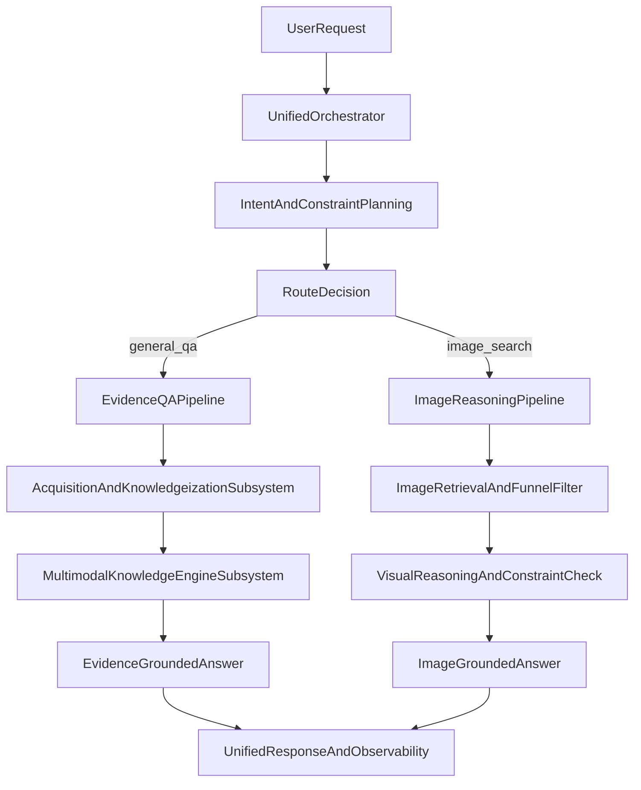
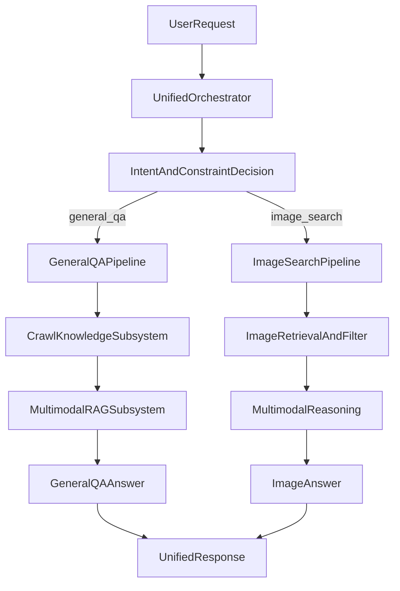

# 多模态 RAG 系统技术方案（价值深化版）

## 1. 方案摘要：系统到底解决什么问题

本方案解决的不是“如何调用更多模型”，而是三类真实工程难题：

1. **开放信息不稳定**：网页质量参差、图片链接失效、外部服务波动频繁。  
2. **多模态语义不一致**：检索、排序、回答各阶段语义容易漂移。  
3. **系统可用性与可解释性冲突**：为了稳态降级常牺牲可解释，或为了强语义常牺牲稳定。  

本系统的核心价值在于：通过两个核心子系统（采集知识化子系统、知识推理子系统）构建了可持续的多模态闭环，做到**“可用、可解释、可演进”同时成立**。

---

## 2. 设计哲学与技术路线

## 2.1 四个顶层原则

- **证据优先**：回答必须来自可追溯证据，不允许黑盒式纯生成。  
- **稳态优先**：外部依赖失败时系统能力下降但服务不断。  
- **解耦优先**：采集、知识化、检索、回答职责分离，方便替换与扩展。  
- **一致性优先**：检索约束要贯穿到最终回答，避免“搜的是A，答的是B”。  

## 2.2 为什么采用“统一入口 + 双主链路”

统一入口的意义不是接口美观，而是策略统一：  
同一请求协议下，系统可将问题路由到通用问答链路或文搜图链路，避免前端维护两套协议、两套状态机、两套观测体系。

双主链路的意义不是分裂系统，而是分工协作：  
- 通用问答链路强调证据构建与知识问答；  
- 文搜图链路强调视觉约束命中与图文一致性。  

---

## 3. 系统总体架构（方案视角）

架构上最重要的不是模块数量，而是三条闭环：
- 语义闭环：意图解析 -> 检索改写 -> 约束过滤 -> 回答一致。  
- 数据闭环：采集输入 -> 知识化入库 -> 检索输出 -> 证据回传。  
- 运维闭环：运行标记 -> 指标统计 -> 参数调优 -> 策略迭代。  

---

## 4. 核心价值子系统 A：采集知识化子系统（Crawl4AI 体系）

> 这是系统的信息入口与质量上限决定者。  
> 价值不在“抓到页面”，而在“把页面变成可计算知识”。

## 4.1 子系统要解决的核心矛盾

开放网页天然存在冲突：
- 覆盖越广，噪声越高；
- 清洗越激进，信息丢失越大；
- 结构越复杂，稳定性越差。

本子系统通过“分层采集 + 结构化归一 + 全量快照保留”解决上述矛盾。

## 4.2 核心方案：三阶段知识化

### 阶段1：多路径采集保障可用

采集采用“本地优先 -> 远程服务 -> 兼容接口 -> 占位兜底”的分层路径。  
意义：当某一路径失败，不会导致上游问答链路整体不可用。

### 阶段2：统一知识单元归一化

无论上游返回格式如何，统一映射为标准知识单元：
- 主体语义文本；
- 模态元素；
- 页面结构信息；
- 全量原始快照。

意义：下游无需感知采集来源差异，实现统一消费。

### 阶段3：快照保留支持二次知识化

保留 full snapshot 的目的不是备份，而是支持后续：
- HTML 深解析；
- 表格结构化恢复；
- 图片二次本地化；
- 失败回溯与质量审计。

意义：把采集结果从“一次性文本”升级为“可迭代数据资产”。

## 4.3 子系统价值如何体现为能力

- **鲁棒输入能力**：外部站点波动时仍能提供最小可用知识输入。  
- **保真输入能力**：文本、表格、图片等信号不会被单一清洗策略抹平。  
- **可审计输入能力**：任何回答证据可追到采集原始快照。  

## 4.4 关键取舍（为什么这样做）

- 取舍1：保留 full snapshot 会增加存储，但换来后续知识化弹性与审计能力。  
- 取舍2：占位兜底会引入“弱证据”，但换来链路稳定与协议不破。  
- 取舍3：多路径采集复杂度更高，但显著降低单点依赖风险。  

## 4.5 边界与约束

该子系统不是爬虫平台，不负责：
- 大规模调度编排；
- 反爬策略博弈；
- 全站索引任务管理。  

它负责的是：把“当前请求需要的信息源”可靠转成可计算知识单元。

---

## 5. 核心价值子系统 B：多模态知识引擎子系统（RAGAnything 体系）

> 这是系统从“信息处理”走向“知识回答”的核心。  
> 价值不在“能回答”，而在“可证据、可一致、可降级地回答”。

## 5.1 子系统要解决的核心矛盾

多模态问答中最难的不是检索，而是“异构证据统一”：
- 文本是线性语义；
- 表格是关系语义；
- 图片是视觉语义；
- 网页结构是层级语义。  

若只做文本向量检索，会系统性丢失结构与视觉信号。

## 5.2 核心方案：三路径入库 + 一致性查询

### 路径A：Hybrid 知识化（核心路径）

融合 HTML、markdown、table、image 多信号入库。  
意义：最大化保留原始网页的可计算信息密度。

### 路径B：结构化文档路径

针对 HTML/文档输入做结构恢复后入库。  
意义：减少长文档被“纯文本化”带来的语义损失。

### 路径C：基础保底路径

任何输入至少可转换为文本/模态组合内容单元。  
意义：保证“无论输入质量如何，系统都不断链”。

## 5.3 查询与回答一致性机制

回答由两层组成：
- 主回答层：多模态知识引擎推理结果；
- 证据层：可回溯证据项（文本片段与图片证据）。  

当主引擎失败时，证据层仍可输出弱证据回答，保持：
- 协议一致；
- 用户可感知降级；
- 系统可观测可恢复。

## 5.4 关键取舍（为什么这样做）

- 取舍1：Hybrid 提升准确但增加入库成本；系统接受成本换取证据保真。  
- 取舍2：弱证据回退可能降低回答质量；系统接受质量下降换取高可用。  
- 取舍3：本地化图片增加I/O；系统接受I/O开销换取检索稳定与复用。  

## 5.5 边界与约束

该子系统不是全局知识库平台，不负责：
- 跨业务线统一索引治理；
- 离线大规模重建流程；
- 多租户权限模型。  

它负责的是：将本次请求相关知识在可控时延内组织成可回答形态。

---

## 6. 语义决策方案：意图与约束传播

## 6.1 为什么不能只做意图分类

仅有 intent 不能驱动精确检索。  
用户提出“左边是A右边是B”这类问题，必须提取为结构化约束并贯穿执行链路。

## 6.2 方案要点

- 先做 query 规划，再做检索执行；
- 规划结果包含：路由意图、检索改写、结构化约束；
- 低置信时回退传统识别与启发式；
- 同类请求使用解析缓存，降低调用开销。

## 6.3 价值体现

- 降低检索语义漂移；
- 降低重复模型调用；
- 提升“约束能落地”的概率。  

即：从“识别用户在问什么”升级为“识别系统该怎么执行”。

---

## 7. 图像链路方案：多阶段漏斗与一致性保障

## 7.1 核心思想

图像链路不是一次排序，而是“分层淘汰”：
1. 召回覆盖层：尽量不漏。  
2. 可达性层：保证可下载可展示。  
3. 粗语义层：快速去噪。  
4. 细语义层：视觉推理精排。  
5. 严格约束层：确保空间/动作条件成立。  

## 7.2 为什么要做“检索语义”和“回答语义”分离

检索语义要求“高召回表达”，回答语义要求“忠于用户原问题”。  
两者混用会导致：检索命中提高但回答偏题。  
因此系统将二者解耦，保证召回与回答同时最优。

## 7.3 图文一致性是硬约束

严格过滤后若结果集合发生变化，必须重生成回答。  
否则会出现结果与描述不一致，直接损害用户信任和系统可信度。

---

## 8. 配置与参数治理方案

## 8.1 治理目标

参数治理不是“给很多开关”，而是保证：
- 每个参数有明确影响面；
- 参数之间存在可解释联动；
- 调参后可通过指标验证收益。  

## 8.2 双层配置策略

- 编排层配置：控制超时、并发、fallback 策略；
- 子系统配置：控制采集、知识化、检索漏斗、解析缓存。  

这样可以让“业务策略”与“子系统策略”分别演进。

## 8.3 调优基本方法

- 准确率不足：扩召回池、扩重排池、扩严格检查池；
- 延迟过高：收缩池规模、提高缓存命中、减少冗余调用；
- 可用性不足：提升可达性阈值、完善降级路径、优化超时边界。

---

## 9. 可观测与降级方案（可信工程核心）

## 9.1 观测必须回答三个问题

1. 本次请求走了哪条策略路径？  
2. 哪个阶段发生了降级？  
3. 降级是否影响了最终质量？  

## 9.2 观测分层

- 请求层：路径标记与策略触发记录；
- 系统层：成功率、回退率、时延、阶段质量指标；
- 业务层：约束命中率、图文一致率、可展示率。

## 9.3 降级设计原则

- 降级可见：必须显式标注，不允许“假成功”；
- 协议不变：前端与调用方不用分支处理异常结构；
- 证据不断：即使降级，仍保留最小可追溯证据。

---

## 10. 方案价值如何被验证（评估框架）

## 10.1 评估维度

- **可用性**：服务是否稳定返回；
- **一致性**：回答是否与返回证据一致；
- **约束命中**：空间/动作等条件是否满足；
- **可解释性**：失败与降级是否可追踪。  

## 10.2 场景化验证

建议至少覆盖三类场景：
- 正常场景：复杂查询稳定命中；
- 噪声场景：低质量网页/图片源仍可输出；
- 故障场景：外部依赖失败时仍保持服务可用。  

---

## 11. 方案的真正创新点（可用于答辩）

与常见“检索+大模型”方案相比，本方案创新不在单模型，而在工程体系：

1. **采集知识化能力**：把网页从“可读内容”变成“可推理知识”。  
2. **多模态证据一致性能力**：把约束从检索阶段传播到回答阶段。  
3. **稳态可解释能力**：把降级从“报错”升级为“可用且可追溯”。  

这三点共同构成系统价值壁垒：  
不依赖某个特定模型版本，依赖的是可持续演进的技术架构。

---

## 12. 演进路线（能力产品化）

### 短期：做深现有能力
- 强化两个核心子系统的质量看板；
- 固化约束一致性回归测试；
- 统一降级等级与策略语义。

### 中期：做强策略系统
- 建立参数自动调优闭环；
- 构建离线评测集并纳入持续集成；
- 建立阶段级成本与收益模型。

### 长期：做成平台能力
- 将采集知识化子系统产品化；
- 将多模态知识引擎子系统平台化；
- 支持多场景复用与策略模板化部署。

---

## 13. 结语：从“功能系统”到“能力系统”

这套方案的最终价值不是“能回答问题”，而是建立了两项可复用核心能力：
- 高保真知识输入能力；
- 高一致性多模态回答能力。  

当这两项能力具备可观测、可降级、可演进特性后，系统才真正具备工程与业务双重生命力。
# 多模态 RAG 系统技术方案（思路与设计版）

## 1. 方案目标与设计原则

本方案目标不是“把很多模型串起来”，而是构建一个**可长期演进的多模态知识系统**。系统核心价值体现在两件事：
- 把开放网络信息稳定转成结构化知识（采集与知识化）。
- 把用户复杂问题稳定路由到正确能力链路（编排与推理）。

设计原则：
- **稳定优先**：外部能力失败时，系统仍可返回结构完整响应。
- **证据优先**：回答必须可追溯到采集或检索证据。
- **解耦优先**：采集、检索、排序、回答各阶段职责单一，便于替换。
- **观测优先**：每次请求必须可解释“为什么这样回答”。

---

## 2. 总体架构思路

系统采用“统一入口 + 双主链路 + 子系统协同”的架构：

架构重点：
- 编排层只做决策，不做重计算。
- 重计算在子系统内部完成。
- 输出层统一协议，前端无须关心内部链路差异。

---

## 3. 双链路策略（不是两套系统）

## 3.1 通用问答链路

适用问题：解释、总结、对比、趋势、基于网页与文档的知识问答。

策略：
1. 对用户问题进行检索化表达（避免口语噪声）。
2. 先做网页候选，再做正文采集，再做证据重排。
3. 将结果送入多模态 RAG 子系统生成答案。
4. 若任一外部依赖异常，进入降级证据回答。

价值：
- 对开放域问题保持覆盖率。
- 对噪声网页保持可控过滤。

## 3.2 文搜图链路

适用问题：明确要求“找图/找照片/按视觉约束筛图”。

策略：
1. 把用户问题拆为“回答语义”与“检索语义”两条表达。
2. 检索阶段重召回，筛选阶段重约束。
3. 先可达性过滤，再语义过滤，再严格约束过滤。
4. 回答只基于最终入选图片，避免“答非所示”。

价值：
- 兼顾召回与精度。
- 对空间关系、动作关系等约束更稳定。

---

## 4. 核心价值子系统一：采集知识化子系统（Crawl4AI）

> 这是系统的“输入质量引擎”。没有高质量采集，后续 RAG 与回答会系统性退化。

## 4.1 子系统目标

- 将开放网页转为“可计算知识单元”，而非仅抓取原始 HTML。
- 保留文本、表格、图片、链接等多模态上下文。
- 在采集失败时提供可追溯最小结果，而不是直接断链。

## 4.2 核心方案思路

### 4.2.1 三层采集策略

1. **本地优先采集**  
   优点是低网络开销、低链路复杂度。
2. **远程服务采集**  
   支持容器化和分布式部署。
3. **兼容模式采集**  
   处理历史接口差异与非标准响应。

最终原则：**采集能力可退化，但数据契约不能退化**。

### 4.2.2 统一知识单元契约

采集结果统一转为四类信息：
- 主体文本（语义正文）
- 模态元素（图像/表格/公式/泛型媒体）
- 页面结构（标题、链接、表格结构）
- 全量快照（用于二次知识化与审计）

这样可以保证后续任何知识引擎都能消费，不绑定单一 RAG 实现。

## 4.3 质量控制思路

### 4.3.1 文本质量

- 优先使用结构化 markdown；
- 不丢弃原始快照，避免“清洗过度导致信息缺失”；
- 空正文时保留最小可追溯信息。

### 4.3.2 模态质量

- 图片必须可引用；
- 重复资源去重；
- 非图像媒体不强行转图，防止语义污染。

### 4.3.3 结构质量

- 表格与链接按统一结构保存；
- 非法结构降级为空，不传播脏数据。

## 4.4 容错与韧性方案

失败模式包含：超时、反爬、非标准返回、正文缺失。  
韧性策略包含：
- 分层重试路径；
- 请求级失败标记；
- 占位级输出保障（可配置开关）；
- 上游可感知“当前是降级证据”。

## 4.5 这个子系统为什么是核心价值

该子系统本质上解决了“互联网内容不可直接检索推理”的问题。  
它不是网络抓取工具，而是“内容知识化引擎”：
- 把非结构化网页变成结构化知识输入；
- 为下游 RAG 提供稳定一致的高质量原料；
- 决定系统上限（信息完整度）和下限（故障可用性）。

---

## 5. 核心价值子系统二：多模态知识引擎子系统（RAGAnything）

> 这是系统的“知识组织与回答引擎”。没有这个子系统，系统只能做浅层检索，无法形成稳定证据问答。

## 5.1 子系统目标

- 把多源、多模态内容统一组织为可检索可推理知识空间。
- 支持文本、图像、表格、公式的统一入库与查询。
- 在部分能力不可用时保持“可解释回答”能力。

## 5.2 核心方案思路

### 5.2.1 三路径入库策略

1. **混合知识化路径（核心）**  
   将网页快照中的 HTML、markdown、表格、图片融合入库。
2. **结构化文档路径**  
   对 HTML/文档进行结构化解析后入库。
3. **基础保底路径**  
   任何输入至少可转成文本级知识单元入库。

该策略保证：**高质量输入吃得下，低质量输入不断链**。

### 5.2.2 查询策略

- 主回答来自多模态检索推理；
- 证据通道独立构建，确保回答可追溯；
- 查询失败时提供“弱证据回答”，保持产品层稳定。

## 5.3 混合知识化（Hybrid）为何关键

Hybrid 的本质价值是“信息保真”：
- HTML 提供结构语义；
- markdown 提供语言语义；
- 表格保留关系信息；
- 图片保留视觉证据。

只有把四类信号协同入库，系统才具备真实多模态问答能力。  
这也是本项目区别于普通文本 RAG 的核心技术点。

## 5.4 可靠性与一致性方案

### 5.4.1 入库一致性

- 入库成功/失败都保留可追溯记录；
- 不允许出现“接口成功但无任何证据记录”的状态。

### 5.4.2 查询一致性

- 无论主引擎状态如何，返回结构保持稳定；
- 明确标注降级状态，避免“假成功回答”。

### 5.4.3 运行环境一致性

- 统一环境治理（代理、路径、解析器依赖）；
- 降低部署环境差异导致的隐性故障。

## 5.5 这个子系统为什么是核心价值

该子系统把“采集到的信息”转成“可推理知识”，解决三件关键问题：
- 知识组织：多模态信息如何统一表示。
- 知识检索：复杂问题如何命中有效证据。
- 知识回答：回答如何与证据对齐并可解释。

它决定了系统是“搜索聚合器”还是“知识问答系统”。

---

## 6. 意图与约束方案（策略视角）

## 6.1 为什么必须做结构化约束

自然语言中的“左边/右边/追逐/排除某对象”等条件，若不结构化，后续检索与筛选会丢失约束。  
因此必须将用户意图转成可执行约束，再传播到检索与回答各阶段。

## 6.2 解析策略

- 主路径：模型驱动的结构化解析（高泛化）。
- 兜底路径：启发式解析（高可用）。
- 缓存策略：同类请求复用解析结果（降成本降时延）。

## 6.3 约束传播策略

- 检索阶段：用约束生成高召回查询表达。
- 筛选阶段：用约束进行硬过滤或软评分。
- 回答阶段：只基于满足约束的结果输出答案。

---

## 7. 图像链路方案（策略视角）

## 7.1 多阶段过滤思路

图像链路采用“先宽后窄”的漏斗：
1. 宽召回（保证不漏）。
2. 可达过滤（保证可用）。
3. 语义粗排（控制成本）。
4. 多模态精排（提升准确）。
5. 严格约束过滤（保证匹配）。

## 7.2 关键平衡

- 召回不足 -> 约束命中率低；
- 保留池过小 -> VLM 无法纠错；
- 过滤过严 -> 结果为空；
- 过滤过松 -> 结果不符合约束。

因此参数必须联动调优，而不是单点调参。

## 7.3 图文一致性策略

严格过滤后若候选变化，需要重生成回答；  
否则会出现“回答说 2 张，实际返回 5 张”的一致性问题。

---

## 8. 配置与参数治理方案

## 8.1 双层配置思路

- 应用层配置：控制编排行为、超时、并发、fallback。
- 子系统层配置：控制采集、知识化、检索与排序策略。

## 8.2 参数治理原则

- 所有关键参数有上限，防止失控。
- 参数具备联动关系，避免局部最优。
- 参数调整必须伴随观测指标变化验证。

## 8.3 典型调优方向

- 提准：提高候选池、提高严格匹配范围。
- 降延迟：收缩候选池、提高缓存命中。
- 保稳定：提高可达检测阈值和回退可见性。

---

## 9. 可观测与降级方案

## 9.1 请求级可观测

每个请求必须能回答三件事：
- 实际走了哪条链路？
- 哪些策略被触发？
- 哪些环节发生了回退？

## 9.2 系统级可观测

核心指标分三类：
- 可靠性：成功率、失败率、回退率；
- 性能：总时延、阶段时延；
- 质量：约束命中率、可展示率、图文一致率。

## 9.3 降级方案

降级不是“返回错误”，而是“降低能力但保持服务”：
- 结果结构不变；
- 明确告知降级状态；
- 保留可追溯证据。

---

## 10. 验证与评估方案

## 10.1 验证层次

- 接口正确性验证；
- 链路完整性验证；
- 失败注入验证；
- 质量指标验证。

## 10.2 重点评估集

建议建立三类评估集：
- 复杂空间关系图搜集；
- 通用问答证据一致性集；
- 异常场景（超时、空结果、服务不可达）稳定性集。

## 10.3 评估目标

- 不仅看“是否回答”，更看“是否有证据、是否一致、是否可解释”。

---

## 11. 演进路线（方案级）

### 短期
- 强化子系统观测面板（采集质量、hybrid 成功率、严格匹配命中率）。
- 统一降级文案与策略标记语义。

### 中期
- 构建策略自动调优机制（基于反馈调参）。
- 建立离线基准评测并纳入持续回归。

### 长期
- 子系统产品化：采集知识化平台 + 多模态知识引擎平台。
- 引入多租户策略模板和版本化回滚能力。

---

## 12. 结论：方案核心价值重述

本系统价值不在“调用了多少模型”，而在于形成了两大可复用能力：

1. **采集知识化能力**：把开放网络内容稳定转成可计算知识输入。  
2. **多模态知识引擎能力**：把复杂多模态输入稳定转成可解释回答。  

统一编排、双链路策略、可观测降级机制，是这两大能力在产品层可持续落地的关键。

