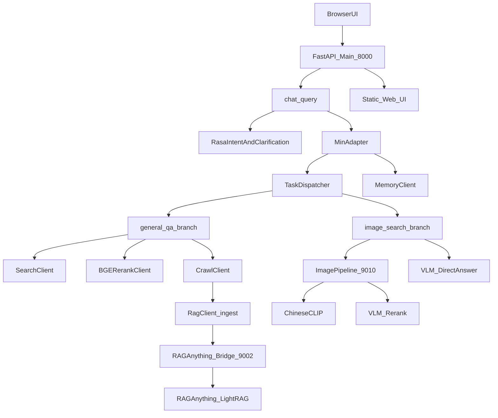
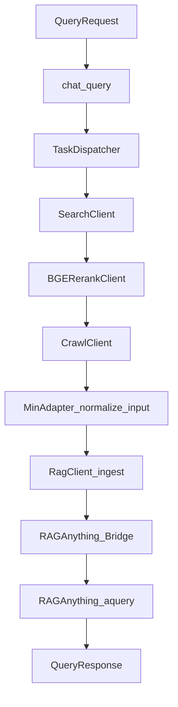
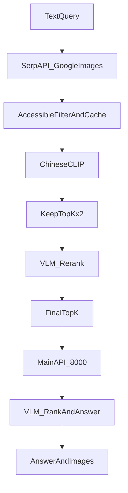

# 多模态 RAG 项目系统技术方案说明

## 1. 项目概述

本项目是一个面向多模态问答场景的研究型系统原型，目标是将网页检索、网页抓取、文本重排、多模态图像检索、视觉语言模型回答、对话记忆与 RAG 推理统一编排到同一个服务入口中。系统当前支持两类核心任务：

1. `general_qa`：通用问答 / 网页检索增强问答。
2. `image_search`：文搜图与基于图像证据的多模态回答。

项目整体采用“主编排服务 + 外部桥接服务 + 轻量 Web 前端”的架构模式：

- 主编排服务：FastAPI，负责统一 API、意图判定、任务分流、上下文记忆、RAG 入库和查询编排。
- 图像桥接服务：负责图像搜索、可访问性过滤、CLIP 粗排、VLM 精排以及图像缓存。
- RAGAnything Bridge：负责将结构化网页、多模态块、HTML/Markdown 混合内容转换为 RAGAnything/LightRAG 可接受的 `content_list`。
- 前端：静态 HTML/CSS/JS 页面，由主服务直接托管，作为轻量实验界面。

从论文角度，本系统更适合描述为“可运行的多模态 RAG 研究原型（executable research prototype）”，而不是完全生产级平台。

## 2. 系统总体架构

## 3. 运行时组件与端口

当前项目运行时主要包含下列组件：

| 组件 | 端口 | 职责 |
|---|---:|---|
| 主编排服务 `app.main:app` | `8000` | 暴露 `/v1/chat/query`、托管前端、图片代理、健康检查、metrics |
| 图像桥接服务 `app.integrations.image_pipeline_bridge:app` | `9010` | 搜图、图片可访问性探测、缓存、CLIP、VLM 排序 |
| RAGAnything Bridge `app.integrations.raganything_bridge:app` | `9002` | 统一 `/ingest` 和 `/query` 契约，桥接 RAGAnything/LightRAG |
| Rasa Parse Bridge | `5005` | 意图识别与槽位抽取兼容接口 |
| Redis（可选） | `6379` | 记忆后端 |
| MySQL（可选） | `3306` | 记忆后端 |

主服务入口位于：

- `app/main.py`
- 主要路由：`/`、`/healthz`、`/metrics`、`/v1/chat/query`、`/v1/chat/image-proxy`

## 4. 目录结构与模块职责

### 4.1 主要目录

- `app/main.py`：FastAPI 主入口。
- `app/api/`：HTTP 路由层。
- `app/adapters/`：输入归一化和结果编排适配层。
- `app/services/`：核心业务服务层。
- `app/integrations/`：外部系统桥接层。
- `app/models/`：Pydantic 数据结构定义。
- `web/`：轻量静态前端。
- `raganything_storage/`：RAGAnything 工作目录、缓存、图像缓存等。
- `rasa_project/`：Rasa 训练数据。
- `third_party/`：引入的开源项目副本，如 Crawl4AI、RAG-ANYTHING、rank_llm、Rasa。

### 4.2 关键模块职责

#### `app/api/chat.py`

负责：

- 接收统一问答请求 `POST /v1/chat/query`
- 处理意图识别
- 调用澄清逻辑
- 触发输入归一化
- 执行 RAG 入库与查询编排
- 返回统一结构 `QueryResponse`
- 暴露图片代理 `/v1/chat/image-proxy`

关键函数：

- `chat_query(req: QueryRequest) -> QueryResponse`
- `chat_image_proxy(url: str) -> Response`
- `_apply_image_entities(req, entities)`
- `_parse_count(raw)`

#### `app/adapters/min_adapter.py`

负责三件核心事情：

1. `normalize_input()`：将不同来源的输入整理成 `NormalizedPayload`
2. `ingest_to_rag()`：按统一契约进行入库
3. `query_with_context()`：执行最终查询或多模态回答

#### `app/services/dispatcher.py`

负责任务分流：

- `prepare_documents()`
- `_general_qa_branch()`
- `_image_search_branch()`

#### `app/services/connectors.py`

封装外部能力调用：

- `SearchClient`
- `CrawlClient`
- `BGERerankClient`
- `ImagePipelineClient`

#### `app/integrations/raganything_bridge.py`

负责：

- 将统一文档结构转为 RAGAnything 支持的 `content_list`
- 混合 HTML / Markdown / table / image 内容装配
- 向 RAGAnything SDK 发起 `insert_content_list()` 与 `aquery()`

#### `app/integrations/image_pipeline_bridge.py`

负责：

- SerpAPI 图像召回
- URL 可访问性验证
- 图片缓存
- Chinese-CLIP 粗排
- VLM 精排
- 返回 top-k 可访问结果

#### `app/integrations/bridge_settings.py`

新增的 bridge 共享配置层，负责收敛原本散落在多个 bridge 文件中的高频环境变量读取，当前已经统一了：

- OpenAI / Qwen 凭证与 base URL
- RAGAnything 模型与工作目录
- RAGAnything parser 运行时辅助开关（如是否自动把 Python scripts 目录注入 `PATH`）
- SerpAPI key
- Chinese-CLIP 模型
- image pipeline provider 与缓存目录
- image pipeline 的核心调优参数（如 `IMAGE_RETRIEVAL_K`、`IMAGE_CLIP_KEEP`、`IMAGE_ACCESS_CHECK_CONCURRENCY`、`IMAGE_VLM_RANK_POOL`）

这样做的目的是降低 `os.getenv()` 直接散落在多个 bridge 中带来的维护成本，并与主服务的 `AppSettings` 形成更一致的配置组织方式。

同时，图像缓存目录已经引入最小可用的生命周期治理参数：

- `IMAGE_CACHE_TTL_HOURS`
- `IMAGE_CACHE_CLEANUP_INTERVAL_SECONDS`

用于控制缓存文件的存活时间以及惰性清理的触发频率。

## 5. 前端设计

前端采用轻量单页静态页面方案：

- `web/index.html`
- `web/static/styles.css`
- `web/static/app.js`

特点：

- 与主服务同端口部署，不需要额外网关。
- 页面结构参考聊天式界面。
- 直接调用 `/v1/chat/query`。
- 图片展示统一走 `/v1/chat/image-proxy`，避免浏览器直接加载外链图片时出现防盗链或跨域问题。

前端的关键逻辑包括：

- `sendMessage(text)`：发送请求
- `renderImages(images)`：图片渲染
- `safeImageUrl(u)`：基础 URL 过滤

## 6. 核心数据结构

以下结构定义在 `app/models/schemas.py`。

### 6.1 `QueryRequest`

字段：

- `uid: str`：用户会话标识
- `intent: IntentType | None`：可选显式意图
- `query: str`：用户问题
- `url: str | None`：可选指定网页
- `source_docs: list[SourceDoc]`：外部注入文档
- `images: list[ModalElement]`：外部注入图片
- `use_rasa_intent: bool`
- `intent_confidence_threshold: float`
- `max_images: int`
- `max_web_docs: int`
- `max_web_candidates: int | None`

### 6.2 `QueryResponse`

字段：

- `answer: str`
- `evidence: list[EvidenceItem]`
- `images: list[ImageItem]`
- `trace_id: str`
- `latency_ms: int`
- `route: IntentType | None`
- `runtime_flags: list[str]`

### 6.3 `ModalElement`

统一多模态块表示：

- `type`
- `url`
- `desc`
- `local_path`

其中 `local_path` 是当前系统新增的重要字段，用于在图像搜索链路中复用本地缓存图片，避免跨阶段重复下载。

### 6.4 `SourceDoc`

表示上游准备好的源文档：

- `doc_id`
- `text_content`
- `modal_elements`
- `structure`
- `metadata`

### 6.5 `NormalizedDocument` / `NormalizedPayload`

归一化层结构：

- `NormalizedDocument.doc_id`
- `NormalizedDocument.text`
- `NormalizedDocument.modal_elements`
- `NormalizedDocument.metadata`

- `NormalizedPayload.uid`
- `NormalizedPayload.intent`
- `NormalizedPayload.query`
- `NormalizedPayload.documents`

### 6.6 `ImageCandidate`

定义在 `app/integrations/image_pipeline_bridge.py`，是图像排序阶段的内部工作态结构：

- `url`
- `title`
- `desc`
- `source`
- `score`
- `local_path`

## 7. 通用问答技术方案

### 7.1 调用链

### 7.2 流程说明

1. 若请求显式给出 `source_docs`，直接使用。
2. 若给出 `url`，直接 crawl 该 URL。
3. 否则：
   - 用 `optimize_web_query()` 对 query 轻量改写；
   - 搜索引擎返回 `n` 个候选结果；
   - 用 BGE 对摘要级结果重排；
   - 选出 `m` 个 URL；
   - 对这些 URL 调用 Crawl4AI 抓取；
   - 将结果归一化后送入 RAG 入库和查询链。

### 7.3 当前实现特点

- web rerank 依赖标题/摘要，而不是正文级 rerank。
- Crawl 阶段支持本地 Crawl4AI SDK 和远端 endpoint 双路径。
- 最终由 RAGAnything bridge 处理混合多模态内容装配。

## 8. 文搜图技术方案

### 8.1 总体方法

当前文搜图链路采用“分阶段多模态检索与回答”策略：

1. 搜索阶段：开放域图像召回
2. 可访问性过滤：仅保留真实可取回图片
3. CLIP 粗排：用 Chinese-CLIP 做图文相似度剪枝
4. VLM 精排：仅对 CLIP 后的候选使用视觉语言模型进一步排序
5. VLM 回答：基于最终图像集直接生成自然语言回答

### 8.2 当前链路

### 8.3 搜索与可访问性过滤

在 `app/integrations/image_pipeline_bridge.py` 中：

- 先通过 SerpAPI 取回图像候选，默认召回规模约为 `top_k * 5`
- 执行并发可访问性探测
- 成功下载的图片直接落入本地缓存目录
- 只保留可访问的候选继续进入后续阶段

重要参数：

- `IMAGE_RETRIEVAL_K`
- `IMAGE_SOURCE_MIN_ACCESSIBLE`
- `IMAGE_SOURCE_MAX_CHECK`
- `IMAGE_ACCESS_CHECK_CONCURRENCY`
- `IMAGE_ACCESS_CHECK_TIMEOUT`

### 8.4 CLIP 粗排

使用 Chinese-CLIP：

- 对 query 与候选图做跨模态相似度打分
- 保留 `top_k * 2` 规模的候选进入 VLM 阶段

参数：

- `IMAGE_CLIP_EVAL`
- `IMAGE_CLIP_DOWNLOAD_CONCURRENCY`
- `IMAGE_CLIP_KEEP`
- `IMAGE_CLIP_MIN_SCORE`

### 8.5 VLM 精排

在 image pipeline 内，VLM 只处理 CLIP 过滤后的图：

- `vlm_rank_clip_pool()`
- 输入：`(url, title, desc, local_path)` 列表
- 输出：相关性排序结果 `order`

若 VLM 不可用或失败：

- 回退到 `_qwen_rerank()` 的 metadata 文本排序

这里必须明确区分：

1. **VLM 图像精排**：真正看图
2. **LLM metadata rerank**：只看标题/描述/URL/score 文本

### 8.6 VLM 最终回答

在主服务内，由 `build_image_search_vlm_response()` 负责：

- 收集归一化后的候选图片
- 优先使用 `local_path` 读取缓存图片
- 调用 `vlm_rank_and_answer_from_image_urls()`
- 如果联合排序+回答失败，再降级到 `vlm_answer_from_image_urls()`

### 8.7 重要优化点

本项目近期已经做了如下优化：

- 图片可访问性检查改成并发
- CLIP 下载改成并发
- VLM 组装图片改成并发
- 图片显示改用主服务图片代理
- 新增 `local_path` 以支持缓存复用
- 搜索侧缓存图片后，排序和回答优先直接读取本地文件

## 9. RAGAnything Bridge 技术方案

### 9.1 作用

bridge 的核心任务不是单纯转发，而是把不同来源的文本/HTML/Markdown/图像块转换为 RAGAnything 可插入的数据结构。

主要接口：

- `POST /ingest`
- `POST /query`

### 9.2 Hybrid 装配

关键函数：

- `_build_hybrid_crawl_content_list()`
- `_pick_best_html_from_crawl_snapshot()`
- `_markdown_supplement_from_crawl_snapshot()`
- `_table_dict_to_markdown_body()`
- `_materialize_remote_image()`

当前策略是：

1. 优先从 crawl snapshot 中挑选高质量 HTML
2. 将 HTML 交给 Docling 解析
3. 若失败，则至少保留文本正文
4. 追加 markdown 补充内容
5. 表格转为 `table` 块
6. 图片转为本地 `image` 块，失败则降级为文本占位

## 10. 意图识别、澄清与上下文记忆

### 10.1 Rasa 意图识别

由 `app/services/rasa_client.py` 负责，支持：

- `general_qa`
- `image_search`

### 10.2 澄清机制

关键模块：

- `app/services/clarification.py`

支持：

- 针对缺少关键信息的问题先追问
- 将待补全问题存入 memory context 中的 `pending_clarification`

### 10.3 记忆机制

由 `MemoryClient` 管理，支持：

- `memory`
- `redis`
- `mysql`
- `hybrid`

上下文内容包括：

- 历史问答
- 用户偏好（如回答风格）
- 待澄清状态

## 11. 开源组件与内部技术方案映射

### 11.1 主要开源组件

| 开源组件 | 用途 |
|---|---|
| FastAPI | 主服务和桥接服务 API |
| Pydantic / pydantic-settings | 配置与数据结构 |
| httpx | HTTP 客户端 |
| Crawl4AI | 网页抓取与页面内容提取 |
| RAG-ANYTHING | 多模态 RAG 框架 |
| LightRAG | 底层图谱/检索增强能力 |
| Docling | HTML / 文档解析 |
| Rasa | 意图识别与槽位抽取 |
| Chinese-CLIP | 图文粗排模型 |
| Qwen / Qwen-VL | 文本精排、多模态精排与回答 |
| Redis / MySQL | 可选记忆后端 |

### 11.2 内部技术方案

| 内部方案 | 核心模块 |
|---|---|
| 统一编排入口 | `app/api/chat.py` |
| 任务分流 | `TaskDispatcher` |
| 输入归一化 | `MinAdapter.normalize_input()` |
| 远程优先 + 本地降级 | `RagClient` / `SearchClient` / `CrawlClient` |
| 文搜图双阶段 VLM | `image_pipeline_bridge.py` + `image_search_vlm_answer.py` |
| hybrid HTML/Markdown 装配 | `raganything_bridge.py` |
| runtime flags 可观测性 | `app/core/runtime_flags.py` |

## 12. 配置项与环境变量

配置来源分为两类：

1. 主服务 `AppSettings`
2. Bridge 共享配置 `BridgeSettings`

当前比较关键的环境变量包括：

- `RAG_ANYTHING_ENDPOINT`
- `RASA_ENDPOINT`
- `IMAGE_PIPELINE_ENDPOINT`
- `WEB_SEARCH_CANDIDATES_N`
- `WEB_URL_SELECT_M`
- `SERPAPI_API_KEYS`
- `QWEN_API_KEY`
- `QWEN_BASE_URL`
- `QWEN_MODEL`
- `QWEN_VLM_MODEL`
- `OPENAI_API_KEY`
- `OPENAI_BASE_URL`
- `RAGANYTHING_ADD_SCRIPTS_DIR_TO_PATH`
- `CHINESE_CLIP_MODEL`
- `CHINESE_CLIP_LOCAL_FILES_ONLY`
- `IMAGE_TOP_K_DEFAULT`
- `IMAGE_CACHE_TTL_HOURS`
- `IMAGE_CACHE_CLEANUP_INTERVAL_SECONDS`
- `IMAGE_RETRIEVAL_K`
- `IMAGE_SOURCE_MIN_ACCESSIBLE`
- `IMAGE_SOURCE_MAX_CHECK`
- `IMAGE_ACCESS_CHECK_CONCURRENCY`
- `IMAGE_ACCESS_CHECK_TIMEOUT`
- `IMAGE_CLIP_EVAL`
- `IMAGE_CLIP_KEEP`
- `IMAGE_CLIP_DOWNLOAD_CONCURRENCY`
- `IMAGE_CLIP_MIN_SCORE`
- `IMAGE_FINAL_MAX_CHECK`
- `IMAGE_VLM_RANK_POOL`
- `IMAGE_SEARCH_INGEST_ENABLED`
- `GENERAL_QA_BODY_RERANK_ENABLED`

### 配置收敛进展

当前项目已经开始从“主服务 typed settings + bridge 分散 `os.getenv()`”的模式，过渡到“双配置中心”模式：

- 主服务：`app/core/settings.py` 中的 `AppSettings`
- bridge：`app/integrations/bridge_settings.py` 中的 `BridgeSettings`

这一步已经统一了 bridge 中最核心、最频繁使用的配置项，并已覆盖 image pipeline 的主要调优参数以及 RAGAnything parser 的运行时路径注入开关。当前 bridge 内保留的更多是运行时 helper，而不是业务配置散点读取，因此配置层已经从“部分收敛”进入“主体收敛”阶段。

### 本轮新增或强调的参数

- `IMAGE_CLIP_DOWNLOAD_CONCURRENCY`
- `IMAGE_SOURCE_MAX_CHECK`
- `IMAGE_ACCESS_CHECK_CONCURRENCY`
- `IMAGE_ACCESS_CHECK_TIMEOUT`
- `image_search_ingest_enabled`（通过 `AppSettings` 控制）

## 13. 可观测性设计

### 13.1 指标

通过 `/metrics` 暴露 Prometheus 风格计数：

- 请求总数
- 成功/失败数
- fallback 次数
- 延迟累计

### 13.2 runtime flags

request 级降级或路径标记包括：

- `intent_fallback`
- `search_fallback`
- `crawl_fallback`
- `rag_ingest_fallback`
- `rag_query_fallback`
- `image_pipeline_fallback`
- `image_search_ingest_skipped`
- `image_search_vlm_rank_answer_combined`
- `image_search_vlm_rank_answer_fallback`
- `image_search_vlm_answer_generated`
- `image_search_vlm_answer_degraded`
- `image_search_vlm_answer_empty`

## 14. 本轮低风险优化说明

### 14.1 文搜图默认跳过冗余 RAG ingest

问题：

- `image_search` 最终不走普通 `rag_client.query()`，但之前仍然会执行 `ingest_to_rag()`。

优化：

- 在 `MinAdapter.ingest_to_rag()` 中增加控制：
  - 当 `intent == image_search` 且 `image_search_ingest_enabled == false` 时，直接跳过入库。

收益：

- 减少文搜图无意义入库
- 降低不必要的远程 RAG 写入延迟
- 减少 `rag_ingest_fallback` 对文搜图结果的干扰

### 14.2 收敛 image_search runtime flags

问题：

- 之前 `image_search_vlm_direct_answer` 无论是否降级都会打标，容易误导。

优化：

- 区分成功回答与降级回答：
  - `image_search_vlm_answer_generated`
  - `image_search_vlm_answer_degraded`

### 14.3 `general_qa` 正文级二次 rerank

问题：

- 之前 `general_qa` 在搜索阶段只对搜索引擎返回的 snippet/title 做 BGE 重排，crawl 到正文后不会再做一次正文级筛选。

优化：

- 在 `TaskDispatcher._general_qa_branch()` 中增加正文级二次 rerank：
  - 先按摘要级 BGE 选 URL；
  - crawl 正文；
  - 再用 BGE 对抓取后的正文做一次 rerank；
  - 最终仅保留 `max_web_docs`。

对应控制参数：

- `GENERAL_QA_BODY_RERANK_ENABLED`

收益：

- 提高最终送入 RAG 的网页正文相关性；
- 降低“摘要相关但正文不相关”的页面噪声。

### 14.4 成功路径补弱 evidence / images

问题：

- 之前 RAGAnything bridge 成功返回时，`evidence=[]`、`images=[]`，前端缺乏解释性。

优化：

- bridge 成功路径现在也会从 `_fallback_docs[uid]` 提取弱证据与图片列表返回：
  - `doc_id`
  - 简短 `snippet`
  - 前若干图片

收益：

- 增强成功路径的可解释性；
- 更适合论文中描述“系统可回溯证据”的能力。

### 14.5 图片缓存复用

问题：

- 同一张图在搜索侧、CLIP、VLM 排序、VLM 回答阶段可能重复下载。

优化：

- `9010` 先缓存图片
- 使用 `local_path` 在后续阶段复用本地文件

收益：

- 避免重复下载
- 降低网络开销
- 提升 VLM 阶段稳定性

### 14.6 图片缓存生命周期

为避免 `image_pipeline_cache` 长期增长，本系统补充了一个最小可用的缓存生命周期策略：

- 以文件最后修改时间（mtime）作为 TTL 判断依据
- 在缓存命中时刷新 mtime，使热点图片可以继续保留
- 采用惰性清理方式，不额外引入独立定时任务
- 通过 `IMAGE_CACHE_CLEANUP_INTERVAL_SECONDS` 控制目录扫描频率，避免每次请求都触发全量清理

这类设计的优点是实现简单、侵入性低，适合当前原型系统阶段；后续若系统进入长期在线运行阶段，可再升级为“TTL + 容量上限 + 后台清理任务”的组合治理方案。

## 15. 当前技术债

1. 成功路径 evidence 返回仍然偏弱。
2. 配置管理虽已明显收敛，但主服务与 bridge 仍是双配置中心，后续还可继续做 schema、默认值与说明文档统一。
3. `general_qa` 仍依赖摘要级 rerank，正文级 rerank 不足。
4. fallback 文案和占位逻辑偏原型化。
5. 多个 bridge 的配置与契约还可进一步统一。
6. `image_search` 链路仍有重复过滤与重复排序的痕迹。
7. 当前缓存治理仍是 TTL 惰性清理，尚未引入容量上限与后台回收。

## 16. 适合论文写作的技术亮点

1. **可访问性感知的多模态图像检索框架**：不是只检索语义相关图，而是保证图像在工程上可取回、可显示、可送模态模型。
2. **分阶段多模态排序策略**：先 CLIP 粗排，再 VLM 精排。
3. **多模态直接回答机制**：最终回答不只是返回图片列表，而是基于图像证据生成自然语言响应。
4. **混合 HTML / Markdown / 表格 / 图像装配入 RAG**：网页多模态结构统一转换为 RAGAnything 内容块。
5. **远程优先 + 本地降级设计**：系统具备较强的鲁棒性和可运行性。
6. **统一契约与适配层设计**：`QueryRequest -> NormalizedPayload -> QueryResponse` 提供清晰的系统边界。

## 17. 论文正文可直接参考的系统描述

可将本系统概括为：

“本文实现了一个面向通用问答与文搜图场景的多模态 RAG 原型系统。系统采用统一编排层设计，以 FastAPI 作为主服务入口，结合 Rasa 完成意图识别与槽位抽取，结合 Search、BGE、Crawl4AI 与 RAGAnything 构建网页问答链路；同时设计了可访问性感知的图像检索链路，通过开放域图像搜索引擎召回候选图像，采用 Chinese-CLIP 完成粗粒度图文匹配，再利用视觉语言模型进行细粒度排序与基于图像证据的自然语言回答生成。为解决开放域图像链接不稳定的问题，系统在检索阶段引入了并发可访问性验证与本地缓存机制，并在排序和回答阶段复用缓存结果，从而提高了系统的稳定性与响应效率。”  

## 18. 后续建议

1. 为成功路径补结构化 evidence。
2. 继续统一主服务与 bridge 配置模型，并补齐配置文档与清理策略。
3. 为 `general_qa` 增加正文级 rerank。
4. 对 `image_search` 的排序与回答做进一步职责合并。
5. 将缓存治理从 TTL 惰性清理升级为 TTL + 容量上限 + 后台任务。

